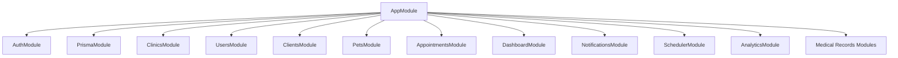

# Relatório do Estado Atual do Sistema — VetOS AI

Este relatório apresenta uma auditoria detalhada de toda a base de código do **VetOS AI**, contemplando o estado dos módulos do backend, do frontend, do banco de dados, da segurança, do débito técnico e da cobertura de testes.

---

## 1. Mapeamento de Fases e Waves do Roadmap

| Fase | Título / Objetivo | Status | Waves Concluídas |
| :--- | :--- | :--- | :--- |
| **Fase 1** | Setup do Projeto e Infraestrutura | **Concluído** | Monorepo setup, Docker (Postgres/Redis) |
| **Fase 2** | Modelagem do Banco e Core API | **Concluído** | Multi-tenant, Autenticação JWT, RBAC |
| **Fase 3** | Consultas e Lógica de Negócio | **Concluído** | CRUD de entidades, Agrupamentos de Dashboard |
| **Fase 4** | Automação e Notificações Core | **Concluído** | Wave 1A (Foundation), 1B (SMTP), 2 (Automations), 3 (WhatsApp/UI) |
| **Fase 5** | Desenvolvimento do Frontend (Admin) | **Concluído** | Dashboard, Login, Cadastros, CRUD |
| **Fase 8** | Refinamentos de UI/UX | **Concluído** | Estilizações Premium, Estados de Loading/Vazio |
| **Fase 9** | Suporte a Tema Claro / Escuro | **Concluído** | Toggle de tema e persistência local |
| **Fase 10** | Calendário de Consultas Premium | **Concluído** | Visualização diária/semanal e criação ágil |
| **Fase 11** | Prontuário Clínico & Histórico do Pet | **Concluído** | Linha do tempo, Alergias, Vacinas, Peso, Notas |
| **Fase 12** | Feed de Atividades da Clínica | **Concluído** | Histórico consolidado de auditoria (7 entidades) |
| **Fase 13** | Insights e Analytics Operacional | **Concluído** | Wave 13A (Overview), 13B (Trends/CSS Charts), 13C (Estabilização) |
| **Fase 14** | Automação de Disparo de Vacinas | **Parcial** | Wave 14A (Backend Engine, ID Dedupe, UTC, Dev-Trigger) |

---

## 2. Features Prontas para Produção (Production-Ready)

- **Arquitetura Multi-Tenant**: Isolamento de dados absoluto por `clinicId` em todos os níveis de requisição e persistência.
- **Autenticação e RBAC**: Proteção JWT, rotas guardadas por privilégios (`ADMIN`, `STAFF`, `SUPERADMIN`) e suporte a simulação de acesso (`impersonation`) por superadministradores.
- **Calendário Veterinário Premium**: Painel interativo com visualização diária/semanal, gerenciamento de status de agendamentos (`SCHEDULED`, `COMPLETED`, `CANCELLED`) e filtros rápidos.
- **Prontuário Médico Unificado (PetDetails)**: Registro completo do histórico clínico, acompanhamento de curvas de peso, listagem de alergias, procedimentos e histórico vacinal.
- **Feed de Atividades Dinâmico**: Log operacional agregando inserções e atualizações de clientes, pets, consultas, prontuários, alergias, vacinas e pesos em ordem cronológica.
- **Painel de Analytics Operacional**: Módulos de controle trazendo:
  - Totalizadores diários e contagem de pacientes inativos há mais de 90 dias.
  - Alertas de vacinas que expiram no intervalo de D0 a D+7 com contatos diretos do tutor.
  - Gráficos de barra e áreas puros (CSS/HTML) com scroll mobile suave e contraste otimizado para temas escuro e claro.
- **Central de Configuração de Mensagens (Messaging Hub)**:
  - Credenciais de SMTP de e-mail e Evolution API do WhatsApp salvas com criptografia robusta de chave privada local.
  - Testes de conexão SMTP e WhatsApp (envios de teste dinâmicos) e geração/leitura de QR Code para pareamento.
  - CRUD de templates personalizados de mensagens com substituição de placeholders dinâmica.
  - Log de auditoria de disparos com paginação, filtros e retry manual de falhas.
- **Motor Automático de Vacinas (Fase 14A)**:
  - Scheduler rodando diariamente às 02:00.
  - Janelas UTC-safe de verificação D0 (Hoje), D-1 (Amanhã) e D-7 (7 dias).
  - Deduplicação estrita baseada em `vaccineRecordId` no log do banco de dados (evita checagem insegura de corpo de texto).
  - ID de Job unificado no BullMQ para evitar enfileiramento concorrente idêntico.
  - Script manual standalone (`trigger-vaccine-reminders`) com sleep de 5s de processamento e travas para não rodar em produção.

---

## 3. Features Parcialmente Implementadas / Em Andamento

- **Integração com WhatsApp Real**: O código do backend possui suporte robusto à Evolution API, mas as credenciais de produção dependem de instâncias ativas do cliente e atualmente contam com um mock ativo (`WhatsAppMockProvider`) caso a conexão falhe ou não esteja configurada.
- **Restrição de Cotas de Planos SaaS**: A infraestrutura do banco de dados (`Plan` e `ClinicSubscription`) possui os limites de usuários, armazenamento e volume de notificações cadastrados, porém o bloqueio de operações que excedam estes limites (e.g. impedir cadastro de nova consulta se exceder o limite do plano) não está totalmente distribuído pelos controllers da API do tenant.

---

## 4. Features Planejadas (Não Iniciadas)

- **Fase 14B — Interface de Gerenciamento de Vacinas**: Telas do frontend dedicadas ao módulo de vacinas, permitindo ao administrador acompanhar agendamentos futuros de disparos, gerenciar a fila do BullMQ pelo painel e visualizar estatísticas de entrega/conversão de vacinas em lote.
- **SaaS Billing & Subscription Manager**: Integração comercial real com gateways de pagamento (e.g. Stripe, Asaas) para cobrança recorrente das clínicas de forma automatizada, suspensão automática por inadimplência e upgrade de plano via checkout.
- **Inteligência Artificial (AI Copilot)**: Assistente virtual integrado ao prontuário para sugerir diagnósticos e receitas com base na descrição dos sintomas clínicos, otimizador inteligente de agendas baseado na probabilidade histórica de no-show dos clientes, e redação de e-mails/WhatsApp inteligentes e humanizados para reengajamento de clientes inativos.

---

## 5. Status dos Módulos do Backend (`backend/src/`)

- **[auth](file:///home/moadev/projetos/vetOSAI/backend/src/auth)**: Autenticação JWT, login, registro de novos tenants (clínicas) e guardas de rotas por role (`JwtAuthGuard`, `RolesGuard`). (Status: **Completo e Estável**)
- **[prisma](file:///home/moadev/projetos/vetOSAI/backend/src/prisma)**: Serviço encapsulado do Prisma Client para conexões centralizadas de banco de dados. (Status: **Completo e Estável**)
- **[clinics](file:///home/moadev/projetos/vetOSAI/backend/src/clinics)**, **[users](file:///home/moadev/projetos/vetOSAI/backend/src/users)**: Gestão de clínicas e usuários administrativos. (Status: **Completo**)
- **[clients](file:///home/moadev/projetos/vetOSAI/backend/src/clients)**, **[pets](file:///home/moadev/projetos/vetOSAI/backend/src/pets)**: Gestão e CRUD de tutores e animais de estimação. (Status: **Completo**)
- **[appointments](file:///home/moadev/projetos/vetOSAI/backend/src/appointments)**: Agendamentos, atualizações de status e vínculos com pets/clientes. (Status: **Completo**)
- **[dashboard](file:///home/moadev/projetos/vetOSAI/backend/src/dashboard)**: Feed de atividades consolidado, estatísticas rápidas e atividades recentes. (Status: **Completo**)
- **[analytics](file:///home/moadev/projetos/vetOSAI/backend/src/analytics)**: Queries complexas de agregação temporal de 30 dias para consultas e notificações, inativos de 90 dias, e alertas de vacinas vencendo em 7 dias. (Status: **Completo**)
- **[notifications](file:///home/moadev/projetos/vetOSAI/backend/src/notifications)**: Processamento de filas (BullMQ), templates padrões, encriptação AES de credenciais, provedores SMTP/Evolution API e logs de notificações. (Status: **Completo e Estável**)
- **[scheduler](file:///home/moadev/projetos/vetOSAI/backend/src/scheduler)**: Cron diário às 02:00 para envio automático de vacinas e retenção de clientes, com janelas calculadas de forma UTC-safe. (Status: **Completo e Estável**)
- **Medical Records Modules** (`vaccines`, `allergies`, `clinical-records`, `weight-records`): Lógica de negócio de prontuários. (Status: **Completo**)

---

## 6. Status dos Módulos do Frontend (`frontend/src/`)

- **[context/ThemeContext.tsx](file:///home/moadev/projetos/vetOSAI/frontend/src/context/ThemeContext.tsx)**: Suporte a temas claro/escuro usando variáveis CSS OKLCH e persistência local. (Status: **Estável**)
- **[context/AuthContext.tsx](file:///home/moadev/projetos/vetOSAI/frontend/src/context/AuthContext.tsx)**: Orquestração do token de autenticação, impersonate de clínicas e rotas guardadas. (Status: **Estável**)
- **[pages/Dashboard.tsx](file:///home/moadev/projetos/vetOSAI/frontend/src/pages/Dashboard.tsx)**: Estatísticas principais e feed de auditoria. (Status: **Completo**)
- **[pages/Appointments.tsx](file:///home/moadev/projetos/vetOSAI/frontend/src/pages/Appointments.tsx)**: Calendário veterinário premium interativo. (Status: **Completo**)
- **[pages/PetDetails.tsx](file:///home/moadev/projetos/vetOSAI/frontend/src/pages/PetDetails.tsx)**: Painel completo de histórico e prontuários médicos. (Status: **Completo**)
- **[pages/Analytics.tsx](file:///home/moadev/projetos/vetOSAI/frontend/src/pages/Analytics.tsx)**: Aba de visão geral operacionais e gráficos de 30 dias responsivos. (Status: **Completo**)
- **[pages/messaging/](file:///home/moadev/projetos/vetOSAI/frontend/src/pages/messaging)**: Painéis de SMTP, WhatsApp (QR Code / Pareamento), logs de disparos e templates de mensageria. (Status: **Completo**)

---

## 7. Entidades do Banco de Dados (Prisma Schema)

O banco de dados relacional PostgreSQL é composto pelas seguintes tabelas:

1. **Clinic**: Raiz da conta e dados do tenant.
2. **User**: Autenticação administrativa com regras de acesso (`Role`: ADMIN, STAFF, SUPERADMIN).
3. **Client**: Proprietário/tutor de pets.
4. **Pet**: Paciente da clínica.
5. **Appointment**: Agendamento de consultas com status (`AppointmentStatus`).
6. **ImpersonationLog**: Logs de auditoria de acesso de Super Admin às clínicas.
7. **Plan** & **ClinicSubscription**: Cadastro de planos e limites dinâmicos por tenant.
8. **WeightRecord**: Acompanhamento histórico de peso corporal.
9. **Allergy**: Alergias medicamentosas ou alimentares.
10. **VaccineRecord**: Histórico e planejamento de futuras doses de imunização.
11. **ClinicalRecord**: Notas de atendimento e procedimentos realizados.
12. **NotificationConfig**: Segredos e credenciais de SMTP e WhatsApp de cada clínica.
13. **NotificationTemplate**: Templates com placeholders dinâmicos por evento e canal.
14. **NotificationLog**: Registro auditável e detalhado de envios e falhas de notificações.

---

## 8. Débito Técnico Identificado

- **Ausência de NestJS Wrapper para Redis**: O agregador de métricas globais em `scheduler.service.ts` instancia o cliente `ioredis` manualmente (`require('ioredis')`) ao invés de usar uma injeção de dependência centralizada ou um RedisModule do NestJS.
- **Criptografia Efêmera**: Quando `ENCRYPTION_KEY` não está presente no ambiente de desenvolvimento, o `EncryptionService` inicializa uma chave randômica em memória. Isso impede o teste local de conexões SMTP/WhatsApp que já foram salvas em execuções anteriores, exigindo que o desenvolvedor re-insira as credenciais a cada boot do backend caso não crie uma variável de ambiente estática.
- **Excesso de Código inline nos Componentes do Frontend**: O componente `PetDetails.tsx` (36KB) cresceu substancialmente e centraliza muitos subformulários (CRUD de alergias, pesos, vacinas, notas e procedimentos) em um único arquivo, o que reduz sua testabilidade unitária e legibilidade no longo prazo.

---

## 9. Preocupações de Segurança (Security Assessment)

- **Ausência de Rate Limiting**: As rotas de login, registro e de teste de conexões (que geram envios externos de SMS/E-mail) não possuem limite de requisições por IP (`NestJS Throttler`), tornando a API exposta a ataques de força bruta ou ataques de negação de serviço e consumo financeiro de cota de envios.
- **Validação de Tamanho e Sanitização de Arquivos**: O sistema não possui validação nativa de tamanho máximo de carga ou checagem de tipos MIME perigosos para futuros uploads de exames ou imagens de perfil no prontuário.
- **Placeholder Injector**: O substituidor de variáveis em `TemplateService` realiza substituições literais através de regex simples. Embora seguro em texto comum, se o corpo renderizar HTML, pode haver vulnerabilidades de Cross-Site Scripting (XSS) caso os nomes de tutores ou pets contenham tags maliciosas.

---

## 10. Cobertura de Testes e Gaps

- **Testes Unitários de Integração do Core**: As rotas de agendamento de vacinas e o compilador de templates do processador estão cobertos por testes unitários sólidos em `scheduler.service.spec.ts` e `notifications.processor.spec.ts`.
- **Gaps Críticos**:
  - Ausência de testes e2e para o fluxo completo de notificação integrando Redis físico e fila BullMQ real (atualmente os testes mockam a conexão Redis).
  - Sem cobertura de testes unitários ou e2e para as páginas e hooks customizados no frontend (React).
