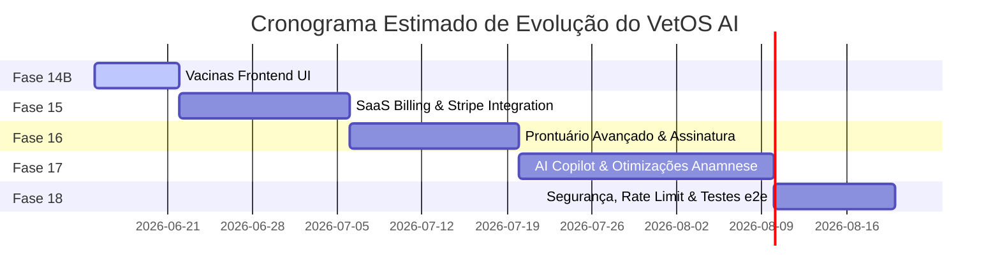

# Roadmap do Projeto — VetOS AI

Este documento detalha o planejamento das próximas etapas de evolução técnica e de negócios do **VetOS AI**. As fases propostas visam estabilizar a arquitetura SaaS, enriquecer a experiência do veterinário no atendimento e habilitar inteligência artificial para otimização operacional.

---

---

## Detalhamento das Próximas Fases

### Fase 14B — Interface de Gerenciamento de Vacinas (Frontend UI)
- **Objetivo**: Fornecer ao administrador da clínica visibilidade completa sobre o motor de lembretes automáticos de imunização.
- **Funcionalidades**:
  - Tela de monitoramento de lembretes futuros na fila do BullMQ (D0, D-1, D-7).
  - Capacidade de desativar ou forçar o disparo manual imediato de lembretes vacinais de um pet pelo frontend.
  - Painel de métricas dedicadas de conversão (vacinas notificadas vs. novas doses aplicadas).
- **Dependências**: Fase 14A (Concluída).

### Fase 15 — Faturamento SaaS & Controle de Limites (Billing)
- **Objetivo**: Monetizar a plataforma VetOS AI com planos recorrentes e aplicar travas automáticas para proteção de infraestrutura.
- **Funcionalidades**:
  - Integração do backend com gateways de pagamento (e.g. Stripe, Asaas) via webhooks.
  - Tela de checkout de plano e portal de faturamento para os tenants (clínicas).
  - Implementação de middlewares/guards no NestJS para bloquear operações quando a cota de uso do plano for atingida (bloqueio de criação de novos pets/membros de equipe/envios de e-mail).
- **Dependências**: Fase 2 e Fase 7.

### Fase 16 — Prontuário Avançado, Assinatura Digital e Uploads
- **Objetivo**: Elevar o nível de conformidade legal do prontuário veterinário e permitir o armazenamento de exames.
- **Funcionalidades**:
  - Layout limpo e responsivo para impressão física ou geração de PDF de prontuários, receitas médicas e termos de consentimento.
  - Integração com assinaturas digitais qualificadas (ICP-Brasil) para chancelar procedimentos e diagnósticos realizados.
  - Área de uploads de arquivos no prontuário (laudos de exames de sangue, imagens de raio-x, ultrassom) com limite de tamanho e validação rígida de formato de arquivo (MIME-types).
- **Dependências**: Fase 11.

### Fase 17 — IA Assistente (AI Copilot) & Otimizador de Consultas
- **Objetivo**: Trazer inteligência artificial generativa e preditiva para o ecossistema do VetOS AI.
- **Funcionalidades**:
  - **Copilot de Anamnese**: Sugestão de possíveis diagnósticos e exames complementares com base na inserção de sintomas e queixas do tutor no prontuário.
  - **Reengajamento por IA**: Geração e redação automatizada de mensagens de e-mail e WhatsApp contextuais e humanizadas para atrair clientes inativos e em atraso vacinal.
  - **Preditor de No-Show**: Modelo de regressão ou rede simples para analisar a probabilidade de um cliente faltar à consulta, sugerindo antecipação de lembretes ou overbooking controlado.
- **Dependências**: Fase 6, Fase 11, Fase 13.

### Fase 18 — Refinamento de Segurança, Infraestrutura e Testes e2e
- **Objetivo**: Sanar débitos técnicos, blindar a segurança da API e expandir a estabilidade da plataforma.
- **Funcionalidades**:
  - **Módulo Redis do NestJS**: Encapsular a conexão do `ioredis` na injeção de dependências do NestJS ao invés de usar importação direta em runtime.
  - **Rate Limiter (Throttler)**: Implementação de guards de limite de chamadas para todas as rotas da API, protegendo o sistema contra flood de e-mails/WhatsApp nos endpoints de teste.
  - **Refatoração do PetDetails**: Separar o grande componente `PetDetails.tsx` (36KB) em subcomponentes isolados e independentes.
  - **Testes e2e**: Implementar uma cobertura de testes de integração ponta a ponta com Playwright ou Cypress no frontend e backend simulando fluxos críticos de negócio.
