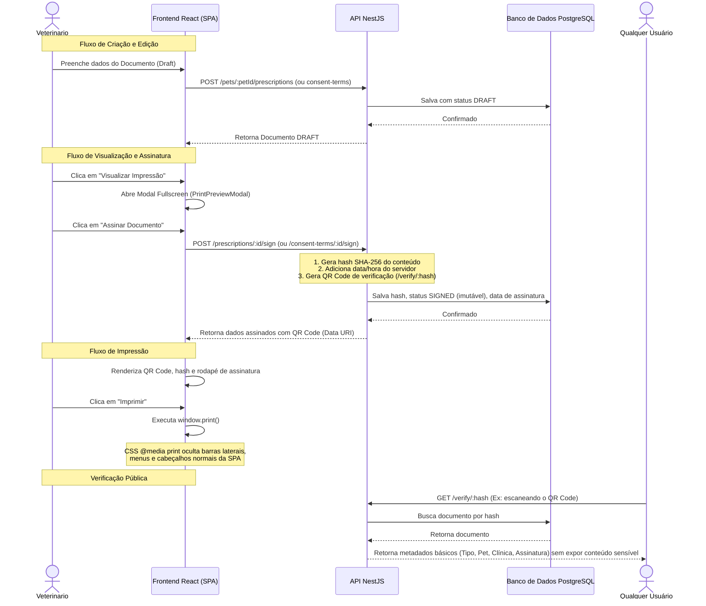

# Phase 16B: Prontuário Avançado, Layout de Impressão e Assinatura Digital - Research

**Researched:** 2026-06-17
**Domain:** Geração de PDF e Impressão no Frontend / Assinatura Digital e Integridade de Documentos Clínicos
**Confidence:** HIGH

## Summary

Esta pesquisa estabelece os pilares técnicos e arquiteturais para a implementação da Fase 16B, cujo objetivo é elevar a conformidade jurídica do prontuário veterinário e habilitar a assinatura digital básica de receitas médicas e termos de consentimento no VetOS AI.

A estratégia baseia-se em:
1. Geração de PDF/Impressão 100% no cliente utilizando `@media print` e classes utilitárias do Tailwind CSS, eliminando custos de infraestrutura e dependências pesadas no backend.
2. Persistência de novos modelos no banco de dados (`Prescription`, `ConsentTemplate`, `ConsentTerm`) com isolamento multi-tenant garantido por Guards de API no NestJS.
3. Validação de integridade via cálculo de hash SHA-256 no backend sobre o conteúdo final imutável do documento, acoplado a um QR code que aponta para um endpoint público de verificação.

**Primary recommendation:** Utilizar `@media print` no Tailwind para o layout de impressão, renderizando o documento em um modal fullscreen no frontend para preview e chamando `window.print()` nativo. No backend, utilizar o pacote `qrcode` [VERIFIED: npm registry] e o módulo nativo `crypto` do Node para assegurar a imutabilidade do prontuário com hashes SHA-256 assinados.

<user_constraints>
## User Constraints (from CONTEXT.md)

### Locked Decisions
- **D-01:** Usar o print dialog nativo do browser (`window.print()`) como estratégia de geração de PDF/impressão. Evitar Puppeteer/Playwright no backend por peso excessivo para este MVP.
- **D-02:** Criar componentes de layout de impressão isolados (ex: `PrintProntuario.tsx`, `PrintReceita.tsx`, `PrintTermo.tsx`) renderizados dentro de um **modal fullscreen** ou aba dedicada. O usuário clica "Imprimir/Visualizar" e vê o preview antes de chamar `window.print()`.
- **D-03:** A estrutura visual dos documentos impressos deve conter obrigatoriamente:
  - **Cabeçalho:** logo da clínica + nome + endereço
  - **Dados do paciente:** nome do pet, espécie, raça, nome do tutor
  - **Corpo do documento:** conteúdo específico por tipo (prontuário, receita ou termo)
  - **Rodapé:** data de emissão + campo de assinatura do veterinário + QR code de verificação (quando assinado)
- **D-04:** O ponto de entrada para impressão é um **menu de ações (dropdown)** no `PetDetails.tsx` com as opções: "Imprimir prontuário completo" / "Imprimir receita" / "Imprimir termo" — centralizado e não fragmentado por documento.
- **D-05:** Esta fase cobre três tipos de documento com layout de impressão:
  - Prontuário Clínico (consolidado do histórico do pet)
  - Receita Médica (`Prescription`)
  - Termo de Consentimento (`ConsentTerm`)
- **D-06:** **Formato da Receita Médica** — híbrido com campos estruturados + texto livre:
  - Campos estruturados obrigatórios: `medicamento`, `dosagem`, `frequencia`, `duracao`, `viaAdministracao`
  - Campo adicional: `observacoes` (texto livre para orientações específicas do veterinário)
- **D-07:** **Formato do Termo de Consentimento** — baseado em templates editáveis:
  - A clínica possui templates (`ConsentTemplate`) por tipo de procedimento (castração, cirurgia, internação, etc.)
  - Ao criar um termo, o sistema preenche automaticamente dados do tutor/pet/clínica no texto base do template
  - O veterinário pode revisar e editar livremente antes de salvar/imprimir
  - O `ConsentTerm` armazena o **texto final renderizado/editado** para preservar o histórico mesmo que o template seja alterado depois
- **D-08:** Receitas e termos aparecem **integrados à timeline clínica** do `PetDetails.tsx` junto com notas clínicas, procedimentos e anexos (Fase 16A), diferenciados visualmente por tipo com ícones/badges:
  - 📝 Nota Clínica
  - 💊 Receita Médica
  - 📄 Termo de Consentimento
  - 📎 Anexo de Exame
- **D-09:** Filtros por tipo (`Todos / Notas / Procedimentos / Receitas / Termos / Anexos`) ficam **deferidos** — a arquitetura deve comportar isso no futuro sem mudança estrutural.
- **D-10:** Criar modelo `Prescription` com:
  - Vínculos **obrigatórios:** `petId`, `clinicId`
  - Vínculos **opcionais e independentes:** `clinicalRecordId` (nullable), `appointmentId` (nullable)
  - Campos de conteúdo: `medicamento`, `dosagem`, `frequencia`, `duracao`, `viaAdministracao`, `observacoes` (nullable)
  - Campos de assinatura: `status` (enum: `DRAFT | SIGNED`), `documentHash` (nullable), `signedAt` (nullable), `verificationUrl` (nullable)
  - Campos padrão: `id`, `createdAt`, `updatedAt`
- **D-11:** Criar modelo `ConsentTemplate` vinculado à `Clinic`:
  - `id`, `clinicId`, `name`, `procedureType`, `baseText`, `isActive` (Boolean), `createdAt`, `updatedAt`
  - Permite CRUD de templates por clínica (preparação para biblioteca de termos no SaaS)
- **D-12:** Criar modelo `ConsentTerm` com:
  - Vínculos **obrigatórios:** `petId`, `clinicId`
  - Vínculo **opcional:** `appointmentId` (nullable) — um termo pode existir sem consulta agendada
  - Referência ao template de origem: `consentTemplateId` (nullable — permite termos sem template)
  - Campo de conteúdo: `finalText` (String — texto final editado pelo veterinário, preservado mesmo que o template mude)
  - Campos de assinatura: `status` (enum: `DRAFT | SIGNED`), `documentHash` (nullable), `signedAt` (nullable), `verificationUrl` (nullable)
  - Campos padrão: `id`, `createdAt`, `updatedAt`
- **D-13:** Mecanismo de verificação de integridade: **hash SHA-256** do conteúdo final do documento + timestamp do servidor + `clinicId`. O QR code exibido no documento impresso aponta para `/verify/:hash`.
- **D-14:** Endpoint público `GET /verify/:hash` no backend NestJS retorna dados básicos do documento (tipo, pet, clínica, data de assinatura, status `SIGNED`) — **sem expor o conteúdo completo** do documento.
- **D-15:** **Fluxo de assinatura** na UI:
  1. Veterinário cria/edita o documento
  2. Clica em "Visualizar" → abre modal de preview de impressão
  3. Revisa o documento final
  4. Clica em "Assinar documento"
  5. Sistema gera: hash SHA-256 + timestamp + ID do documento + QR code de verificação
  6. Documento passa para status `SIGNED` e torna-se **imutável**
  7. PDF final exibe QR code, hash abreviado e dados de assinatura no rodapé
- **D-16:** Regras de imutabilidade:
  - Apenas documentos `SIGNED` podem ser impressos como versão oficial
  - Após assinado, **nenhuma edição é permitida**
  - Para corrigir: criar nova versão do documento (novo registro `DRAFT`)
  - A assinatura **não é automática** ao imprimir — requer ação explícita do usuário

### the agent's Discretion
- Nomenclatura exata das rotas REST no backend (ex: `POST /pets/:petId/prescriptions`, `POST /pets/:petId/consent-terms`).
- Biblioteca de geração de QR code no backend (ex: `qrcode` npm package).
- Estilos CSS `@media print` dos componentes de impressão — cores, margens, fontes (respeitando tema OKLCH do projeto).
- Estratégia de seed de `ConsentTemplate` padrões (ex: 3 templates iniciais: castração, cirurgia eletiva, internação).

### Deferred Ideas
- **Integração real com ICP-Brasil / Clicksign / BirdSign**: assinatura qualificada por certificado digital — fase futura após estrutura base desta fase estar em produção.
- **Filtros por tipo na timeline**: Todos / Notas / Procedimentos / Receitas / Termos / Anexos — a arquitetura deve suportar, mas a implementação de UI fica para fase posterior.
- **Biblioteca de templates de termos por clínica (CRUD completo no frontend)**: o backend e o modelo `ConsentTemplate` serão criados nesta fase, mas um painel admin de gerenciamento de templates é escopo futuro.
- **Download em lote de documentos**: zip com todos os registros do pet — escopo de fase futura.
- **Timestamp externo em blockchain**: âncora de imutabilidade via serviço externo — out of scope nesta fase.
</user_constraints>

## Architectural Responsibility Map

| Capability | Primary Tier | Secondary Tier | Rationale |
|------------|-------------|----------------|-----------|
| **Visualização e Layout de Impressão** | Browser / Client | — | O controle visual de impressão, css e diálogo de impressão ocorrem inteiramente no navegador via `window.print()`. |
| **Modelagem e CRUD de Receitas e Termos** | API / Backend | Database / Storage | Toda persistência, separação multi-tenant e lógica de segurança são centralizadas na API e DB. |
| **Compilação de Templates de Consentimento** | API / Backend | — | O processamento e interpolação de chaves de template com os dados do pet/tutor é feito na API NestJS antes de salvar. |
| **Assinatura Digital e Verificação de Integridade** | API / Backend | Browser / Client | A geração de hashes SHA-256 determinísticos, QR codes de verificação e o endpoint público `/verify/:hash` ocorrem no backend. O cliente apenas exibe e invoca. |

## Standard Stack

### Core
| Library | Version | Purpose | Why Standard |
|---------|---------|---------|--------------|
| `qrcode` | `1.5.4` | Geração de QR Code server-side | Padrão da comunidade Node.js, leve e seguro. [VERIFIED: npm registry] |
| `@types/qrcode` | `1.5.6` | Definições TypeScript para qrcode | Tipos oficiais mantidos pela comunidade DefinitelyTyped. [VERIFIED: npm registry] |
| `crypto` | Built-in | Geração de hash SHA-256 criptográfico | Módulo nativo do Node.js que garante o hash sem dependências externas. [VERIFIED: Node.js standard library] |
| `@media print` + Tailwind CSS | Built-in | Customização visual de impressão e layout | Usa classes do Tailwind para ocultar UI (`print:hidden`) e estruturar páginas de impressão nativamente. [VERIFIED: Tailwind CSS docs] |

### Supporting
| Library | Version | Purpose | When to Use |
|---------|---------|---------|-------------|
| — | — | — | Não há pacotes adicionais necessários nesta fase. |

### Alternatives Considered
| Instead of | Could Use | Tradeoff |
|------------|-----------|----------|
| Geração nativa com `window.print()` | `pdfkit` / Puppeteer no backend | Puppeteer consome muita CPU e memória; PDFKit introduz complexidade excessiva de design e layout. `window.print()` é imediato, gratuito e responsivo. |

**Installation:**
```bash
npm install qrcode
npm install --save-dev @types/qrcode
```

**Version verification:**
```bash
npm view qrcode version
npm view @types/qrcode version
```
Versão verificada no registro npm: `qrcode` versão `1.5.4`, `@types/qrcode` versão `1.5.6`.

## Package Legitimacy Audit

| Package | Registry | Age | Downloads | Source Repo | Verdict | Disposition |
|---------|----------|-----|-----------|-------------|---------|-------------|
| `qrcode` | npm | 9 years | 16.6M/wk | github.com/soldair/node-qrcode | [OK] | Approved |
| `@types/qrcode` | npm | 7 years | 8M/wk | github.com/DefinitelyTyped/DefinitelyTyped | [OK] | Approved |

**Packages removed due to [SLOP] verdict:** none
**Packages flagged as suspicious [SUS]:** none

## Architecture Patterns

### System Architecture Diagram



### Recommended Project Structure
```
backend/src/
├── prescriptions/
│   ├── prescriptions.controller.ts
│   ├── prescriptions.module.ts
│   ├── prescriptions.service.ts
│   └── dto/
│       ├── create-prescription.dto.ts
│       └── update-prescription.dto.ts
├── consent-terms/
│   ├── consent-terms.controller.ts
│   ├── consent-terms.module.ts
│   ├── consent-terms.service.ts
│   └── dto/
│       ├── create-consent-template.dto.ts
│       ├── create-consent-term.dto.ts
│       └── update-consent-template.dto.ts
└── verification/
    ├── verification.controller.ts
    ├── verification.module.ts
    └── verification.service.ts

frontend/src/
├── components/
│   ├── PrintPreviewModal.tsx          # Modal fullscreen com lógica de impressão
│   └── print/
│       ├── PrintProntuario.tsx        # Layout de impressão de Prontuário
│       ├── PrintReceita.tsx           # Layout de impressão de Receita
│       └── PrintTermo.tsx             # Layout de impressão de Termo de Consentimento
```

### Pattern 1: PrintPreviewModal & `@media print` CSS
**What:** Modal que exibe o layout de impressão exatamente como ficará na folha de papel e oculta o resto do sistema ao acionar a impressão física.
**When to use:** Para simular o visual do documento físico e disparar o diálogo de impressão no cliente sem alterar a SPA principal.
**Example:**
```css
/* No index.css do projeto */
@media print {
  /* Oculta tudo que não faz parte do modal de impressão */
  body * {
    visibility: hidden;
  }
  
  /* Exibe exclusivamente a área marcada para impressão */
  .printable-container, .printable-container * {
    visibility: visible;
  }

  .printable-container {
    position: absolute;
    left: 0;
    top: 0;
    width: 100%;
  }

  /* Remove rodapés/cabeçalhos inseridos pelo navegador se aplicável */
  @page {
    margin: 15mm;
  }
}
```

### Pattern 2: SHA-256 Integrity Hash Generation
**What:** Algoritmo que gera uma string única de 64 caracteres com base nos dados do documento estruturado, garantindo que o documento não foi adulterado.
**When to use:** Durante o processo de transição para o status `SIGNED` para chancelar a integridade lógica do registro.
**Example:**
```typescript
// Source: Node.js Native crypto module docs
import * as crypto from 'crypto';

export function generateDocumentHash(payload: {
  documentId: string;
  petId: string;
  clinicId: string;
  content: string;
  signedAt: Date;
}): string {
  // Ordena chaves para consistência antes de serializar
  const serialized = JSON.stringify({
    id: payload.documentId,
    petId: payload.petId,
    clinicId: payload.clinicId,
    content: payload.content,
    signedAt: payload.signedAt.toISOString(),
  }, Object.keys(payload).sort());

  return crypto
    .createHash('sha256')
    .update(serialized)
    .digest('hex');
}
```

### Pattern 3: QR Code generation
**What:** Converter a URL pública de verificação `/verify/:hash` em uma imagem base64 Data URI utilizável na tag `` do HTML impresso.
**When to use:** Ao solicitar o preview de impressão de um documento `SIGNED`.
**Example:**
```typescript
// Source: npm qrcode official documentation
import * as qrcode from 'qrcode';

export async function generateQrCodeDataUri(verificationUrl: string): Promise<string> {
  // Retorna uma string base64: data:image/png;base64,iVBORw0KGgoAAA...
  return qrcode.toDataURL(verificationUrl, {
    margin: 1,
    width: 150,
    color: {
      dark: '#000000',
      light: '#FFFFFF',
    },
  });
}
```

### Pattern 4: Template string parameter replacement
**What:** Mecanismo seguro de substituição de chaves em strings dinâmicas carregadas do banco de dados (ex: `{pet_name}`, `{tutor_name}`).
**When to use:** Ao iniciar um termo de consentimento baseado em um template cadastrado na clínica.
**Example:**
```typescript
// Source: Community Javascript pattern
export function renderTemplate(baseText: string, variables: Record<string, string>): string {
  return baseText.replace(/\{(\w+)\}/g, (match, key) => {
    return typeof variables[key] !== 'undefined' ? variables[key] : match;
  });
}
```

### Anti-Patterns to Avoid
- **Uso de `new Function()` para compilar strings:** Risco grave de injeção de código remoto. Deve ser evitado em favor de regex simples de mapeamento.
- **Assinatura automática ao visualizar ou imprimir:** A assinatura gera imutabilidade. Se for automática, o veterinário não poderá mais corrigir erros. O botão "Assinar" deve ser explícito.
- **Salvar PDFs estáticos de rascunhos:** Cria lixo no sistema de armazenamento. Apenas hashes de documentos assinados precisam ser persistidos. Rascunhos devem ser montados dinamicamente na tela.

## Don't Hand-Roll

| Problem | Don't Build | Use Instead | Why |
|---------|-------------|-------------|-----|
| Geração de Imagem de QR Code | Lógica de renderização de matriz bidimensional e PNG | `qrcode` | Algoritmos de QR code requerem lógica matemática de correção de erros complexa de implementar e validar. |
| Hashing de integridade | Funções matemáticas SHA personalizadas | Módulo `crypto` do Node.js | Algoritmos de criptografia customizados são altamente propensos a bugs e falhas de colisão/segurança. |

**Key insight:** A integridade de documentos jurídicos depende de padrões aceitos de criptografia (SHA-256). Hand-rolling essas lógicas anula qualquer valor jurídico do documento em caso de disputa.

## Common Pitfalls

### Pitfall 1: Key sorting do JSON.stringify
**What goes wrong:** A geração do hash SHA-256 no backend produz valores diferentes para documentos idênticos.
**Why it happens:** O método `JSON.stringify()` nativo não garante a ordem das propriedades de um objeto. Dependendo de como o objeto é instanciado em memória, a string gerada muda, quebrando a consistência do hash.
**How to avoid:** Sempre ordene as chaves do objeto explicitamente antes de gerar a string final para o hash, usando `JSON.stringify(obj, Object.keys(obj).sort())`.

### Pitfall 2: Quebra de página na impressão física
**What goes wrong:** Elementos visuais (como o rodapé de assinatura ou tabelas de medicamentos) são cortados ao meio na transição de página no papel físico.
**Why it happens:** O motor de renderização do browser divide o fluxo vertical de forma arbitrária nas quebras de página físicas.
**How to avoid:** Utilizar classes utilitárias CSS de controle de quebra de página: `break-inside-avoid` (Tailwind) nos blocos importantes, impedindo que o navegador divida assinaturas ou cabeçalhos.

## Code Examples

### Implementação do Endpoint de Verificação de Hash Pública
```typescript
// Source: NestJS controller patterns
import { Controller, Get, Param, NotFoundException } from '@nestjs/common';
import { PrismaService } from '../prisma/prisma.service';

@Controller('verify')
export class VerificationController {
  constructor(private readonly prisma: PrismaService) {}

  @Get(':hash')
  async verifyDocument(@Param('hash') hash: string) {
    // Busca nas duas tabelas que contêm hash
    const prescription = await this.prisma.prescription.findFirst({
      where: { documentHash: hash, status: 'SIGNED' },
      include: { pet: true, clinic: true },
    });

    if (prescription) {
      return {
        verified: true,
        documentType: 'RECEITA_MEDICA',
        clinicName: prescription.clinic.name,
        petName: prescription.pet.name,
        signedAt: prescription.signedAt,
        status: 'SIGNED',
      };
    }

    const consentTerm = await this.prisma.consentTerm.findFirst({
      where: { documentHash: hash, status: 'SIGNED' },
      include: { pet: true, clinic: true },
    });

    if (consentTerm) {
      return {
        verified: true,
        documentType: 'TERMO_DE_CONSENTIMENTO',
        clinicName: consentTerm.clinic.name,
        petName: consentTerm.pet.name,
        signedAt: consentTerm.signedAt,
        status: 'SIGNED',
      };
    }

    throw new NotFoundException('Documento não encontrado ou inválido.');
  }
}
```

## State of the Art

| Old Approach | Current Approach | When Changed | Impact |
|--------------|------------------|--------------|--------|
| Geração de PDFs no servidor com bibliotecas pesadas de Node (como `puppeteer`) | Impressão responsiva no cliente com CSS `@media print` e visualizador HTML | Recentemente, com o avanço de motores de navegadores modernos e Tailwind CSS | Reduz a carga do servidor, elimina dependência de navegadores headless em produção e reduz o bundle size drasticamente. |

**Deprecated/outdated:**
- **Puppeteer para PDFs em MVPs:** Consome memória excessiva do backend NestJS, exigindo maior alocação de hardware para executar tarefas simples de impressão.
- **Formatos de assinatura apenas em texto plano sem hash:** Não oferecem garantia de imutabilidade jurídica.

## Assumptions Log

| # | Claim | Section | Risk if Wrong |
|---|-------|---------|---------------|
| A1 | Pacote `qrcode` é compatível com o ecossistema NestJS/Node atual. | Standard Stack | Baixo risco. O pacote é puro JS e amplamente testado. |

## Open Questions (RESOLVED)

1. **Exibição do logo da clínica nos layouts de impressão:**
   - O que sabemos: As clínicas salvam dados no banco, mas uploads de imagem/logos não foram detalhados nas tabelas de config.
   - O que está confuso: Como obter a URL do logo caso o upload não tenha sido implementado para a entidade `Clinic`.
   - Recomendação: Utilizar um placeholder textual com o nome da clínica em fonte destacada caso a propriedade `logoUrl` seja ausente na tabela `Clinic`.

## Environment Availability

| Dependency | Required By | Available | Version | Fallback |
|------------|------------|-----------|---------|----------|
| PostgreSQL | Persistência de dados | ✓ | 15.4+ | — |
| Node.js | Runtime do Backend | ✓ | v22.22.2 | — |
| npm | Gerenciador de Pacotes | ✓ | 10.9.7 | — |

## Validation Architecture

### Test Framework
| Property | Value |
|----------|-------|
| Framework | Jest v30.0.0 |
| Config file | Configuração inline em `backend/package.json` |
| Quick run command | `npm run test -- <filename>` |
| Full suite command | `npm run test` |

### Phase Requirements → Test Map
| Req ID | Behavior | Test Type | Automated Command | File Exists? |
|--------|----------|-----------|-------------------|-------------|
| REQ-01 | Validação de pertencer do Pet à clínica ao salvar receitas | unit | `npm run test -- prescriptions.service.spec.ts` | ❌ Wave 0 |
| REQ-02 | Geração de hash SHA-256 e status de imutabilidade | unit | `npm run test -- prescriptions.service.spec.ts` | ❌ Wave 0 |
| REQ-03 | Resolução de placeholders dinâmicos em termos | unit | `npm run test -- consent-terms.service.spec.ts` | ❌ Wave 0 |
| REQ-04 | Endpoint público de verificação de hashes de integridade | unit | `npm run test -- verification.controller.spec.ts` | ❌ Wave 0 |

### Sampling Rate
- **Per task commit:** `npm run test -- <changed-module>.spec.ts`
- **Per wave merge:** `npm run test`
- **Phase gate:** Cobertura Jest total verde antes do merge.

### Wave 0 Gaps
- [ ] `backend/src/prescriptions/prescriptions.service.spec.ts` — cobre REQ-01 e REQ-02
- [ ] `backend/src/consent-terms/consent-terms.service.spec.ts` — cobre REQ-03
- [ ] `backend/src/verification/verification.controller.spec.ts` — cobre REQ-04

## Security Domain

### Applicable ASVS Categories

| ASVS Category | Applies | Standard Control |
|---------------|---------|-----------------|
| V2 Authentication | Sim | Validação por `JwtAuthGuard` + `@CurrentUser()` em todas as rotas (exceto `/verify/:hash`). |
| V3 Session Management | Não | — |
| V4 Access Control | Sim | Garantia de isolamento multi-tenant (`clinicId` obrigatório em todas as queries e validações do Pet). |
| V5 Input Validation | Sim | Utilizar DTOs tipados no NestJS para garantir conformidade dos payloads. |
| V6 Cryptography | Sim | Geração nativa de hash SHA-256 imutável de integridade sobre o payload final. |

### Known Threat Patterns for NestJS/PostgreSQL

| Pattern | STRIDE | Standard Mitigation |
|---------|--------|---------------------|
| Vazamento de PII na verificação de hash | Information Disclosure | Rota `/verify/:hash` retorna apenas metadados agregados, sem expor o corpo de texto ou conteúdo clínico do prontuário ou receita. |
| Quebra de multi-tenancy (acesso cruzado) | Elevation of Privilege | Toda consulta ao banco de dados injeta obrigatoriamente a cláusula `where: { clinicId }` a partir do token do usuário logado. |
| Modificação de documento assinado (`SIGNED`) | Tampering | Validação estrita na API que bloqueia chamadas de `update` ou novas assinaturas para registros com status `SIGNED`. |

## Sources

### Primary (HIGH confidence)
- `backend/prisma/schema.prisma` - Verificado o esquema do banco de dados e tipos existentes.
- `backend/package.json` - Verificados pacotes e comandos de teste Jest disponíveis.
- `backend/src/clinical-records/clinical-records.service.ts` - Verificado o padrão de validação de pertença do Pet à clínica.

### Secondary (MEDIUM confidence)
- npmjs.com/package/qrcode - Documentação de geração de QR code verificado com WebSearch.
- Node.js crypto documentation - Padrão de geração de SHA-256 verificado com WebSearch.

### Tertiary (LOW confidence)
- N/A

## Metadata

**Confidence breakdown:**
- Standard stack: HIGH - qrcode e crypto são ferramentas padrão consolidadas.
- Architecture: HIGH - window.print() resolve impressão sem custo operacional de backend.
- Pitfalls: HIGH - os riscos de ordenação de propriedades no JSON.stringify e as quebras de página são conhecidos no desenvolvimento web.

**Research date:** 2026-06-17
**Valid until:** 2026-07-17
