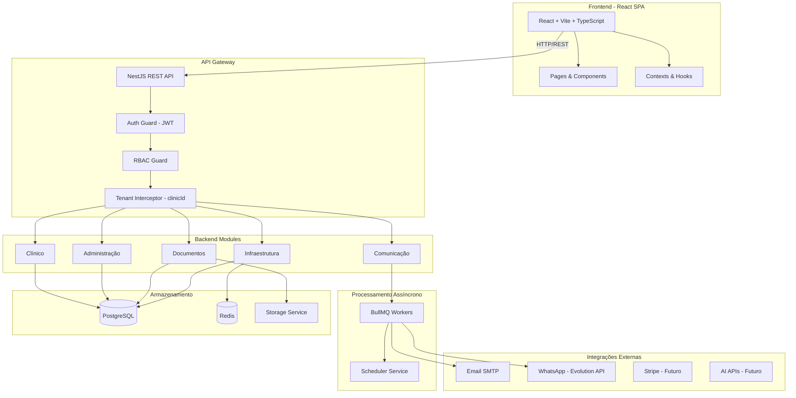
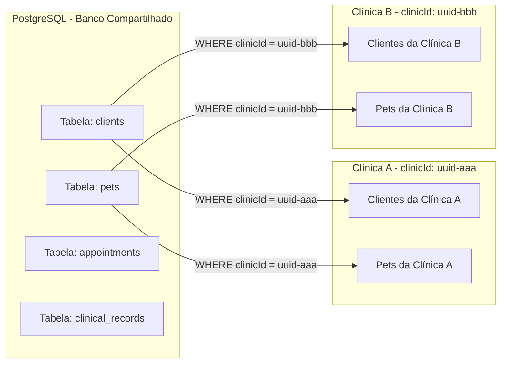
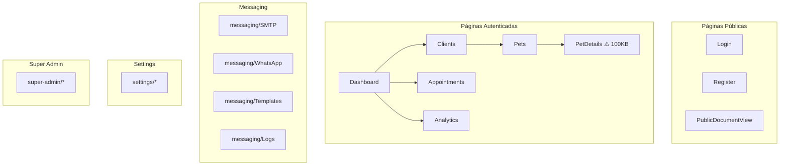
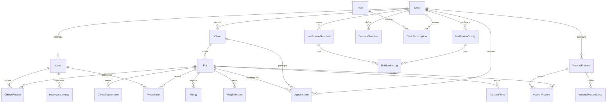
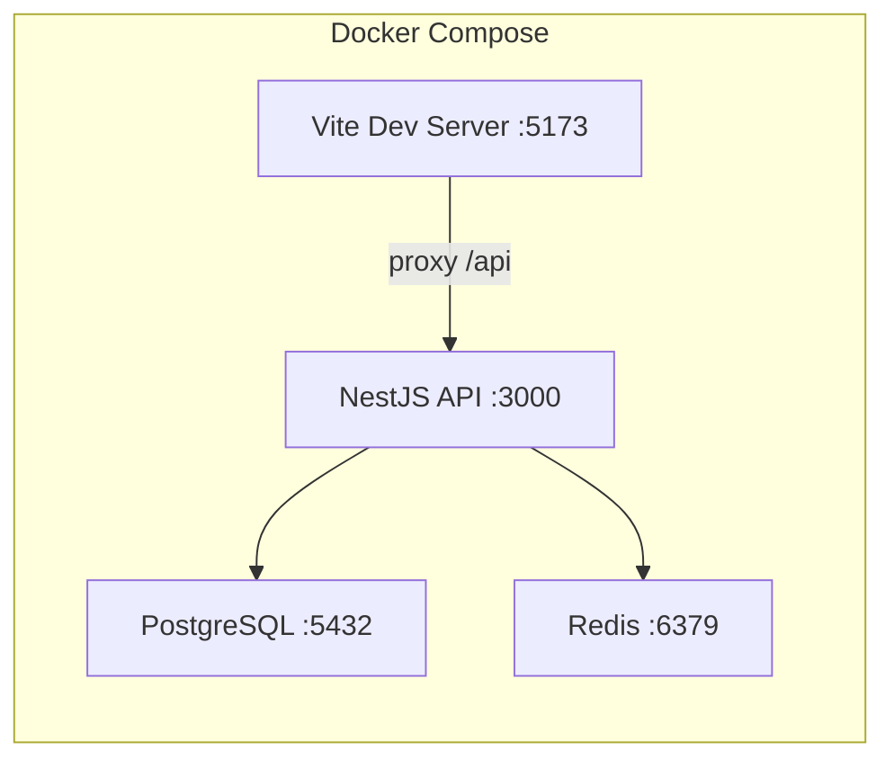
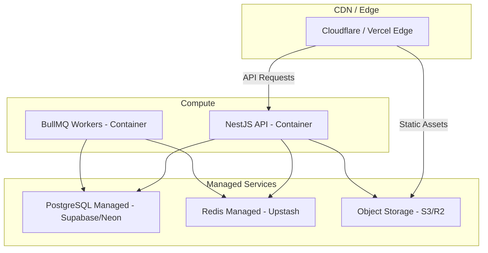
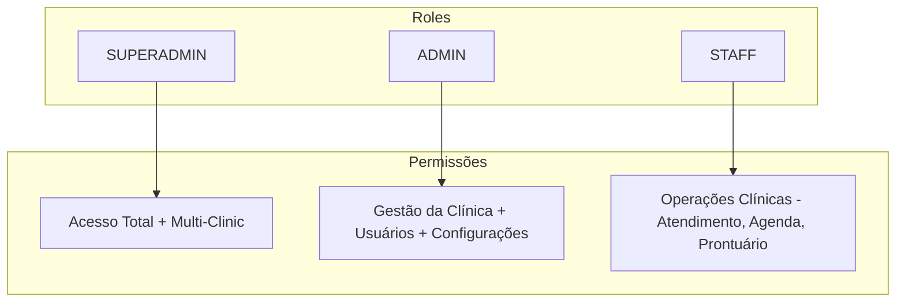
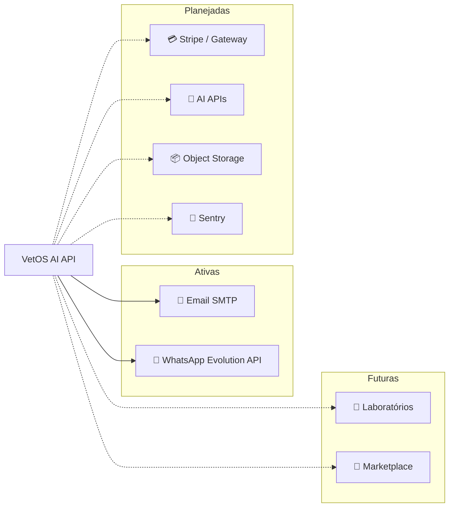
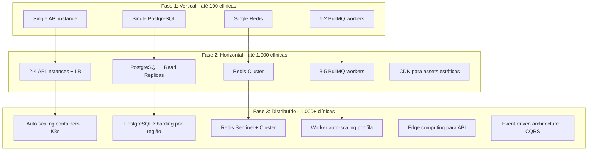

# VetOS AI — Arquitetura Técnica

> **Versão:** 1.0  
> **Data:** 2026-06-26  
> **Status:** Ativo  
> **Classificação:** Estratégico — Técnico & Stakeholders

---

## 1. Visão Geral do Sistema

O VetOS AI é uma plataforma SaaS multi-tenant para gestão veterinária, arquitetada como um **monorepo** com separação clara entre backend (API REST) e frontend (SPA). A arquitetura prioriza isolamento de dados por clínica, processamento assíncrono de tarefas e extensibilidade para futuras integrações de IA.

### 1.1 Diagrama de Arquitetura



---

## 2. Stack Tecnológica

### 2.1 Backend

| Camada | Tecnologia | Versão | Propósito |
|---|---|---|---|
| **Runtime** | Node.js | 20 LTS | Ambiente de execução |
| **Framework** | NestJS | 10.x | Framework modular com DI, guards e interceptors |
| **ORM** | Prisma | 5.x | Type-safe database access, migrations, schema-first |
| **Banco de Dados** | PostgreSQL | 15+ | Armazenamento relacional primário |
| **Cache / Queue Broker** | Redis | 7.x | Cache, sessões, broker para BullMQ |
| **Filas** | BullMQ | 5.x | Processamento assíncrono de jobs (notificações, scheduler) |
| **Autenticação** | JWT | — | Tokens de acesso e refresh |
| **Validação** | class-validator / class-transformer | — | DTOs com validação declarativa |
| **Criptografia** | @nestjs/crypto / custom | — | Criptografia de dados sensíveis |

### 2.2 Frontend

| Camada | Tecnologia | Versão | Propósito |
|---|---|---|---|
| **Framework** | React | 18.x | Biblioteca de UI declarativa |
| **Build Tool** | Vite | 5.x | Build rápido com HMR |
| **Linguagem** | TypeScript | 5.x | Tipagem estática |
| **Roteamento** | React Router | 6.x | SPA routing com layouts aninhados |
| **Estado** | React Context + Hooks | — | Gerenciamento de estado local e global |
| **HTTP Client** | Axios / Fetch | — | Comunicação com a API |
| **Estilização** | CSS Modules / Tailwind | — | Estilos componentizados |

### 2.3 Infraestrutura

| Componente | Tecnologia | Propósito |
|---|---|---|
| **Containerização** | Docker + Docker Compose | Ambiente de desenvolvimento e deploy |
| **CI/CD** | GitHub Actions (planejado) | Pipeline de build, test e deploy |
| **Monitoramento** | A definir | Logs, métricas e alertas |
| **Storage** | Local / S3 (planejado) | Armazenamento de arquivos e anexos clínicos |

---

## 3. Estratégia de Isolamento Multi-Tenant

### 3.1 Modelo: Shared Database, Row-Level Isolation

O VetOS AI utiliza um modelo de **banco de dados compartilhado com isolamento em nível de linha (row-level)**. Cada entidade de negócio contém um campo `clinicId` que garante a segregação de dados entre clínicas.



### 3.2 Mecanismos de Enforcement

| Camada | Mecanismo | Descrição |
|---|---|---|
| **API Gateway** | Tenant Interceptor | Extrai `clinicId` do JWT e injeta automaticamente nas queries |
| **ORM (Prisma)** | Query Scoping | Todas as queries de leitura/escrita incluem `WHERE clinicId = ?` |
| **Guards** | RBAC + Tenant Validation | Verifica se o usuário pertence à clínica acessada |
| **Database** | Foreign Keys | `clinicId` como FK obrigatória em todas as tabelas de negócio |

### 3.3 Exceções ao Isolamento

| Entidade | Motivo |
|---|---|
| `Clinic` | Entidade raiz — não pertence a outra clínica |
| `Plan` | Planos de assinatura são globais |
| `User` (SUPERADMIN) | Superadmins acessam múltiplas clínicas via impersonation |
| `ImpersonationLog` | Auditoria de acessos cross-tenant |

---

## 4. Mapa de Módulos Backend (NestJS)

### 4.1 Módulos por Domínio

```mermaid
graph TB
    subgraph "🏗️ Infraestrutura"
        PRISMA["prisma"]
        ENCRYPTION["encryption"]
        STORAGE["storage"]
        SCHEDULER["scheduler"]
        VERIFICATION["verification"]
    end

    subgraph "🔐 Autenticação & Autorização"
        AUTH["auth"]
        USERS["users"]
        CLINICS["clinics"]
    end

    subgraph "🏥 Domínio Clínico"
        CLIENTS["clients"]
        PETS["pets"]
        APPOINTMENTS["appointments"]
        CLINICAL_RECORDS["clinical-records"]
        CLINICAL_ATTACHMENTS["clinical-attachments"]
        ALLERGIES["allergies"]
        VACCINES["vaccines"]
        WEIGHT["weight-records"]
    end

    subgraph "📄 Documentos"
        PRESCRIPTIONS["prescriptions"]
        CONSENT["consent-terms"]
    end

    subgraph "📢 Comunicação"
        NOTIFICATIONS["notifications"]
    end

    subgraph "📊 Inteligência"
        DASHBOARD["dashboard"]
        ANALYTICS["analytics"]
    end

    AUTH --> PRISMA
    CLIENTS --> PRISMA
    PETS --> PRISMA
    APPOINTMENTS --> PRISMA
    CLINICAL_RECORDS --> PRISMA
    PRESCRIPTIONS --> ENCRYPTION
    CONSENT --> VERIFICATION
    NOTIFICATIONS --> SCHEDULER
    DASHBOARD --> PRISMA
    ANALYTICS --> PRISMA
    CLINICAL_ATTACHMENTS --> STORAGE
```



### 4.2 Responsabilidades por Módulo

| Módulo | Responsabilidade | Endpoints Principais |
|---|---|---|
| **auth** | Login, registro, JWT, refresh tokens, guards | `POST /auth/login`, `POST /auth/register` |
| **prisma** | Serviço singleton do Prisma Client | — (service interno) |
| **clinics** | CRUD de clínicas, configurações | `GET/POST/PATCH /clinics` |
| **users** | Gestão de usuários, perfis, roles | `GET/POST/PATCH /users` |
| **clients** | Cadastro de tutores (clientes da clínica) | `GET/POST/PATCH/DELETE /clients` |
| **pets** | Cadastro de animais, vínculo com tutores | `GET/POST/PATCH/DELETE /pets` |
| **appointments** | Agenda de consultas, status, filtros | `GET/POST/PATCH /appointments` |
| **clinical-records** | Prontuário eletrônico, registros clínicos | `GET/POST /clinical-records` |
| **clinical-attachments** | Upload e gestão de anexos clínicos | `POST/GET /clinical-attachments` |
| **allergies** | Registro de alergias por pet | `GET/POST/DELETE /allergies` |
| **vaccines** | Registros vacinais, protocolos, doses | `GET/POST /vaccines` |
| **weight-records** | Histórico de peso por pet | `GET/POST /weight-records` |
| **prescriptions** | Prescrições digitais com assinatura | `GET/POST /prescriptions` |
| **consent-terms** | Termos de consentimento, templates, aceite | `GET/POST /consent-terms` |
| **notifications** | Envio multicanal (email, WhatsApp), templates, logs | `GET/POST /notifications` |
| **scheduler** | BullMQ workers, jobs agendados | — (service interno) |
| **dashboard** | Dados agregados para dashboard principal | `GET /dashboard` |
| **analytics** | Métricas avançadas e relatórios | `GET /analytics` |
| **verification** | Verificação de links públicos (documentos) | `GET /verification` |
| **encryption** | Criptografia de dados sensíveis | — (service interno) |
| **storage** | Upload e gestão de arquivos | — (service interno) |

---

## 5. Estrutura Frontend

### 5.1 Mapa de Páginas



### 5.2 Componentes Críticos

| Componente / Página | Tamanho | Observações |
|---|---|---|
| **PetDetails** | ~100KB | ⚠️ Monolito — candidato a decomposição. Contém timeline clínica, alergias, vacinas, peso, prescrições, termos de consentimento em uma única página |
| **Dashboard** | Médio | Widgets de resumo, atividades recentes, métricas rápidas |
| **Appointments** | Médio | Calendário interativo com drag-and-drop |
| **Analytics** | Médio | Gráficos e relatórios com filtros temporais |

### 5.3 Contexts e Estado Global

| Context | Propósito |
|---|---|
| **AuthContext** | Estado de autenticação, token JWT, dados do usuário |
| **ClinicContext** | Dados da clínica ativa, configurações |
| **NotificationContext** | Estado de notificações da UI |
| **ThemeContext** | Tema visual (claro/escuro) |

---

## 6. Schema do Banco de Dados

### 6.1 Diagrama de Entidade-Relacionamento



### 6.2 Entidades Principais

| Entidade | Campos-Chave | Propósito |
|---|---|---|
| **Clinic** | `id`, `name`, `document`, `email`, `phone`, `address` | Tenant raiz — cada clínica é um tenant isolado |
| **User** | `id`, `clinicId`, `email`, `role`, `passwordHash` | Usuários do sistema (ADMIN, STAFF, SUPERADMIN) |
| **Client** | `id`, `clinicId`, `name`, `email`, `phone`, `document` | Tutores dos animais (clientes da clínica) |
| **Pet** | `id`, `clinicId`, `clientId`, `name`, `species`, `breed`, `birthDate`, `weight` | Animais / pacientes |
| **Appointment** | `id`, `clinicId`, `petId`, `clientId`, `userId`, `dateTime`, `status`, `type` | Consultas e atendimentos agendados |
| **ClinicalRecord** | `id`, `clinicId`, `petId`, `userId`, `type`, `content`, `date` | Registros do prontuário eletrônico |
| **ClinicalAttachment** | `id`, `clinicId`, `petId`, `fileName`, `filePath`, `mimeType` | Anexos de exames, imagens, documentos |
| **Allergy** | `id`, `clinicId`, `petId`, `substance`, `severity`, `notes` | Registro de alergias do animal |
| **VaccineRecord** | `id`, `clinicId`, `petId`, `protocolId`, `vaccine`, `date`, `batch` | Vacinas administradas |
| **VaccineProtocol** | `id`, `clinicId`, `name`, `species`, `description` | Protocolos vacinais configuráveis por clínica |
| **VaccineProtocolDose** | `id`, `protocolId`, `doseNumber`, `intervalDays`, `vaccine` | Doses de um protocolo vacinal |
| **WeightRecord** | `id`, `clinicId`, `petId`, `weight`, `date` | Histórico de pesagens |
| **Prescription** | `id`, `clinicId`, `petId`, `userId`, `content`, `signature`, `signedAt` | Prescrições digitais com assinatura |
| **ConsentTemplate** | `id`, `clinicId`, `title`, `content`, `type` | Templates de termos de consentimento |
| **ConsentTerm** | `id`, `clinicId`, `petId`, `templateId`, `status`, `tutorSignature`, `signedAt` | Termos gerados e assinados |
| **NotificationConfig** | `id`, `clinicId`, `channel`, `provider`, `credentials` | Configuração de canais de notificação por clínica |
| **NotificationTemplate** | `id`, `clinicId`, `channel`, `type`, `subject`, `body` | Templates de mensagens (email, WhatsApp) |
| **NotificationLog** | `id`, `clinicId`, `configId`, `templateId`, `recipient`, `status`, `sentAt` | Log de envios de notificação |
| **Plan** | `id`, `name`, `price`, `features`, `limits` | Planos de assinatura disponíveis |
| **ClinicSubscription** | `id`, `clinicId`, `planId`, `status`, `expiresAt` | Assinatura ativa de cada clínica |
| **ImpersonationLog** | `id`, `userId`, `targetClinicId`, `action`, `timestamp` | Auditoria de acessos SUPERADMIN |

---

## 7. Infraestrutura

### 7.1 Ambiente de Desenvolvimento



### 7.2 Componentes de Infraestrutura

| Componente | Porta | Propósito | Persistência |
|---|---|---|---|
| **PostgreSQL** | 5432 | Banco relacional primário | Volume Docker (`pgdata`) |
| **Redis** | 6379 | Cache, sessões, broker BullMQ | Volátil (sem AOF em dev) |
| **NestJS API** | 3000 | Backend REST API | — |
| **Vite Dev Server** | 5173 | Frontend com HMR | — |

### 7.3 Filas BullMQ

| Fila | Propósito | Workers | Prioridade |
|---|---|---|---|
| **email-notifications** | Envio de emails via SMTP | 1-3 | Normal |
| **whatsapp-notifications** | Envio de mensagens via Evolution API | 1-2 | Normal |
| **vaccine-scheduler** | Processamento de protocolos vacinais | 1 | Alta |
| **general-scheduler** | Jobs genéricos agendados | 1 | Baixa |

### 7.4 Arquitetura de Deploy (Planejado)



---

## 8. Modelo de Segurança

### 8.1 Autenticação

| Aspecto | Implementação |
|---|---|
| **Método** | JWT (JSON Web Tokens) |
| **Access Token** | Curta duração (~15 min), contém `userId`, `clinicId`, `role` |
| **Refresh Token** | Longa duração (~7 dias), rotação automática |
| **Hash de Senha** | bcrypt com salt rounds configurável |
| **Registro** | Criação simultânea de User + Clinic (auto-onboarding) |

### 8.2 Autorização (RBAC)



| Role | Escopo | Capacidades |
|---|---|---|
| **SUPERADMIN** | Global (todas as clínicas) | Impersonation, gestão de planos, acesso a qualquer clínica, auditoria |
| **ADMIN** | Clínica específica | Gestão de usuários, configurações, notificações, templates, analytics |
| **STAFF** | Clínica específica | Atendimento, agenda, prontuário, prescrições — sem acesso administrativo |

### 8.3 Criptografia e Proteção de Dados

| Camada | Mecanismo | Status |
|---|---|---|
| **Transporte** | HTTPS / TLS 1.3 | ✅ (produção) |
| **Dados sensíveis** | Criptografia AES-256 via módulo `encryption` | ✅ |
| **Senhas** | bcrypt hash | ✅ |
| **Assinaturas digitais** | Hash + timestamp para prescrições e termos | ✅ |
| **Chave de criptografia** | ⚠️ Variável de ambiente (efêmera) | ⚠️ Vulnerável |
| **Logs de auditoria** | ImpersonationLog para acessos SUPERADMIN | ✅ |

### 8.4 Conformidade

| Requisito | Status | Notas |
|---|---|---|
| **LGPD** | 🟡 Parcial | Isolamento de dados OK, falta: consentimento explícito, direito ao esquecimento, DPO |
| **CFMV** | 🟡 Parcial | Prontuário eletrônico OK, falta: assinatura digital com certificado ICP-Brasil |
| **PCI-DSS** | 🔲 Não aplicável | Pagamentos delegados a gateway (não armazena dados de cartão) |

---

## 9. Pontos de Integração

### 9.1 Integrações Ativas

| Integração | Protocolo | Módulo | Status |
|---|---|---|---|
| **Email SMTP** | SMTP (TLS) | `notifications` | ✅ Ativo |
| **WhatsApp Evolution API** | REST HTTP | `notifications` | ✅ Ativo |

### 9.2 Integrações Planejadas

| Integração | Protocolo | Propósito | Prioridade |
|---|---|---|---|
| **Stripe** | REST + Webhooks | Pagamentos e assinaturas | 🔴 Alta |
| **Pagar.me / Asaas** | REST + Webhooks | Gateway nacional alternativo | 🟡 Média |
| **OpenAI / Anthropic API** | REST | IA para diagnóstico e prescrições | 🟡 Média |
| **AWS S3 / Cloudflare R2** | S3 API | Storage de arquivos e anexos | 🔴 Alta |
| **Sentry** | SDK | Monitoramento de erros | 🔴 Alta |
| **Datadog / Grafana** | Agent / SDK | Observabilidade e métricas | 🟡 Média |
| **Laboratórios (futura)** | HL7/FHIR ou REST | Resultados de exames | 🟢 Futura |

### 9.3 Diagrama de Integrações



---

## 10. Dívida Técnica

### 10.1 Inventário de Débitos

| ID | Severidade | Área | Débito | Impacto | Esforço |
|---|---|---|---|---|---|
| **TD-001** | 🔴 Crítico | Security | **Chave de criptografia efêmera** — armazenada em variável de ambiente sem rotação ou KMS | Dados criptografados podem ser perdidos em redeploy; sem rotação de chaves | Médio |
| **TD-002** | 🔴 Crítico | Security | **Sem rate limiting** — nenhum middleware de rate limiting na API | Vulnerável a ataques de força bruta e DDoS | Baixo |
| **TD-003** | 🔴 Crítico | Quality | **Sem testes e2e** — nenhum teste end-to-end implementado | Regressões não detectadas, deploy arriscado | Alto |
| **TD-004** | 🟡 Alto | Frontend | **PetDetails monolito (100KB)** — página única com toda a lógica de detalhes do pet | Performance ruim, manutenibilidade comprometida, bundle size | Médio |
| **TD-005** | 🟡 Alto | Infra | **Sem módulo wrapper para Redis** — acesso direto sem abstração NestJS | Acoplamento, sem circuit breaker, difícil de mockar em testes | Baixo |
| **TD-006** | 🟡 Alto | Observability | **Sem monitoramento estruturado** — sem Sentry, sem métricas, sem alertas | Incidentes não detectados, debugging em produção | Médio |
| **TD-007** | 🟡 Médio | Backend | **Sem health checks** — nenhum endpoint de health/readiness | Orquestradores não conseguem verificar saúde da aplicação | Baixo |
| **TD-008** | 🟡 Médio | Backend | **Sem API versioning** — nenhuma estratégia de versionamento de API | Breaking changes afetam todos os clientes | Baixo |
| **TD-009** | 🟢 Baixo | Docs | **Sem documentação de API** — sem Swagger/OpenAPI | Integradores não têm referência, onboarding lento | Médio |
| **TD-010** | 🟢 Baixo | Frontend | **Sem lazy loading de rotas** — todas as rotas carregadas no bundle inicial | Bundle size elevado, TTI maior que necessário | Baixo |

### 10.2 Plano de Remediação Sugerido

```
Prioridade Imediata (Sprint 1-2):
├── TD-002: Rate limiting (helmet + express-rate-limit)
├── TD-007: Health checks (/health, /readiness)
├── TD-005: Redis module wrapper com NestJS

Prioridade Alta (Sprint 3-4):
├── TD-001: Migrar para KMS ou Vault para chaves de criptografia
├── TD-006: Integrar Sentry + structured logging
├── TD-004: Decompor PetDetails em sub-componentes

Prioridade Média (Sprint 5-8):
├── TD-003: Framework de testes e2e (Playwright / Cypress)
├── TD-008: API versioning strategy (URL prefix /v1/)
├── TD-009: Swagger/OpenAPI via @nestjs/swagger
├── TD-010: React.lazy() + Suspense para rotas
```

---

## 11. Considerações de Escalabilidade

### 11.1 Gargalos Identificados

| Componente | Gargalo | Limiar | Mitigação |
|---|---|---|---|
| **PostgreSQL** | Queries N+1 em listagens | ~100 clínicas | Eager loading, índices compostos, caching |
| **Redis** | Single instance sem cluster | ~10K conexões | Redis Cluster ou managed Redis |
| **BullMQ Workers** | Single process | ~1K jobs/min | Horizontal scaling de workers |
| **API** | Single instance sem LB | ~500 req/s | Container orchestration + load balancer |
| **Frontend Bundle** | PetDetails 100KB monolith | N/A | Code splitting + lazy loading |

### 11.2 Estratégia de Escala



### 11.3 Índices de Banco Recomendados

| Tabela | Índice | Tipo | Justificativa |
|---|---|---|---|
| Todas com `clinicId` | `idx_{table}_clinic_id` | B-tree | Isolamento multi-tenant |
| `appointments` | `idx_appointments_clinic_date` | B-tree composto | Consultas por período |
| `clinical_records` | `idx_clinical_records_pet_date` | B-tree composto | Timeline do paciente |
| `notification_logs` | `idx_notification_logs_clinic_status` | B-tree composto | Filtro de logs por status |
| `vaccine_records` | `idx_vaccine_records_pet_date` | B-tree composto | Histórico vacinal |
| `pets` | `idx_pets_client_id` | B-tree | Listagem por tutor |

### 11.4 Caching Strategy

| Recurso | TTL | Invalidação | Benefício |
|---|---|---|---|
| Dashboard stats | 5 min | Write-through em mutations | Reduz queries agregadas pesadas |
| Clinic config | 30 min | Cache-aside com invalidação explícita | Configurações consultadas em toda request |
| Notification templates | 15 min | Invalidação em update | Templates consultados em cada envio |
| User session data | Duração do JWT | Logout / token rotation | Evita lookup de user a cada request |

---

## 12. Decisões Arquiteturais (ADRs Resumidas)

| # | Decisão | Justificativa | Trade-off |
|---|---|---|---|
| **ADR-001** | Monorepo (backend + frontend) | Compartilhamento de types, deploy unificado, DX simplificada | Build mais complexo, acoplamento de deploy |
| **ADR-002** | NestJS como framework backend | DI nativa, módulos, guards, interceptors — enterprise-grade | Curva de aprendizado, overhead para APIs simples |
| **ADR-003** | Prisma como ORM | Type-safety, migrations declarativas, schema-first | Performance inferior a query builders em queries complexas |
| **ADR-004** | Row-level multi-tenancy | Simplicidade operacional, custo menor que DB-per-tenant | Risco de data leak se enforcement falhar |
| **ADR-005** | BullMQ para filas | Integração nativa Redis, retry policies, dashboard | Dependência de Redis, sem DLQ nativa robusta |
| **ADR-006** | Evolution API para WhatsApp | Alternativa open-source ao WhatsApp Business API oficial | Estabilidade inferior, risco de bloqueio por Meta |
| **ADR-007** | JWT sem blacklist | Simplicidade, stateless auth | Tokens comprometidos válidos até expiração |

---

> **Referências:**
> - [VISION.md](file:///home/moa-dev/projetos/vetos-ai/.planning/product/VISION.md) — Visão estratégica de produto
> - [ROADMAP.md](file:///home/moa-dev/projetos/vetos-ai/.planning/ROADMAP.md) — Plano de execução fase a fase
> - [Prisma Schema](file:///home/moa-dev/projetos/vetos-ai/backend/prisma/schema.prisma) — Schema do banco de dados
