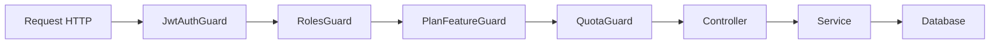
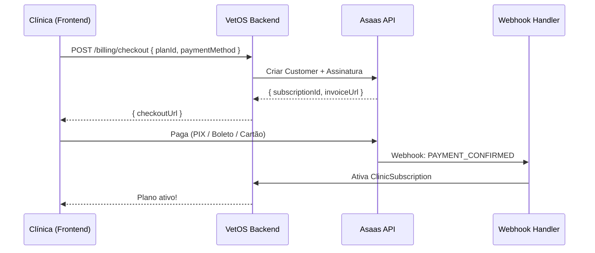
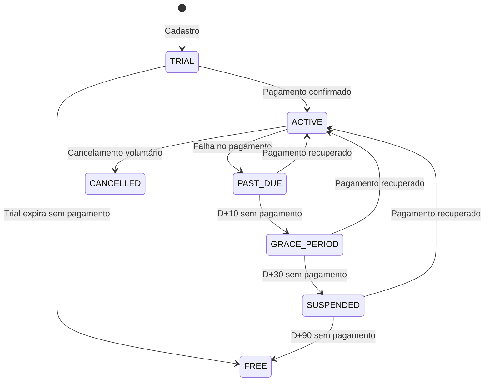
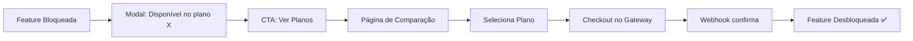

# Implementação Técnica de Billing — VetOS AI

> Guia técnico para implementação do sistema de cobrança, assinaturas e enforcement de planos.
> Última atualização: Junho/2026

---

## 1. Estado Atual — Models Existentes

### 1.1 Model `Plan`

O model [Plan](file:///home/moa-dev/projetos/vetos-ai/backend/prisma/schema.prisma#L141-L149) já existe no Prisma schema e define os limites base de cada tier:

```prisma
model Plan {
  id               String               @id @default(uuid())
  name             String               @unique
  maxStaffSeats    Int
  maxNotifications Int
  maxStorage       Int
  features         Json
  subscriptions    ClinicSubscription[]
}
```

**Campos:**
- `maxStaffSeats`: Número máximo de usuários (`User`) permitidos na clínica.
- `maxNotifications`: Cota mensal de notificações (e-mail + WhatsApp).
- `maxStorage`: Armazenamento máximo em MB.
- `features`: JSON com flags booleanas de funcionalidades habilitadas.

### 1.2 Model `ClinicSubscription`

O model [ClinicSubscription](file:///home/moa-dev/projetos/vetos-ai/backend/prisma/schema.prisma#L151-L162) vincula uma clínica a um plano, com possibilidade de overrides customizados:

```prisma
model ClinicSubscription {
  id                     String @id @default(uuid())
  clinicId               String @unique
  planId                 String
  customMaxStaffSeats    Int?
  customMaxNotifications Int?
  customMaxStorage       Int?
  customFeatures         Json?

  clinic Clinic @relation(fields: [clinicId], references: [id])
  plan   Plan   @relation(fields: [planId], references: [id])
}
```

**Lógica de resolução de limites:**
```
limite_efetivo = custom_override ?? plan_default
```

### 1.3 Lacunas Identificadas

> [!WARNING]
> O estado atual tem os models de dados, mas **nenhum código de enforcement**. A criação de usuários, pets, consultas e notificações não verifica limites.

| Componente | Existe? | Status |
| :--- | :---: | :--- |
| Schema de Plan/ClinicSubscription | ✅ | Completo |
| Seed de planos no banco | ❌ | Precisa criar |
| Guards de feature gating | ❌ | Não implementado |
| Guards de cota (quota) | ❌ | Não implementado |
| Service de resolução de limites | ❌ | Não implementado |
| Campos de billing (gateway) na subscription | ❌ | Schema precisa extensão |
| Frontend de billing | ❌ | Não existe |
| Integração com gateway | ❌ | Não existe |

---

## 2. Middleware e Guards para Enforcement de Cotas

### 2.1 Arquitetura de Enforcement



### 2.2 `SubscriptionService` — Serviço Central

Responsável por resolver os limites efetivos de uma clínica, considerando overrides.

```typescript
// backend/src/billing/subscription.service.ts

@Injectable()
export class SubscriptionService {
  constructor(private prisma: PrismaService) {}

  async getEffectiveLimits(clinicId: string): Promise<EffectiveLimits> {
    const sub = await this.prisma.clinicSubscription.findUnique({
      where: { clinicId },
      include: { plan: true },
    });

    if (!sub) throw new ForbiddenException('Clínica sem plano ativo');

    return {
      maxStaffSeats: sub.customMaxStaffSeats ?? sub.plan.maxStaffSeats,
      maxNotifications: sub.customMaxNotifications ?? sub.plan.maxNotifications,
      maxStorage: sub.customMaxStorage ?? sub.plan.maxStorage,
      features: { ...sub.plan.features, ...(sub.customFeatures ?? {}) },
    };
  }

  async checkQuota(clinicId: string, resource: QuotaResource): Promise<boolean> {
    const limits = await this.getEffectiveLimits(clinicId);
    const current = await this.getCurrentUsage(clinicId, resource);
    return current < limits[resource];
  }

  async getCurrentUsage(clinicId: string, resource: QuotaResource): Promise<number> {
    switch (resource) {
      case 'maxStaffSeats':
        return this.prisma.user.count({ where: { clinicId } });
      case 'maxNotifications':
        return this.getMonthlyNotificationCount(clinicId);
      case 'maxStorage':
        return this.calculateStorageUsageMB(clinicId);
      default:
        return 0;
    }
  }
}
```

### 2.3 `PlanFeatureGuard` — Guard de Feature Gating

```typescript
// backend/src/billing/guards/plan-feature.guard.ts

@Injectable()
export class PlanFeatureGuard implements CanActivate {
  constructor(
    private reflector: Reflector,
    private subscriptionService: SubscriptionService,
  ) {}

  async canActivate(context: ExecutionContext): Promise<boolean> {
    const requiredFeature = this.reflector.get<string>('requiredFeature', context.getHandler());
    if (!requiredFeature) return true;

    const request = context.switchToHttp().getRequest();
    const clinicId = request.user.clinicId;
    const limits = await this.subscriptionService.getEffectiveLimits(clinicId);

    if (!limits.features[requiredFeature]) {
      throw new ForbiddenException(
        `Recurso "${requiredFeature}" não disponível no seu plano. Faça upgrade para acessar.`
      );
    }
    return true;
  }
}
```

### 2.4 `QuotaGuard` — Guard de Cota Numérica

```typescript
// backend/src/billing/guards/quota.guard.ts

@Injectable()
export class QuotaGuard implements CanActivate {
  constructor(
    private reflector: Reflector,
    private subscriptionService: SubscriptionService,
  ) {}

  async canActivate(context: ExecutionContext): Promise<boolean> {
    const quotaResource = this.reflector.get<QuotaResource>('quotaResource', context.getHandler());
    if (!quotaResource) return true;

    const request = context.switchToHttp().getRequest();
    const clinicId = request.user.clinicId;
    const allowed = await this.subscriptionService.checkQuota(clinicId, quotaResource);

    if (!allowed) {
      throw new ForbiddenException(
        `Limite de ${quotaResource} atingido. Faça upgrade do seu plano para continuar.`
      );
    }
    return true;
  }
}
```

### 2.5 Uso nos Controllers (Decorators)

```typescript
// Exemplo de uso nos controllers existentes

@Post()
@RequireFeature('whatsapp_integration')  // Feature gating
@RequireQuota('maxNotifications')         // Quota gating
async sendWhatsAppNotification(@Body() dto: SendNotificationDto) {
  // Só chega aqui se o plano permite WhatsApp E a cota não estourou
}

@Post()
@RequireQuota('maxStaffSeats')
async createUser(@Body() dto: CreateUserDto) {
  // Só permite criar se não excedeu o limite de usuários
}
```

### 2.6 Rotas que Precisam de Guards

| Controller | Rota | Guard Necessário | Recurso |
| :--- | :--- | :--- | :--- |
| `UsersController` | `POST /users` | QuotaGuard | `maxStaffSeats` |
| `NotificationsController` | `POST /notifications/send` | QuotaGuard | `maxNotifications` |
| `NotificationsController` | `POST /notifications/send` (WhatsApp) | PlanFeatureGuard | `whatsapp_integration` |
| `SchedulerService` | Cron de vacinas | PlanFeatureGuard | `vaccine_automation` |
| `AnalyticsController` | `GET /analytics/trends` | PlanFeatureGuard | `analytics_trends` |
| `AppointmentsController` | `GET /appointments` (semanal) | PlanFeatureGuard | `calendar_weekly` |

---

## 3. Integração com Gateway de Pagamento

### 3.1 Arquitetura Asaas (Gateway Primário)



### 3.2 Campos Adicionais no Schema

O model `ClinicSubscription` precisa ser estendido com dados do gateway:

```prisma
model ClinicSubscription {
  id                     String    @id @default(uuid())
  clinicId               String    @unique
  planId                 String
  
  // --- Campos existentes ---
  customMaxStaffSeats    Int?
  customMaxNotifications Int?
  customMaxStorage       Int?
  customFeatures         Json?

  // --- Campos novos para billing ---
  status                 SubscriptionStatus @default(TRIAL)
  gatewayProvider        String?            // "asaas" | "stripe"
  gatewayCustomerId      String?            // ID do customer no gateway
  gatewaySubscriptionId  String?            // ID da subscription no gateway
  currentPeriodStart     DateTime?
  currentPeriodEnd       DateTime?
  trialEndsAt            DateTime?
  cancelledAt            DateTime?
  cancelReason           String?
  billingCycle           BillingCycle       @default(MONTHLY)
  
  createdAt              DateTime  @default(now())
  updatedAt              DateTime  @updatedAt

  clinic   Clinic   @relation(fields: [clinicId], references: [id])
  plan     Plan     @relation(fields: [planId], references: [id])
  invoices Invoice[]
}

model Invoice {
  id                   String        @id @default(uuid())
  subscriptionId       String
  clinicId             String
  gatewayInvoiceId     String?       @unique
  amount               Decimal       @db.Decimal(10, 2)
  currency             String        @default("BRL")
  status               InvoiceStatus @default(PENDING)
  paymentMethod        PaymentMethod?
  paidAt               DateTime?
  dueDate              DateTime
  invoiceUrl           String?       // Link do boleto/PIX
  pixQrCode            String?       // QR Code do PIX
  pixCopyPaste         String?       // Código PIX copia e cola
  gatewayPayload       Json?         // Payload completo do gateway

  createdAt            DateTime  @default(now())
  updatedAt            DateTime  @updatedAt

  subscription ClinicSubscription @relation(fields: [subscriptionId], references: [id])
}

model BillingEvent {
  id                String   @id @default(uuid())
  clinicId          String
  eventType         String   // "payment.confirmed", "subscription.cancelled", etc.
  gatewayEventId    String   @unique  // Idempotency key
  payload           Json
  processedAt       DateTime @default(now())
}

enum SubscriptionStatus {
  TRIAL
  ACTIVE
  PAST_DUE
  GRACE_PERIOD
  SUSPENDED
  CANCELLED
}

enum BillingCycle {
  MONTHLY
  YEARLY
}

enum InvoiceStatus {
  PENDING
  PAID
  OVERDUE
  CANCELLED
  REFUNDED
}

enum PaymentMethod {
  CREDIT_CARD
  PIX
  BOLETO
}
```

### 3.3 Módulo de Billing (NestJS)

```
backend/src/billing/
├── billing.module.ts
├── billing.controller.ts          # Rotas de checkout, portal, faturas
├── billing.service.ts             # Lógica de negócio de billing
├── subscription.service.ts        # Resolução de limites e cotas
├── webhook.controller.ts          # Recebe webhooks do gateway
├── webhook.service.ts             # Processa eventos de webhook
├── guards/
│   ├── plan-feature.guard.ts      # Guard de feature gating
│   └── quota.guard.ts             # Guard de cota numérica
├── decorators/
│   ├── require-feature.decorator.ts
│   └── require-quota.decorator.ts
├── providers/
│   ├── gateway.interface.ts       # Interface abstrata do gateway
│   ├── asaas.provider.ts          # Implementação Asaas
│   └── stripe.provider.ts         # Implementação Stripe (futuro)
├── dto/
│   ├── create-checkout.dto.ts
│   ├── change-plan.dto.ts
│   └── webhook-event.dto.ts
└── types/
    ├── effective-limits.type.ts
    └── quota-resource.type.ts
```

### 3.4 Endpoints do BillingController

| Método | Rota | Descrição |
| :--- | :--- | :--- |
| `GET` | `/billing/plans` | Lista planos disponíveis com preços |
| `GET` | `/billing/subscription` | Retorna assinatura atual da clínica |
| `GET` | `/billing/usage` | Retorna uso atual vs limites |
| `POST` | `/billing/checkout` | Cria sessão de checkout no gateway |
| `POST` | `/billing/change-plan` | Upgrade/downgrade de plano |
| `POST` | `/billing/cancel` | Solicita cancelamento |
| `GET` | `/billing/invoices` | Lista faturas da clínica |
| `GET` | `/billing/invoices/:id/pdf` | Download do PDF da fatura |
| `POST` | `/webhooks/asaas` | Endpoint de webhooks do Asaas |
| `POST` | `/webhooks/stripe` | Endpoint de webhooks do Stripe |

---

## 4. Segurança de Webhooks e Idempotência

### 4.1 Verificação de Assinatura

**Asaas:**
```typescript
// Asaas usa um token de acesso no header
async verifyAsaasWebhook(req: Request): boolean {
  const token = req.headers['asaas-access-token'];
  return token === this.configService.get('ASAAS_WEBHOOK_TOKEN');
}
```

**Stripe:**
```typescript
// Stripe usa assinatura HMAC no header
async verifyStripeWebhook(req: Request): Stripe.Event {
  const sig = req.headers['stripe-signature'];
  return stripe.webhooks.constructEvent(
    req.rawBody,
    sig,
    this.configService.get('STRIPE_WEBHOOK_SECRET'),
  );
}
```

### 4.2 Idempotência

O model `BillingEvent` armazena o `gatewayEventId` com constraint `@unique`, garantindo que um evento nunca seja processado duas vezes:

```typescript
async processWebhookEvent(eventId: string, payload: any): Promise<void> {
  // Tenta inserir — se já existe, ignora (idempotente)
  const existing = await this.prisma.billingEvent.findUnique({
    where: { gatewayEventId: eventId },
  });

  if (existing) {
    this.logger.log(`Evento ${eventId} já processado, ignorando.`);
    return;
  }

  await this.prisma.$transaction(async (tx) => {
    // Registra o evento
    await tx.billingEvent.create({
      data: { clinicId, eventType, gatewayEventId: eventId, payload },
    });

    // Processa conforme o tipo
    switch (eventType) {
      case 'PAYMENT_CONFIRMED':
        await this.activateSubscription(tx, payload);
        break;
      case 'PAYMENT_OVERDUE':
        await this.markPastDue(tx, payload);
        break;
      case 'SUBSCRIPTION_DELETED':
        await this.cancelSubscription(tx, payload);
        break;
    }
  });
}
```

### 4.3 Checklist de Segurança

- [ ] Verificar assinatura/token em todo webhook recebido
- [ ] Usar `@unique` constraint no `gatewayEventId` para idempotência
- [ ] Processar webhooks dentro de `$transaction` do Prisma
- [ ] Logar todos os eventos recebidos (mesmo os duplicados)
- [ ] Usar HTTPS obrigatório na URL de webhook
- [ ] Configurar retry policy no gateway (Asaas: até 10 tentativas)
- [ ] Monitorar webhooks falhados com alertas
- [ ] Nunca confiar em dados do frontend para status de pagamento

---

## 5. Grace Period e Dunning Automatizado

### 5.1 Máquina de Estados da Assinatura



### 5.2 Middleware de Status

```typescript
// Guard que verifica se a subscription está ativa
@Injectable()
export class ActiveSubscriptionGuard implements CanActivate {
  async canActivate(context: ExecutionContext): Promise<boolean> {
    const request = context.switchToHttp().getRequest();
    const clinicId = request.user.clinicId;
    const sub = await this.subscriptionService.getSubscription(clinicId);

    switch (sub.status) {
      case 'ACTIVE':
      case 'TRIAL':
        return true;
        
      case 'GRACE_PERIOD':
        // Permite leitura, bloqueia escrita
        if (request.method !== 'GET') {
          throw new ForbiddenException(
            'Sua conta está em período de carência. Regularize o pagamento para continuar operando.'
          );
        }
        return true;

      case 'PAST_DUE':
        // Permite uso com aviso (webhook vai mudar pra GRACE_PERIOD se não pagar)
        return true;

      case 'SUSPENDED':
      case 'CANCELLED':
        throw new ForbiddenException(
          'Sua assinatura foi suspensa. Entre em contato com o suporte.'
        );

      default:
        return false;
    }
  }
}
```

### 5.3 Cron de Dunning

```typescript
// Roda diariamente para verificar estados
@Cron(CronExpression.EVERY_DAY_AT_3AM)
async processDunning(): Promise<void> {
  // 1. PAST_DUE há mais de 10 dias → GRACE_PERIOD
  await this.transitionToGracePeriod();
  
  // 2. GRACE_PERIOD há mais de 30 dias → SUSPENDED
  await this.transitionToSuspended();
  
  // 3. SUSPENDED há mais de 90 dias → downgrade para FREE
  await this.transitionToFree();
  
  // 4. Envia notificações de dunning conforme a régua
  await this.sendDunningNotifications();
}
```

---

## 6. Metering e Rastreamento de Uso

### 6.1 Métricas Rastreadas

| Métrica | Como contar | Período |
| :--- | :--- | :--- |
| Usuários ativos | `COUNT(users WHERE clinicId)` | Snapshot atual |
| Pets cadastrados | `COUNT(pets WHERE clinicId)` | Snapshot atual |
| Notificações enviadas | `COUNT(notification_logs WHERE clinicId AND month)` | Mensal (reset no ciclo) |
| Armazenamento usado | Soma de arquivos/documentos | Snapshot atual |

### 6.2 Cache de Uso

Para evitar queries pesadas em cada request, usar Redis para cache:

```typescript
// Atualiza cache a cada operação relevante
async incrementUsage(clinicId: string, metric: string): Promise<void> {
  const key = `usage:${clinicId}:${metric}:${getCurrentMonth()}`;
  await this.redis.incr(key);
  await this.redis.expire(key, 35 * 24 * 60 * 60); // 35 dias
}

// Verifica sem bater no banco
async getUsage(clinicId: string, metric: string): Promise<number> {
  const key = `usage:${clinicId}:${metric}:${getCurrentMonth()}`;
  const cached = await this.redis.get(key);
  if (cached !== null) return parseInt(cached, 10);
  
  // Fallback: consulta banco e popula cache
  const count = await this.countFromDatabase(clinicId, metric);
  await this.redis.set(key, count, 'EX', 3600);
  return count;
}
```

### 6.3 Alertas de Consumo

| Threshold | Ação |
| :--- | :--- |
| 80% da cota | Alerta in-app + e-mail ao admin |
| 95% da cota | Banner persistente com CTA de upgrade |
| 100% da cota | Bloqueio suave + modal de upgrade |

---

## 7. Frontend — Páginas de Billing

### 7.1 Páginas Necessárias

| Página | Rota | Descrição |
| :--- | :--- | :--- |
| Planos & Pricing | `/settings/billing/plans` | Comparação de planos com CTA de upgrade |
| Checkout | `/settings/billing/checkout` | Formulário de pagamento (redirect para gateway) |
| Minha Assinatura | `/settings/billing` | Status atual, próximo ciclo, uso de cotas |
| Histórico de Faturas | `/settings/billing/invoices` | Lista de faturas com status e download |
| Alterar Plano | `/settings/billing/change-plan` | Upgrade/downgrade com preview de prorating |

### 7.2 Componentes de UI

```
frontend/src/pages/billing/
├── BillingDashboard.tsx     # Visão geral: plano atual, uso, próximo ciclo
├── PlanComparison.tsx       # Tabela comparativa com feature matrix
├── CheckoutPage.tsx         # Redirect para checkout do gateway
├── InvoiceList.tsx          # Histórico de faturas com filtros
├── UsageMetrics.tsx         # Barras de progresso de consumo
├── UpgradeBanner.tsx        # Banner de upgrade (reutilizável)
└── PlanBadge.tsx            # Badge com nome e ícone do plano
```

### 7.3 Experiência de Upgrade



---

## 8. Migração de Clínicas Existentes

### 8.1 Estratégia de Migração

Para clínicas que já estão usando o sistema sem um plano formal atribuído:

```typescript
// Script de migração
async migrateExistingClinics(): Promise<void> {
  // 1. Criar planos padrão no banco
  const plans = await this.seedPlans();
  
  // 2. Buscar clínicas sem subscription
  const clinicsWithoutSub = await this.prisma.clinic.findMany({
    where: { subscription: null },
  });

  // 3. Atribuir plano Trial/Free com grace period de 30 dias
  for (const clinic of clinicsWithoutSub) {
    await this.prisma.clinicSubscription.create({
      data: {
        clinicId: clinic.id,
        planId: plans.trial.id,
        status: 'TRIAL',
        trialEndsAt: addDays(new Date(), 30),
      },
    });
  }

  // 4. Notificar admins sobre a transição
  await this.sendMigrationEmails(clinicsWithoutSub);
}
```

### 8.2 Rollout Gradual

| Etapa | Ação | Impacto |
| :--- | :--- | :--- |
| **Semana 1** | Deploy com guards desativados (log-only mode) | Zero impacto |
| **Semana 2** | Ativar guards com soft-block (aviso, permite continuar) | Mínimo |
| **Semana 3** | Enviar e-mails de migração para clínicas existentes | Informativo |
| **Semana 4** | Ativar hard-block para novas clínicas | Novas clínicas apenas |
| **Semana 6** | Ativar hard-block para todas as clínicas | Total |
| **Semana 8** | Remover modo de compatibilidade | Permanente |

---

## 9. Variáveis de Ambiente Necessárias

```bash
# Gateway Primário (Asaas)
ASAAS_API_KEY=<chave de API do Asaas>
ASAAS_ENVIRONMENT=sandbox|production
ASAAS_WEBHOOK_TOKEN=<token de autenticação do webhook>

# Gateway Secundário (Stripe) — Futuro
STRIPE_SECRET_KEY=<chave secreta do Stripe>
STRIPE_PUBLISHABLE_KEY=<chave pública do Stripe>
STRIPE_WEBHOOK_SECRET=<secret do webhook signing>

# Billing
BILLING_TRIAL_DAYS=14
BILLING_GRACE_PERIOD_DAYS=10
BILLING_SUSPENSION_DAYS=30
BILLING_ARCHIVE_DAYS=90
```

---

## 10. Checklist de Implementação

- [ ] Criar `BillingModule` no NestJS
- [ ] Estender schema do Prisma (Invoice, BillingEvent, enums, campos novos)
- [ ] Rodar migration do Prisma
- [ ] Criar seed script para planos padrão (Free, Starter, Professional, Enterprise)
- [ ] Implementar `SubscriptionService` com resolução de limites
- [ ] Implementar `PlanFeatureGuard` e `QuotaGuard`
- [ ] Adicionar decorators `@RequireFeature()` e `@RequireQuota()` aos controllers existentes
- [ ] Implementar `AsaasProvider` (criar customer, subscription, checkout)
- [ ] Implementar `WebhookController` com verificação e idempotência
- [ ] Implementar cron de dunning
- [ ] Implementar cache de uso no Redis
- [ ] Criar páginas de billing no frontend
- [ ] Criar script de migração para clínicas existentes
- [ ] Configurar webhooks no painel do Asaas (sandbox)
- [ ] Testes unitários para guards e services
- [ ] Testes e2e para fluxo completo de checkout
- [ ] Testes de webhook com payloads reais do Asaas

---

> [!IMPORTANT]
> O billing é a infraestrutura de monetização mais crítica do VetOS AI. A implementação deve ser feita em fases incrementais, começando pelo enforcement de cotas (sem gateway) e evoluindo para a integração completa com pagamentos. Cada fase deve ter rollback seguro.
