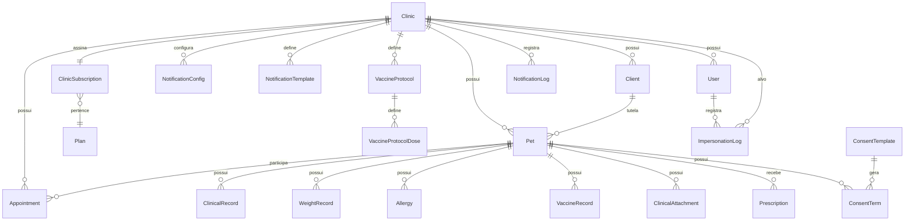

# Catálogo de Módulos — VetOS AI

> **Última atualização:** 26/06/2026
> **Versão:** 1.0

Inventário completo de todos os módulos funcionais do sistema VetOS AI, agrupados por domínio. Para cada módulo consta: nome, status de implementação, descrição funcional, componentes de backend e frontend, e entidades de banco de dados associadas.

---

## Legenda de Status

| Ícone | Status | Descrição |
| :---: | :--- | :--- |
| ✅ | **Completo** | Módulo implementado, integrado e funcional |
| 🟡 | **Parcial** | Backend ou frontend implementado, mas não ambos |
| 📋 | **Planejado** | Existe planejamento formal, mas sem código |
| 💭 | **Conceitual** | Mencionado no roadmap sem planejamento detalhado |

---

## 1. Core Clínico

Módulos fundamentais que sustentam o funcionamento básico da clínica veterinária.

### 1.1 Autenticação e Autorização ✅

| Aspecto | Detalhamento |
| :--- | :--- |
| **Status** | Completo |
| **Descrição** | Autenticação JWT, login, registro de novos tenants (clínicas), guardas de rotas por role (RBAC), suporte a impersonation por SUPERADMIN |
| **Backend** | `auth/` — `AuthModule`, `AuthService`, `AuthController`, `JwtAuthGuard`, `RolesGuard`, `JwtStrategy` |
| **Frontend** | [Login.tsx](file:///home/moa-dev/projetos/vetos-ai/frontend/src/pages/Login.tsx), [Register.tsx](file:///home/moa-dev/projetos/vetos-ai/frontend/src/pages/Register.tsx), [AuthContext.tsx](file:///home/moa-dev/projetos/vetos-ai/frontend/src/context/AuthContext.tsx) |
| **Entidades** | `User` (com campo `role`: ADMIN, STAFF, SUPERADMIN) |
| **Fase de Entrega** | Fase 2 |

### 1.2 Gestão de Clínicas ✅

| Aspecto | Detalhamento |
| :--- | :--- |
| **Status** | Completo |
| **Descrição** | CRUD de clínicas (tenants), isolamento multi-tenant por `clinicId` em toda a camada de dados |
| **Backend** | `clinics/` — `ClinicsModule`, `ClinicsService`, `ClinicsController` |
| **Frontend** | Gerenciado via painel Super Admin ([SuperAdminClinics.tsx](file:///home/moa-dev/projetos/vetos-ai/frontend/src/pages/super-admin/SuperAdminClinics.tsx)) |
| **Entidades** | `Clinic`, `ClinicSubscription`, `Plan` |
| **Fase de Entrega** | Fase 2 |

### 1.3 Gestão de Usuários ✅

| Aspecto | Detalhamento |
| :--- | :--- |
| **Status** | Completo |
| **Descrição** | CRUD de usuários administrativos da clínica, atribuição de papéis (ADMIN/STAFF) |
| **Backend** | `users/` — `UsersModule`, `UsersService`, `UsersController` |
| **Frontend** | Integrado ao [SettingsPage.tsx](file:///home/moa-dev/projetos/vetos-ai/frontend/src/pages/settings/SettingsPage.tsx) |
| **Entidades** | `User` |
| **Fase de Entrega** | Fase 2 |

### 1.4 Gestão de Clientes (Tutores) ✅

| Aspecto | Detalhamento |
| :--- | :--- |
| **Status** | Completo |
| **Descrição** | CRUD completo de tutores com dados de contato, CPF, endereço, telefone adicional e dados de emergência. Suporte a cadastro completo via fluxo público |
| **Backend** | `clients/` — `ClientsModule`, `ClientsService`, `ClientsController` |
| **Frontend** | [Clients.tsx](file:///home/moa-dev/projetos/vetos-ai/frontend/src/pages/Clients.tsx) |
| **Entidades** | `Client` (campos expandidos: CPF, endereço, telefone, contato de emergência) |
| **Fase de Entrega** | Fase 2 + Fase 16B.1.2 (expansão cadastral) |

### 1.5 Gestão de Pets (Pacientes) ✅

| Aspecto | Detalhamento |
| :--- | :--- |
| **Status** | Completo |
| **Descrição** | CRUD de animais de estimação vinculados a tutores, com dados de espécie, raça, peso, data de nascimento |
| **Backend** | `pets/` — `PetsModule`, `PetsService`, `PetsController` |
| **Frontend** | [Pets.tsx](file:///home/moa-dev/projetos/vetos-ai/frontend/src/pages/Pets.tsx), [PetDetails.tsx](file:///home/moa-dev/projetos/vetos-ai/frontend/src/pages/PetDetails.tsx) |
| **Entidades** | `Pet` |
| **Fase de Entrega** | Fase 2 |

### 1.6 Agendamentos e Consultas ✅

| Aspecto | Detalhamento |
| :--- | :--- |
| **Status** | Completo |
| **Descrição** | Calendário veterinário premium com visualizações diária/semanal, gerenciamento de status (`SCHEDULED`, `COMPLETED`, `CANCELLED`), criação ágil e filtros rápidos |
| **Backend** | `appointments/` — `AppointmentsModule`, `AppointmentsService`, `AppointmentsController` |
| **Frontend** | [Appointments.tsx](file:///home/moa-dev/projetos/vetos-ai/frontend/src/pages/Appointments.tsx), componentes em `components/appointments/` ([AppointmentCalendarControls](file:///home/moa-dev/projetos/vetos-ai/frontend/src/components/appointments/AppointmentCalendarControls.tsx), [AppointmentCard](file:///home/moa-dev/projetos/vetos-ai/frontend/src/components/appointments/AppointmentCard.tsx), [AppointmentDayView](file:///home/moa-dev/projetos/vetos-ai/frontend/src/components/appointments/AppointmentDayView.tsx), [AppointmentFormModal](file:///home/moa-dev/projetos/vetos-ai/frontend/src/components/appointments/AppointmentFormModal.tsx), [AppointmentWeekView](file:///home/moa-dev/projetos/vetos-ai/frontend/src/components/appointments/AppointmentWeekView.tsx), [AppointmentSummaryBar](file:///home/moa-dev/projetos/vetos-ai/frontend/src/components/appointments/AppointmentSummaryBar.tsx), [calendar-helpers](file:///home/moa-dev/projetos/vetos-ai/frontend/src/components/appointments/calendar-helpers.ts)) |
| **Entidades** | `Appointment` (com `AppointmentStatus`) |
| **Fase de Entrega** | Fase 3 + Fase 10 (calendário premium) |

---

## 2. Prontuário e Documentos

Módulos de registro clínico, documentação médica e conformidade legal.

### 2.1 Prontuário Clínico (Clinical Records) ✅

| Aspecto | Detalhamento |
| :--- | :--- |
| **Status** | Completo |
| **Descrição** | Notas de atendimento, procedimentos realizados e histórico clínico na linha do tempo do pet |
| **Backend** | `clinical-records/` — `ClinicalRecordsModule`, `ClinicalRecordsService`, `ClinicalRecordsController` |
| **Frontend** | Integrado em [PetDetails.tsx](file:///home/moa-dev/projetos/vetos-ai/frontend/src/pages/PetDetails.tsx) (seção de prontuário) |
| **Entidades** | `ClinicalRecord` |
| **Fase de Entrega** | Fase 11 |

### 2.2 Registro de Peso ✅

| Aspecto | Detalhamento |
| :--- | :--- |
| **Status** | Completo |
| **Descrição** | Acompanhamento histórico de peso corporal com curva evolutiva |
| **Backend** | `weight-records/` — `WeightRecordsModule`, `WeightRecordsService`, `WeightRecordsController` |
| **Frontend** | Integrado em [PetDetails.tsx](file:///home/moa-dev/projetos/vetos-ai/frontend/src/pages/PetDetails.tsx) (aba de peso) |
| **Entidades** | `WeightRecord` |
| **Fase de Entrega** | Fase 11 |

### 2.3 Alergias ✅

| Aspecto | Detalhamento |
| :--- | :--- |
| **Status** | Completo |
| **Descrição** | Registro de alergias medicamentosas e alimentares do pet |
| **Backend** | `allergies/` — `AllergiesModule`, `AllergiesService`, `AllergiesController` |
| **Frontend** | Integrado em [PetDetails.tsx](file:///home/moa-dev/projetos/vetos-ai/frontend/src/pages/PetDetails.tsx) (aba de alergias) |
| **Entidades** | `Allergy` |
| **Fase de Entrega** | Fase 11 |

### 2.4 Vacinas e Protocolos Vacinais ✅

| Aspecto | Detalhamento |
| :--- | :--- |
| **Status** | Completo |
| **Descrição** | Histórico vacinal, planejamento de doses futuras e protocolos padrão com doses configuráveis por espécie/raça |
| **Backend** | `vaccines/` — `VaccinesModule`, `VaccinesService`, `VaccinesController` |
| **Frontend** | Integrado em [PetDetails.tsx](file:///home/moa-dev/projetos/vetos-ai/frontend/src/pages/PetDetails.tsx) (aba de vacinas) + [VaccineProtocolsPage.tsx](file:///home/moa-dev/projetos/vetos-ai/frontend/src/pages/settings/VaccineProtocolsPage.tsx) |
| **Entidades** | `VaccineRecord`, `VaccineProtocol`, `VaccineProtocolDose` |
| **Fase de Entrega** | Fase 11 + Fase 14A |

### 2.5 Uploads de Exames e Anexos Clínicos ✅

| Aspecto | Detalhamento |
| :--- | :--- |
| **Status** | Completo |
| **Descrição** | Upload e armazenamento seguro de laudos de exames (sangue, raio-x, ultrassom) vinculados ao prontuário do pet. Validação de MIME-types e limite de tamanho |
| **Backend** | `clinical-attachments/` — `ClinicalAttachmentsModule`, `ClinicalAttachmentsService`, `ClinicalAttachmentsController` |
| **Frontend** | Integrado em [PetDetails.tsx](file:///home/moa-dev/projetos/vetos-ai/frontend/src/pages/PetDetails.tsx) (seção de anexos) |
| **Entidades** | `ClinicalAttachment` |
| **Fase de Entrega** | Fase 16A |

### 2.6 Receitas Médicas (Prescriptions) ✅

| Aspecto | Detalhamento |
| :--- | :--- |
| **Status** | Completo |
| **Descrição** | Criação de receitas médicas veterinárias com layout de impressão, assinatura digital e geração de PDF |
| **Backend** | `prescriptions/` — `PrescriptionsModule`, `PrescriptionsService`, `PrescriptionsController` |
| **Frontend** | [CreatePrescriptionModal.tsx](file:///home/moa-dev/projetos/vetos-ai/frontend/src/components/CreatePrescriptionModal.tsx), [PrintPreviewModal.tsx](file:///home/moa-dev/projetos/vetos-ai/frontend/src/components/PrintPreviewModal.tsx) |
| **Entidades** | `Prescription` |
| **Fase de Entrega** | Fase 16B |

### 2.7 Termos de Consentimento ✅

| Aspecto | Detalhamento |
| :--- | :--- |
| **Status** | Completo |
| **Descrição** | Templates de termos de consentimento, geração de termos individuais para assinatura, aceite digital pelo tutor com captura de auditoria (IP, User-Agent, CPF) |
| **Backend** | `consent-terms/` — `ConsentTermsModule`, `ConsentTermsService`, `ConsentTermsController` |
| **Frontend** | [CreateConsentTermModal.tsx](file:///home/moa-dev/projetos/vetos-ai/frontend/src/components/CreateConsentTermModal.tsx) |
| **Entidades** | `ConsentTemplate`, `ConsentTerm` |
| **Fase de Entrega** | Fase 16B + Fase 16B.1.1 |

### 2.8 Verificação Pública de Documentos ✅

| Aspecto | Detalhamento |
| :--- | :--- |
| **Status** | Completo |
| **Descrição** | Rota pública para verificação de autenticidade de receitas e termos assinados digitalmente via hash de verificação |
| **Backend** | `verification/` — `VerificationModule`, `VerificationService`, `VerificationController` |
| **Frontend** | [PublicDocumentView.tsx](file:///home/moa-dev/projetos/vetos-ai/frontend/src/pages/PublicDocumentView.tsx) (formulário de aceite e assinatura do tutor) |
| **Entidades** | — (utiliza `Prescription`, `ConsentTerm`) |
| **Fase de Entrega** | Fase 16B + Fase 16B.1.1 |

---

## 3. Notificações e Automação

Motor de comunicação multicanal e automações recorrentes.

### 3.1 Central de Notificações ✅

| Aspecto | Detalhamento |
| :--- | :--- |
| **Status** | Completo |
| **Descrição** | Processamento de filas BullMQ, provedores SMTP e Evolution API (WhatsApp), criptografia AES de credenciais, logs de disparos com retry manual |
| **Backend** | `notifications/` — `NotificationsModule`, `NotificationsService`, `NotificationsController`, `NotificationsProcessor` (BullMQ worker) |
| **Frontend** | [MessagingHubPage.tsx](file:///home/moa-dev/projetos/vetos-ai/frontend/src/pages/messaging/MessagingHubPage.tsx), [SmtpSettingsPage.tsx](file:///home/moa-dev/projetos/vetos-ai/frontend/src/pages/messaging/SmtpSettingsPage.tsx), [WhatsappSettingsPage.tsx](file:///home/moa-dev/projetos/vetos-ai/frontend/src/pages/messaging/WhatsappSettingsPage.tsx), [NotificationLogsPage.tsx](file:///home/moa-dev/projetos/vetos-ai/frontend/src/pages/messaging/NotificationLogsPage.tsx) |
| **Entidades** | `NotificationConfig`, `NotificationLog` |
| **Fase de Entrega** | Fase 4 (Waves 1A, 1B, 2, 3) |

### 3.2 Templates de Mensagem ✅

| Aspecto | Detalhamento |
| :--- | :--- |
| **Status** | Completo |
| **Descrição** | CRUD de templates personalizados por evento e canal com substituição de placeholders dinâmica |
| **Backend** | Integrado em `notifications/` — `TemplateService` |
| **Frontend** | [NotificationTemplatesPage.tsx](file:///home/moa-dev/projetos/vetos-ai/frontend/src/pages/messaging/NotificationTemplatesPage.tsx) |
| **Entidades** | `NotificationTemplate` |
| **Fase de Entrega** | Fase 4 |

### 3.3 Scheduler de Automações ✅

| Aspecto | Detalhamento |
| :--- | :--- |
| **Status** | Completo |
| **Descrição** | Cron diário (02:00 UTC) para disparo automático de lembretes vacinais (D0, D-1, D-7) e retenção de clientes, com janelas UTC-safe e deduplicação por `vaccineRecordId` |
| **Backend** | `scheduler/` — `SchedulerModule`, `SchedulerService` |
| **Frontend** | — (sem interface dedicada; monitoramento via Notification Logs) |
| **Entidades** | — (utiliza `VaccineRecord`, `NotificationLog`) |
| **Fase de Entrega** | Fase 4 + Fase 14A |

### 3.4 Compartilhamento de Documentos com Tutor ✅

| Aspecto | Detalhamento |
| :--- | :--- |
| **Status** | Completo |
| **Descrição** | Envio de receitas e termos assinados por e-mail e WhatsApp para o tutor. Geração de PDF e registro de histórico de compartilhamentos |
| **Backend** | Integrado em `notifications/` e `prescriptions/` |
| **Frontend** | [ShareDocumentModal.tsx](file:///home/moa-dev/projetos/vetos-ai/frontend/src/components/ShareDocumentModal.tsx) |
| **Entidades** | — (utiliza `Prescription`, `ConsentTerm`, `NotificationLog`) |
| **Fase de Entrega** | Fase 16B.1 |

---

## 4. Analytics e Insights

Módulos de inteligência operacional e métricas da clínica.

### 4.1 Dashboard Operacional ✅

| Aspecto | Detalhamento |
| :--- | :--- |
| **Status** | Completo |
| **Descrição** | Feed de atividades consolidado, estatísticas rápidas do dia (consultas, novos pets, tutores), atividades recentes com 7 tipos de entidade |
| **Backend** | `dashboard/` — `DashboardModule`, `DashboardService`, `DashboardController` |
| **Frontend** | [Dashboard.tsx](file:///home/moa-dev/projetos/vetos-ai/frontend/src/pages/Dashboard.tsx) |
| **Entidades** | — (agregação de todas as entidades core) |
| **Fase de Entrega** | Fase 5 + Fase 12 (feed de auditoria) |

### 4.2 Analytics e Métricas Avançadas ✅

| Aspecto | Detalhamento |
| :--- | :--- |
| **Status** | Completo |
| **Descrição** | Agregações temporais de 30 dias (consultas e notificações), contagem de pacientes inativos (>90 dias), alertas de vacinas vencendo em D0–D+7, gráficos de barra/área em CSS puro |
| **Backend** | `analytics/` — `AnalyticsModule`, `AnalyticsService`, `AnalyticsController` |
| **Frontend** | [Analytics.tsx](file:///home/moa-dev/projetos/vetos-ai/frontend/src/pages/Analytics.tsx), componentes em `components/analytics/` ([OverviewTab](file:///home/moa-dev/projetos/vetos-ai/frontend/src/components/analytics/OverviewTab.tsx), [TrendsTab](file:///home/moa-dev/projetos/vetos-ai/frontend/src/components/analytics/TrendsTab.tsx), [AlertsActionsTab](file:///home/moa-dev/projetos/vetos-ai/frontend/src/components/analytics/AlertsActionsTab.tsx), [MiniBarChart](file:///home/moa-dev/projetos/vetos-ai/frontend/src/components/analytics/MiniBarChart.tsx), [NotificationTrendChart](file:///home/moa-dev/projetos/vetos-ai/frontend/src/components/analytics/NotificationTrendChart.tsx), [ChannelDistribution](file:///home/moa-dev/projetos/vetos-ai/frontend/src/components/analytics/ChannelDistribution.tsx)) |
| **Entidades** | — (agregação de `Appointment`, `Client`, `VaccineRecord`, `NotificationLog`) |
| **Fase de Entrega** | Fase 13 (Waves 13A, 13B, 13C) |

---

## 5. Experiência do Tutor

Módulos de interface pública voltados para o tutor (dono do pet).

### 5.1 Visualização Pública de Documentos ✅

| Aspecto | Detalhamento |
| :--- | :--- |
| **Status** | Completo |
| **Descrição** | Rota pública (sem autenticação) para visualização de receitas e termos de consentimento compartilhados via link |
| **Backend** | `verification/` |
| **Frontend** | [PublicDocumentView.tsx](file:///home/moa-dev/projetos/vetos-ai/frontend/src/pages/PublicDocumentView.tsx) |
| **Entidades** | — |
| **Fase de Entrega** | Fase 16B.1 |

### 5.2 Aceite e Assinatura Digital do Tutor ✅

| Aspecto | Detalhamento |
| :--- | :--- |
| **Status** | Completo |
| **Descrição** | Formulário de aceite eletrônico com máscara de CPF, validação algorítmica, captura de dados de auditoria (IP, User-Agent, Nome, CPF, Data/Hora) e atualização automática do status na timeline |
| **Backend** | Rota pública em `consent-terms/` |
| **Frontend** | Integrado em [PublicDocumentView.tsx](file:///home/moa-dev/projetos/vetos-ai/frontend/src/pages/PublicDocumentView.tsx) |
| **Entidades** | `ConsentTerm` (campos de assinatura) |
| **Fase de Entrega** | Fase 16B.1.1 |

### 5.3 Cadastro Completo do Tutor ✅

| Aspecto | Detalhamento |
| :--- | :--- |
| **Status** | Completo |
| **Descrição** | Tela pública para atualização cadastral completa (endereço, telefone, e-mail, contato de emergência) no fluxo pós-assinatura ou via link dedicado |
| **Backend** | Rota pública em `clients/` |
| **Frontend** | Formulário público integrado ao fluxo de assinatura |
| **Entidades** | `Client` (campos expandidos) |
| **Fase de Entrega** | Fase 16B.1.2 |

### 5.4 Portal do Tutor 📋

| Aspecto | Detalhamento |
| :--- | :--- |
| **Status** | Planejado (sem planejamento detalhado) |
| **Descrição** | Portal web autenticado para tutores: visualização de histórico dos pets, próximas consultas, documentos, notificações e carteira de vacinação digital |
| **Backend** | A ser definido |
| **Frontend** | A ser definido |
| **Entidades** | A ser definido (potencial modelo `TutorAuth` ou expansão de `Client`) |
| **Fase de Entrega** | Fase 16B.1.2.1 |

---

## 6. Infraestrutura

Módulos de suporte técnico transversais.

### 6.1 Prisma (ORM e Banco de Dados) ✅

| Aspecto | Detalhamento |
| :--- | :--- |
| **Status** | Completo |
| **Descrição** | Serviço encapsulado do Prisma Client para conexões centralizadas com PostgreSQL. Schema com 21 modelos de dados |
| **Backend** | `prisma/` — `PrismaModule`, `PrismaService` |
| **Frontend** | — |
| **Entidades** | Todos os 21 modelos do schema |
| **Fase de Entrega** | Fase 1 |

### 6.2 Criptografia ✅

| Aspecto | Detalhamento |
| :--- | :--- |
| **Status** | Completo |
| **Descrição** | Serviço AES para encriptar credenciais sensíveis (SMTP, WhatsApp). Gera chave efêmera em memória quando `ENCRYPTION_KEY` não está definida |
| **Backend** | `encryption/` — `EncryptionModule`, `EncryptionService` |
| **Frontend** | — |
| **Entidades** | — |
| **Fase de Entrega** | Fase 4 |

> [!WARNING]
> **Débito Técnico:** A ausência de `ENCRYPTION_KEY` no ambiente de desenvolvimento resulta em chave efêmera — credenciais salvas são invalidadas a cada reinicialização do backend.

### 6.3 Storage (Armazenamento de Arquivos) ✅

| Aspecto | Detalhamento |
| :--- | :--- |
| **Status** | Completo |
| **Descrição** | Serviço de armazenamento de arquivos para uploads clínicos (exames, laudos). Armazenamento local com potencial migração para S3/GCS |
| **Backend** | `storage/` — `StorageModule`, `StorageService` |
| **Frontend** | — |
| **Entidades** | — (vinculado a `ClinicalAttachment`) |
| **Fase de Entrega** | Fase 16A |

### 6.4 Temas (Light/Dark Mode) ✅

| Aspecto | Detalhamento |
| :--- | :--- |
| **Status** | Completo |
| **Descrição** | Toggle de tema claro/escuro com variáveis CSS OKLCH e persistência local via `localStorage` |
| **Backend** | — |
| **Frontend** | [ThemeContext.tsx](file:///home/moa-dev/projetos/vetos-ai/frontend/src/context/ThemeContext.tsx), [App.css](file:///home/moa-dev/projetos/vetos-ai/frontend/src/App.css), [index.css](file:///home/moa-dev/projetos/vetos-ai/frontend/src/index.css) |
| **Entidades** | — |
| **Fase de Entrega** | Fase 9 |

### 6.5 Scripts de Operação ✅

| Aspecto | Detalhamento |
| :--- | :--- |
| **Status** | Completo |
| **Descrição** | Scripts standalone para operações manuais: `trigger-vaccine-reminders` (disparo manual de lembretes vacinais com sleep de 5s e trava anti-produção) |
| **Backend** | `scripts/` |
| **Frontend** | — |
| **Entidades** | — |
| **Fase de Entrega** | Fase 14A |

---

## 7. Administração

Módulos de gestão global da plataforma SaaS.

### 7.1 Super Admin Dashboard ✅

| Aspecto | Detalhamento |
| :--- | :--- |
| **Status** | Completo |
| **Descrição** | Painel exclusivo para SUPERADMIN com visão de todas as clínicas, métricas globais, impersonation (simulação de acesso a qualquer clínica) com log de auditoria |
| **Backend** | Rotas guardadas com `@Roles('SUPERADMIN')` em `clinics/`, `users/` |
| **Frontend** | [SuperAdminDashboard.tsx](file:///home/moa-dev/projetos/vetos-ai/frontend/src/pages/super-admin/SuperAdminDashboard.tsx), [SuperAdminClinics.tsx](file:///home/moa-dev/projetos/vetos-ai/frontend/src/pages/super-admin/SuperAdminClinics.tsx) |
| **Entidades** | `ImpersonationLog` |
| **Fase de Entrega** | Fase 7 |

### 7.2 Configurações da Clínica ✅

| Aspecto | Detalhamento |
| :--- | :--- |
| **Status** | Completo |
| **Descrição** | Página de configurações com gestão de equipe e protocolos vacinais |
| **Backend** | Integrado em `users/`, `vaccines/` |
| **Frontend** | [SettingsPage.tsx](file:///home/moa-dev/projetos/vetos-ai/frontend/src/pages/settings/SettingsPage.tsx), [VaccineProtocolsPage.tsx](file:///home/moa-dev/projetos/vetos-ai/frontend/src/pages/settings/VaccineProtocolsPage.tsx) |
| **Entidades** | `User`, `VaccineProtocol`, `VaccineProtocolDose` |
| **Fase de Entrega** | Fase 5 + Fase 14A |

---

## 8. Módulos Planejados (Não Implementados)

### 8.1 Interface de Gerenciamento de Vacinas 📋

| Aspecto | Detalhamento |
| :--- | :--- |
| **Status** | Planejado |
| **Descrição** | Telas frontend para monitoramento de lembretes na fila BullMQ, disparo manual, e métricas de conversão vacinal |
| **Dependência** | Fase 14A (backend completo) |
| **Fase** | Fase 14B |

### 8.2 Billing SaaS e Stripe 📋

| Aspecto | Detalhamento |
| :--- | :--- |
| **Status** | Planejado |
| **Descrição** | Integração com Stripe/Asaas para cobrança recorrente, checkout de planos, enforcement de cotas e portal de faturamento |
| **Dependência** | Fase 2, Fase 7 |
| **Fase** | Fase 15 |

### 8.3 AI Copilot 💭

| Aspecto | Detalhamento |
| :--- | :--- |
| **Status** | Conceitual |
| **Descrição** | IA generativa para sugestão de diagnósticos, reengajamento inteligente de clientes inativos e predição de no-show |
| **Dependência** | Fase 11, Fase 13 |
| **Fase** | Fase 17 |

### 8.4 Segurança e Testes e2e 📋

| Aspecto | Detalhamento |
| :--- | :--- |
| **Status** | Planejado |
| **Descrição** | Rate limiting (NestJS Throttler), NestJS Redis Module, refatoração do PetDetails.tsx e cobertura de testes e2e (Playwright/Cypress) |
| **Dependência** | Nenhuma |
| **Fase** | Fase 18 |

---

## Mapa de Entidades do Banco de Dados

---

## Resumo Quantitativo

| Métrica | Valor |
| :--- | :--- |
| **Total de Módulos** | 26 |
| **Módulos Completos** | 22 (85%) |
| **Módulos Planejados** | 4 (15%) |
| **Entidades no Banco** | 21 modelos Prisma |
| **Módulos Backend** | 22 diretórios em `backend/src/` |
| **Páginas Frontend** | 9 páginas + 3 subdiretórios (messaging, settings, super-admin) |
| **Componentes Frontend** | 20+ componentes reutilizáveis |
| **Fases Entregues** | 17 fases completas |
| **Fases Pendentes** | 4 fases planejadas |
