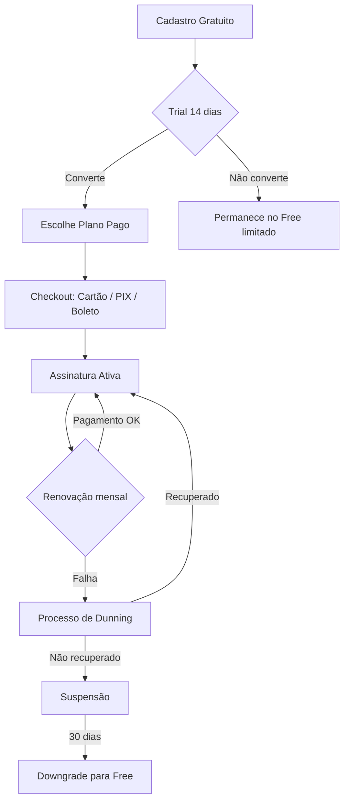

# Estratégia de Monetização — VetOS AI

> Documento estratégico de monetização da plataforma VetOS AI para o mercado veterinário brasileiro.
> Última atualização: Junho/2026

---

## 1. Modelo de Receita

### 1.1 Modelo Principal: SaaS B2B por Assinatura Recorrente

O VetOS AI opera sob o modelo **B2B SaaS com assinatura mensal/anual**, cobrando clínicas veterinárias pelo acesso contínuo à plataforma. A receita recorrente mensal (MRR) é a métrica-chave.

**Composição da receita:**

| Fonte | Tipo | % Alvo (Ano 2) |
| :--- | :--- | :--- |
| Assinatura base (tiers) | Recorrente | 70% |
| Upsell de módulos avulsos | Recorrente | 15% |
| Add-ons de consumo (WhatsApp, SMS) | Variável | 10% |
| Setup/onboarding (Enterprise) | One-time | 5% |

### 1.2 Princípios de Precificação

- **Valor percebido > Custo**: Precificar pelo valor gerado (economia de tempo, redução de no-show, retenção de clientes) e não pelo custo de infraestrutura.
- **Transparência**: Sem taxas ocultas. O tutor da clínica deve entender exatamente o que está pagando.
- **Escalabilidade natural**: O plano cresce junto com a clínica (mais veterinários = upgrade natural).
- **Âncora no mercado brasileiro**: Preços em R$ (BRL), compatíveis com a realidade de clínicas de pequeno e médio porte.

---

## 2. Proposta de Tiers de Preço

### 2.1 Visão Geral

| | **Free / Trial** | **Starter** | **Professional** | **Enterprise** |
| :--- | :---: | :---: | :---: | :---: |
| **Preço/mês** | R$ 0 | R$ 99 | R$ 199 | R$ 399 |
| **Preço/ano** | R$ 0 | R$ 990 (≈2 meses grátis) | R$ 1.990 (≈2 meses grátis) | R$ 3.990 (≈2 meses grátis) |
| **Usuários (staff)** | 1 | 3 | 10 | Ilimitado |
| **Pets cadastrados** | 50 | 200 | Ilimitado | Ilimitado |
| **Armazenamento** | 500 MB | 5 GB | 25 GB | 100 GB |
| **Notificações/mês** | 50 | 500 | 2.000 | 10.000 |

### 2.2 Detalhamento por Tier

#### 🆓 Free / Trial (14 dias → permanece como Free limitado)

**Objetivo**: Aquisição. Reduzir a fricção de entrada e permitir que a clínica experimente o sistema sem compromisso financeiro.

**Inclui:**
- 1 usuário administrador
- Até 50 pets cadastrados
- Agenda de consultas (visualização diária)
- Prontuário clínico básico (notas e peso)
- Dashboard com estatísticas resumidas
- Tema claro/escuro
- 50 notificações por e-mail/mês
- Feed de atividades (últimas 50 entradas)

**Não inclui:**
- WhatsApp, automações de vacina, analytics avançado, documentos, branding

#### 🚀 Starter (R$ 99/mês)

**Objetivo**: Conversão de clínicas de pequeno porte (1-2 veterinários).

**Inclui tudo do Free, mais:**
- Até 3 usuários (1 admin + 2 staff)
- Até 200 pets cadastrados
- 5 GB de armazenamento
- Calendário semanal completo
- Prontuário completo (vacinas, alergias, procedimentos)
- 500 notificações por e-mail/mês
- Analytics operacional (overview)
- Feed de atividades completo
- Suporte por e-mail (SLA 48h)

#### 💼 Professional (R$ 199/mês)

**Objetivo**: Clínicas em crescimento com múltiplos veterinários. Tier de maior volume esperado.

**Inclui tudo do Starter, mais:**
- Até 10 usuários
- Pets ilimitados
- 25 GB de armazenamento
- 2.000 notificações/mês (e-mail + WhatsApp)
- Integração WhatsApp (Evolution API)
- Automação de lembretes de vacinas
- Analytics completo (tendências de 30 dias, gráficos)
- Templates personalizados de mensagens
- Assinatura digital de documentos
- Suporte prioritário por e-mail (SLA 24h)

#### 🏢 Enterprise (R$ 399/mês)

**Objetivo**: Redes de clínicas e clínicas de grande porte com necessidades avançadas.

**Inclui tudo do Professional, mais:**
- Usuários ilimitados
- 100 GB de armazenamento
- 10.000 notificações/mês
- AI Copilot (sugestões de diagnóstico, redação de mensagens)
- Branding customizado (logo, cores, domínio)
- API de integração com sistemas terceiros
- Relatórios avançados e exportação
- SLA de disponibilidade (99,5%)
- Gerente de conta dedicado
- Onboarding assistido (setup guiado)
- Suporte por WhatsApp (SLA 4h em horário comercial)

### 2.3 Desconto Anual

Todos os planos pagos oferecem **≈17% de desconto** no pagamento anual (equivalente a ~2 meses grátis). Isso melhora o fluxo de caixa e reduz o churn voluntário.

---

## 3. Estratégia de Feature Gating

### 3.1 Matriz de Features por Plano

O campo `features` (JSON) no model [Plan](file:///home/moa-dev/projetos/vetos-ai/backend/prisma/schema.prisma#L141-L149) armazena as flags de funcionalidades habilitadas:

```json
{
  "calendar_weekly": true,
  "calendar_daily": true,
  "medical_records_full": true,
  "whatsapp_integration": false,
  "vaccine_automation": false,
  "analytics_overview": true,
  "analytics_trends": false,
  "document_signing": false,
  "custom_templates": false,
  "ai_copilot": false,
  "custom_branding": false,
  "api_access": false,
  "export_reports": false
}
```

### 3.2 Tabela Completa de Feature Gating

| Feature | Free | Starter | Professional | Enterprise |
| :--- | :---: | :---: | :---: | :---: |
| Agenda diária | ✅ | ✅ | ✅ | ✅ |
| Agenda semanal | ❌ | ✅ | ✅ | ✅ |
| Prontuário básico (notas, peso) | ✅ | ✅ | ✅ | ✅ |
| Prontuário completo (vacinas, alergias, procedimentos) | ❌ | ✅ | ✅ | ✅ |
| Feed de atividades (limitado) | ✅ | — | — | — |
| Feed de atividades (completo) | ❌ | ✅ | ✅ | ✅ |
| Notificações por e-mail | ✅ (50/mês) | ✅ (500/mês) | ✅ (2k/mês) | ✅ (10k/mês) |
| Integração WhatsApp | ❌ | ❌ | ✅ | ✅ |
| Automação de vacinas | ❌ | ❌ | ✅ | ✅ |
| Analytics overview | ❌ | ✅ | ✅ | ✅ |
| Analytics tendências (30 dias) | ❌ | ❌ | ✅ | ✅ |
| Templates personalizados | ❌ | ❌ | ✅ | ✅ |
| Assinatura digital | ❌ | ❌ | ✅ | ✅ |
| AI Copilot | ❌ | ❌ | ❌ | ✅ |
| Branding customizado | ❌ | ❌ | ❌ | ✅ |
| API de integração | ❌ | ❌ | ❌ | ✅ |
| Exportação de relatórios | ❌ | ❌ | ❌ | ✅ |

### 3.3 Implementação Técnica do Gating

> [!IMPORTANT]
> O model `Plan` já existe no banco de dados com o campo `features` (JSON), mas **nenhum middleware ou guard** implementa o bloqueio por feature/cota nos controllers da API. Esta é a lacuna técnica mais crítica para a monetização.

**Estratégia de enforcement:**

1. **`PlanGuard` (NestJS Guard)**: Intercepta requests e verifica se a feature solicitada está habilitada no plano da clínica.
2. **`QuotaGuard` (NestJS Guard)**: Verifica limites numéricos (staff, pets, notificações, armazenamento) antes de permitir a criação de novos registros.
3. **Frontend gating**: Componentes desabilitados/escondidos com badge de upgrade para features não disponíveis no plano atual.
4. **Soft limits vs Hard limits**: Notificações e armazenamento usam soft limits (aviso em 80%, bloqueio em 100%). Usuários e pets usam hard limits.

---

## 4. Comparação de Gateways de Pagamento

### 4.1 Análise Comparativa

| Critério | **Stripe** | **Asaas** | **PagSeguro** |
| :--- | :--- | :--- | :--- |
| **Presença no Brasil** | Operação completa desde 2023 | Nativo brasileiro (Joinville/SC) | Nativo (UOL/PagBank) |
| **PIX** | ✅ (via parceiro) | ✅ (nativo, zero taxa em alguns planos) | ✅ (nativo) |
| **Boleto bancário** | ✅ (R$ 3,49/boleto) | ✅ (R$ 1,99/boleto) | ✅ (R$ 2,49/boleto) |
| **Cartão de crédito** | 3,99% + R$ 0,39 | 2,99% | 3,99% + R$ 0,40 |
| **Assinatura recorrente** | ✅ (Billing nativo) | ✅ (módulo de cobranças) | ✅ (assinaturas) |
| **Checkout hosted** | ✅ (Checkout Sessions) | ✅ (Link de pagamento) | ✅ (PagBank Checkout) |
| **Customer Portal** | ✅ (self-service) | ❌ (precisa construir) | ❌ (precisa construir) |
| **Webhooks** | ✅ (robusto, com assinatura) | ✅ (básico) | ✅ (melhorou recentemente) |
| **Nota Fiscal** | ❌ (precisa integração) | ✅ (integração com NF-e) | ❌ (precisa integração) |
| **Dunning automático** | ✅ (Smart Retries) | ✅ (régua de cobrança) | Básico |
| **API Developer Experience** | ⭐⭐⭐⭐⭐ | ⭐⭐⭐⭐ | ⭐⭐⭐ |
| **Suporte a split** | ✅ (Connect) | ✅ (split nativo) | ✅ (split) |
| **Documentação** | Excelente (global) | Muito boa (pt-BR) | Boa (pt-BR) |
| **Sandbox/teste** | ✅ | ✅ | ✅ |

### 4.2 Recomendação

> [!TIP]
> **Recomendação primária: Asaas** como gateway principal para o mercado brasileiro, com **Stripe** como fallback para cartões internacionais e futuras expansões.

**Justificativas para Asaas como primário:**
- Taxas mais competitivas em boleto e cartão
- PIX nativo sem taxas adicionais (em planos selecionados)
- Integração nativa com emissão de NF-e (reduz complexidade fiscal)
- Régua de cobrança (dunning) nativa e configurável
- API moderna com boa documentação em português
- Suporte técnico em português com SLA

**Quando usar Stripe:**
- Clínicas com necessidade de pagamento internacional
- Quando o self-service Customer Portal for essencial
- Futura expansão para outros países da América Latina

---

## 5. Gestão de Ciclo de Cobrança

### 5.1 Fluxo de Assinatura



### 5.2 Regras de Ciclo

- **Cobrança**: No dia da ativação, com renovação na mesma data de cada mês.
- **Plano anual**: Cobrança única ou parcelamento em até 12x no cartão.
- **Upgrade**: Prorated (cobra a diferença proporcional no ciclo atual).
- **Downgrade**: Efetivado no próximo ciclo de cobrança.
- **Cancelamento**: Acesso mantido até o fim do ciclo pago.

---

## 6. Processo de Dunning (Inadimplência)

### 6.1 Régua de Cobrança

| Dia | Ação | Canal |
| :--- | :--- | :--- |
| D+0 | Tentativa de cobrança automática | Gateway |
| D+1 | Notificação: "Pagamento não processado" | E-mail |
| D+3 | 2ª tentativa automática | Gateway |
| D+3 | Alerta: "Atualize seu método de pagamento" | E-mail + WhatsApp |
| D+7 | 3ª tentativa automática | Gateway |
| D+7 | Aviso: "Sua conta será limitada em 3 dias" | E-mail + WhatsApp + In-app |
| D+10 | **Grace period encerra** — Conta em modo leitura | Sistema |
| D+10 | Urgência: "Sua conta foi limitada" | E-mail + WhatsApp |
| D+15 | 4ª tentativa automática (última) | Gateway |
| D+30 | **Suspensão total** — Downgrade para Free | Sistema |
| D+90 | Dados archivados (mantidos, mas não acessíveis) | Sistema |

### 6.2 Modo Leitura (Grace Period)

Durante o grace period (D+10 a D+30):
- ✅ Pode visualizar todos os dados existentes
- ✅ Pode exportar dados (backup)
- ❌ Não pode criar novos registros (consultas, pets, prontuários)
- ❌ Não pode enviar notificações
- ❌ Automações suspensas
- 🔔 Banner persistente no topo da tela com link para regularização

---

## 7. Oportunidades de Upsell e Receita de Expansão

### 7.1 Upsell Natural (Crescimento da Clínica)

| Gatilho | Ação |
| :--- | :--- |
| Clínica atinge 80% do limite de pets | Banner sugerindo upgrade |
| Clínica adiciona 3º veterinário (Starter) | Prompt de upgrade para Professional |
| Volume de notificações atinge 80% | Sugestão de pacote adicional ou upgrade |
| Clínica consulta feature bloqueada | Modal com preview da feature + CTA de upgrade |

### 7.2 Add-ons de Consumo

| Add-on | Preço | Descrição |
| :--- | :--- | :--- |
| Pacote de notificações WhatsApp | R$ 49/1.000 msgs | Para clínicas que excedem a cota mensal |
| Armazenamento extra | R$ 19/10 GB | Para clínicas com muitos exames de imagem |
| Usuários adicionais | R$ 29/usuário/mês | Para clínicas que precisam de 1-2 seats extras sem mudar de tier |

### 7.3 Módulos Premium (Futuro)

| Módulo | Preço estimado | Tier mínimo | Status |
| :--- | :--- | :--- | :--- |
| PetShop & Commerce | R$ 79/mês | Professional | Planejado |
| Portal do Tutor | R$ 49/mês | Professional | Planejado |
| Telemedicina Veterinária | R$ 99/mês | Professional | Backlog |
| Integração ERP/Contábil | R$ 39/mês | Enterprise | Backlog |

---

## 8. Unit Economics — Metas

### 8.1 Métricas-Alvo

| Métrica | Meta (Ano 1) | Meta (Ano 2) | Benchmark SaaS |
| :--- | :--- | :--- | :--- |
| **ARPU** (Receita média por usuário) | R$ 149/mês | R$ 179/mês | — |
| **CAC** (Custo de aquisição) | R$ 350 | R$ 280 | — |
| **LTV** (Valor do tempo de vida) | R$ 3.576 (24 meses) | R$ 5.364 (30 meses) | — |
| **LTV/CAC** | 10,2x | 19,2x | > 3x |
| **Churn mensal** | < 5% | < 3% | < 5% (SMB SaaS) |
| **Payback period** | 2,3 meses | 1,6 meses | < 12 meses |
| **Margem bruta** | > 75% | > 80% | 70-85% |
| **Net Revenue Retention** | > 100% | > 110% | > 100% |

### 8.2 Premissas de Custo por Cliente

| Item | Custo/mês estimado |
| :--- | :--- |
| Infraestrutura (Cloud/DB) | R$ 8-15 |
| WhatsApp (Evolution API / msgs) | R$ 5-20 (variável) |
| E-mail transacional | R$ 1-3 |
| Suporte | R$ 10-25 |
| **Total** | **R$ 24-63** |

### 8.3 Cenário de Break-even

- **Custo fixo operacional estimado**: R$ 25.000/mês (infra + time mínimo)
- **ARPU médio**: R$ 149/mês
- **Margem por cliente**: ~R$ 100/mês
- **Break-even**: ~250 clínicas pagantes

---

## 9. Análise Competitiva de Pricing

### 9.1 Concorrentes Diretos (Mercado Brasileiro)

| Concorrente | Plano inicial | Plano intermediário | Plano avançado | Diferenciais |
| :--- | :--- | :--- | :--- | :--- |
| **SimplesVet** | R$ 159/mês | R$ 239/mês | R$ 399/mês | Líder de mercado, foco em gestão financeira |
| **Vet+** | R$ 129/mês | R$ 199/mês | Sob consulta | Integração com laboratórios |
| **Dentalis Vet** | R$ 89/mês | R$ 169/mês | R$ 299/mês | Foco em odontologia veterinária |
| **Dr. Vet** | R$ 99/mês | R$ 179/mês | R$ 349/mês | PetShop integrado |
| **VetOS AI** | **R$ 99/mês** | **R$ 199/mês** | **R$ 399/mês** | AI Copilot, WhatsApp nativo, automações |

### 9.2 Posicionamento Competitivo

- **Preço de entrada competitivo**: R$ 99 vs R$ 129-159 dos concorrentes.
- **Free tier como diferencial**: Nenhum concorrente direto oferece um plano gratuito permanente.
- **AI como moat**: O AI Copilot no tier Enterprise é um diferencial único no mercado veterinário brasileiro.
- **WhatsApp-first**: Integração nativa com WhatsApp desde o tier Professional, enquanto concorrentes cobram à parte ou não oferecem.

### 9.3 Riscos de Pricing

| Risco | Mitigação |
| :--- | :--- |
| Preço muito baixo para Enterprise | Validar willingness-to-pay com early adopters; ajustar após 50 clínicas |
| Free tier canibaliza conversão | Limitar a 50 pets (força upgrade natural ao crescer) |
| Concorrentes baixam preço | Focar em valor (AI, automações) e não em preço |
| Clínicas pequenas não pagam | Manter Free permanente; converter com valor demonstrado |

---

## 10. Roadmap de Monetização

| Fase | Período | Entregáveis |
| :--- | :--- | :--- |
| **M1** | Mês 1-2 | Enforcement de cotas nos controllers, middleware de gating |
| **M2** | Mês 2-3 | Integração com Asaas (checkout, webhooks, PIX/boleto/cartão) |
| **M3** | Mês 3-4 | Frontend de billing (seleção de plano, checkout, faturas) |
| **M4** | Mês 4-5 | Dunning automatizado, grace period, customer portal |
| **M5** | Mês 5-6 | Métricas de MRR, churn dashboard interno, alertas de upsell |
| **M6** | Mês 6+ | Add-ons de consumo, módulos premium avulsos |

---

> [!NOTE]
> Este documento é um guia estratégico e deve ser revisado trimestralmente com base nos dados reais de adoção, churn e feedback dos clientes. Os preços propostos são ponto de partida e devem ser validados com pesquisa de mercado e testes A/B antes do lançamento comercial.
