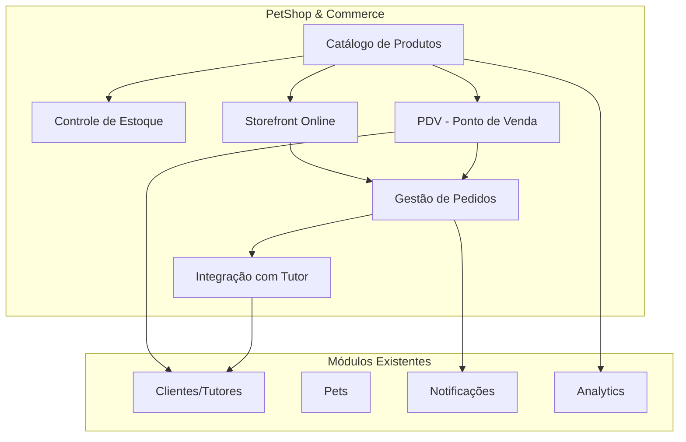
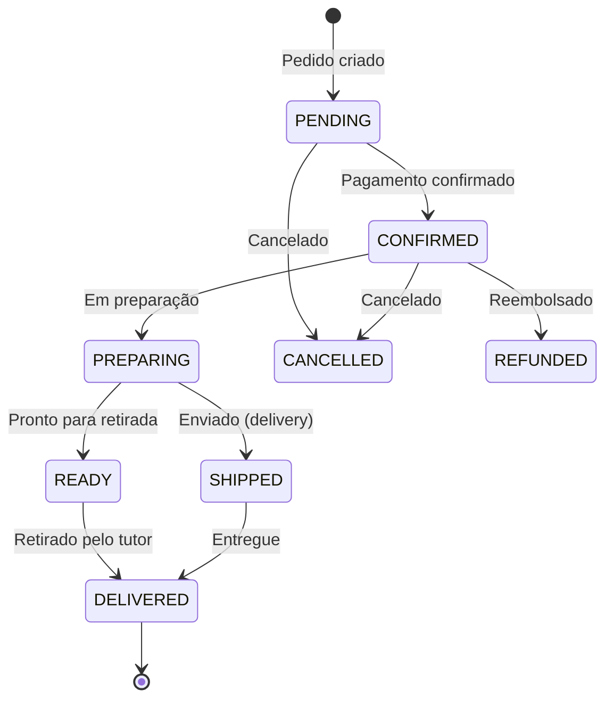
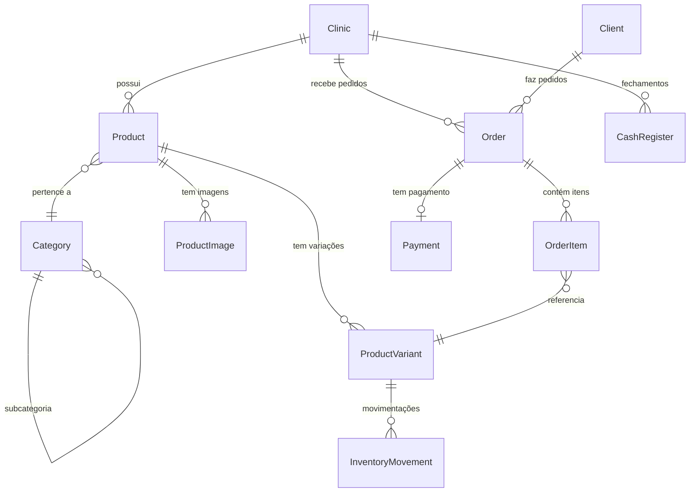
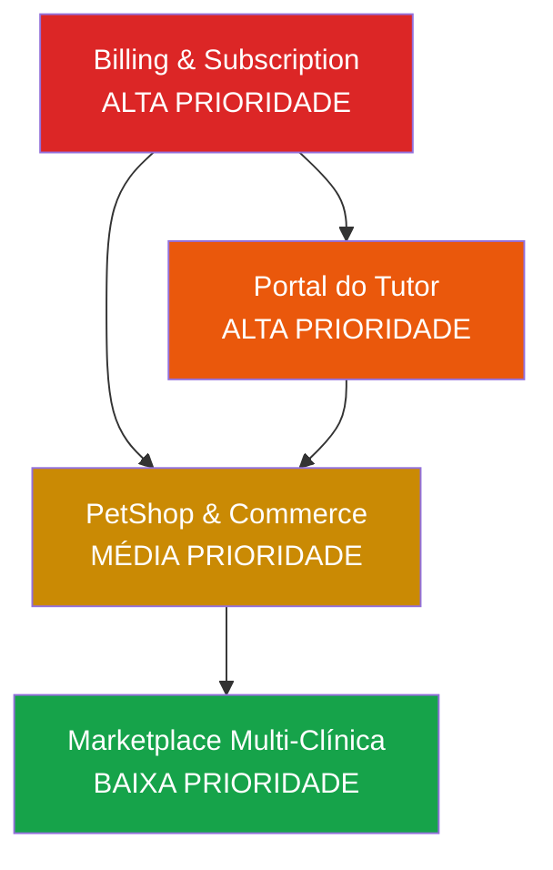
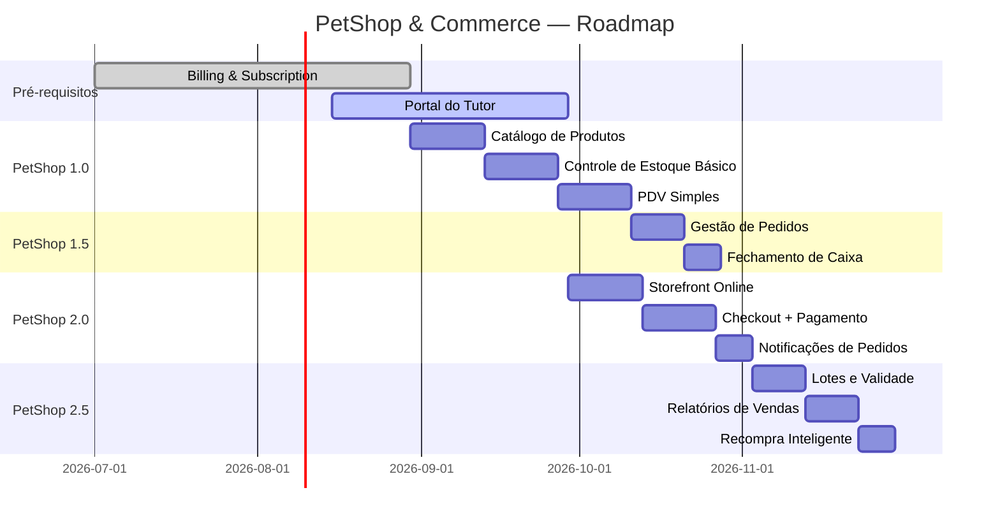

# Módulo PetShop & Commerce — VetOS AI

> Design do módulo de vendas de produtos pet integrado à plataforma VetOS AI.
> Prioridade: **Média** — implementar após Billing e Portal do Tutor.
> Última atualização: Junho/2026

---

## 1. Visão Geral

### 1.1 Por que PetShop?

O mercado pet brasileiro faturou **R$ 67,5 bilhões em 2024** (ABINPET), com crescimento de 14% ao ano. Clínicas veterinárias que vendem produtos pet (rações, medicamentos, acessórios) junto aos serviços clínicos têm **35-50% da receita vinda de vendas de produtos**.

Integrar um módulo de PetShop ao VetOS AI:

- **Aumenta o valor percebido**: A clínica resolve gestão clínica E comercial em um único sistema.
- **Reduz churn**: Quanto mais módulos a clínica usa, maior o custo de troca.
- **Gera receita adicional**: Via tier premium ou comissão sobre vendas.
- **Diferencial competitivo**: Poucos softwares veterinários integram PetShop de forma nativa.

### 1.2 Escopo do Módulo



---

## 2. Funcionalidades Detalhadas

### 2.1 Catálogo de Produtos

**Objetivo**: Permitir que a clínica cadastre e gerencie seu portfólio de produtos.

**Funcionalidades:**
- CRUD de produtos com nome, descrição, SKU, código de barras (EAN-13)
- Categorias hierárquicas (Ração > Ração Premium > Ração Cães Adultos)
- Múltiplas imagens por produto
- Variações (tamanho, sabor, peso) com preços distintos
- Preço de custo e preço de venda com cálculo de margem
- Tags e filtros (marca, espécie, faixa etária)
- Status: ativo, inativo, esgotado
- Produtos vinculados a espécie (cão, gato, ave, etc.) para recomendação personalizada

### 2.2 Controle de Estoque

**Objetivo**: Rastreamento em tempo real de quantidades, lotes e validades.

**Funcionalidades:**
- Quantidade atual por produto/variação
- Estoque mínimo com alertas automáticos (notificação ao admin)
- Movimentações de estoque (entrada, saída, ajuste, devolução) com histórico
- Controle de lotes e validade (crítico para medicamentos e rações)
- Alertas de produtos próximos ao vencimento (D-30, D-7)
- Inventário manual com confirmação de divergências
- Relatório de giro de estoque

### 2.3 PDV — Ponto de Venda

**Objetivo**: Venda rápida de produtos no balcão da clínica.

**Funcionalidades:**
- Busca rápida por nome, SKU ou código de barras
- Carrinho com múltiplos itens
- Vinculação opcional ao cliente/tutor cadastrado
- Aplicação de descontos (percentual ou valor fixo)
- Múltiplas formas de pagamento (dinheiro, PIX, cartão, fiado)
- Fechamento de caixa diário com resumo
- Impressão de recibo (integração com impressora térmica via API)
- Modo offline básico (cache local, sincroniza ao reconectar)

### 2.4 Storefront Online para Tutores

**Objetivo**: Permitir que tutores comprem produtos da clínica pelo portal ou app.

**Funcionalidades:**
- Vitrine pública com produtos da clínica
- Catálogo filtrado por espécie do pet do tutor (recomendações personalizadas)
- Carrinho de compras com checkout simplificado
- Pagamento via PIX, cartão ou boleto (reusa gateway de billing)
- Opções de entrega: retirada na clínica ou delivery
- Histórico de pedidos no perfil do tutor
- Recompra rápida de itens recorrentes (ração, medicamentos contínuos)
- Notificação automática quando o pedido estiver pronto para retirada

### 2.5 Gestão de Pedidos

**Objetivo**: Fluxo completo desde a criação do pedido até a entrega.



**Funcionalidades:**
- Dashboard de pedidos com filtros por status
- Atualização de status com notificação automática ao tutor (e-mail/WhatsApp)
- Notas internas por pedido
- Histórico de alterações
- Relatório de vendas por período, produto, categoria

### 2.6 Integração com o Portal do Tutor

**Objetivo**: Experiência unificada para o tutor.

- Ver produtos recomendados para seu pet no portal
- Comprar diretamente pelo portal
- Receber lembretes de recompra de ração (estimativa baseada no peso do pet e consumo)
- Ver histórico de compras junto ao histórico clínico
- Avaliar produtos comprados

---

## 3. Entidades de Banco de Dados

### 3.1 Diagrama ER



### 3.2 Models Prisma Propostos

```prisma
// ==========================================
// CATÁLOGO
// ==========================================

model Category {
  id          String     @id @default(uuid())
  clinicId    String
  name        String
  slug        String
  parentId    String?
  sortOrder   Int        @default(0)
  isActive    Boolean    @default(true)
  createdAt   DateTime   @default(now())
  updatedAt   DateTime   @updatedAt

  clinic      Clinic     @relation(fields: [clinicId], references: [id])
  parent      Category?  @relation("CategoryTree", fields: [parentId], references: [id])
  children    Category[] @relation("CategoryTree")
  products    Product[]

  @@unique([clinicId, slug])
}

model Product {
  id          String           @id @default(uuid())
  clinicId    String
  categoryId  String?
  name        String
  description String?
  sku         String?
  barcode     String?          // EAN-13
  species     String[]         // ["DOG", "CAT", "BIRD", ...]
  brand       String?
  tags        String[]
  isActive    Boolean          @default(true)
  createdAt   DateTime         @default(now())
  updatedAt   DateTime         @updatedAt

  clinic      Clinic           @relation(fields: [clinicId], references: [id])
  category    Category?        @relation(fields: [categoryId], references: [id])
  variants    ProductVariant[]
  images      ProductImage[]

  @@unique([clinicId, sku])
  @@unique([clinicId, barcode])
  @@index([clinicId, isActive])
}

model ProductVariant {
  id              String              @id @default(uuid())
  productId       String
  name            String              // Ex: "15kg", "Frango", "P"
  sku             String?
  barcode         String?
  costPrice       Decimal             @db.Decimal(10, 2)
  sellingPrice    Decimal             @db.Decimal(10, 2)
  currentStock    Int                 @default(0)
  minStock        Int                 @default(0)
  isActive        Boolean             @default(true)
  createdAt       DateTime            @default(now())
  updatedAt       DateTime            @updatedAt

  product         Product             @relation(fields: [productId], references: [id])
  movements       InventoryMovement[]
  orderItems      OrderItem[]

  @@index([productId])
}

model ProductImage {
  id          String   @id @default(uuid())
  productId   String
  url         String
  altText     String?
  sortOrder   Int      @default(0)
  createdAt   DateTime @default(now())

  product     Product  @relation(fields: [productId], references: [id])
}

// ==========================================
// ESTOQUE
// ==========================================

model InventoryMovement {
  id              String            @id @default(uuid())
  clinicId        String
  variantId       String
  type            MovementType
  quantity        Int               // Positivo = entrada, Negativo = saída
  reason          String?
  batchNumber     String?           // Lote
  expiresAt       DateTime?         // Validade
  referenceId     String?           // ID do pedido ou ajuste que originou
  createdBy       String?           // userId
  createdAt       DateTime          @default(now())

  variant         ProductVariant    @relation(fields: [variantId], references: [id])

  @@index([clinicId, createdAt])
  @@index([variantId])
}

enum MovementType {
  PURCHASE      // Compra/entrada
  SALE          // Venda/saída
  ADJUSTMENT    // Ajuste manual
  RETURN        // Devolução
  LOSS          // Perda/avaria
  TRANSFER      // Transferência entre unidades
}

// ==========================================
// PEDIDOS
// ==========================================

model Order {
  id              String        @id @default(uuid())
  clinicId        String
  clientId        String?       // Opcional para vendas no balcão
  orderNumber     String        // Sequencial por clínica
  channel         OrderChannel
  status          OrderStatus   @default(PENDING)
  subtotal        Decimal       @db.Decimal(10, 2)
  discount        Decimal       @db.Decimal(10, 2) @default(0)
  total           Decimal       @db.Decimal(10, 2)
  notes           String?
  deliveryMethod  DeliveryMethod?
  deliveryAddress String?
  createdAt       DateTime      @default(now())
  updatedAt       DateTime      @updatedAt

  clinic          Clinic        @relation(fields: [clinicId], references: [id])
  client          Client?       @relation(fields: [clientId], references: [id])
  items           OrderItem[]
  payment         Payment?

  @@unique([clinicId, orderNumber])
  @@index([clinicId, status])
  @@index([clientId])
}

model OrderItem {
  id          String         @id @default(uuid())
  orderId     String
  variantId   String
  productName String         // Snapshot do nome (desnormalizado)
  quantity    Int
  unitPrice   Decimal        @db.Decimal(10, 2)
  discount    Decimal        @db.Decimal(10, 2) @default(0)
  total       Decimal        @db.Decimal(10, 2)
  createdAt   DateTime       @default(now())

  order       Order          @relation(fields: [orderId], references: [id])
  variant     ProductVariant @relation(fields: [variantId], references: [id])

  @@index([orderId])
}

model Payment {
  id              String        @id @default(uuid())
  orderId         String        @unique
  method          PaymentMethod
  status          PaymentStatus @default(PENDING)
  amount          Decimal       @db.Decimal(10, 2)
  gatewayId       String?       // ID do pagamento no gateway
  paidAt          DateTime?
  metadata        Json?
  createdAt       DateTime      @default(now())
  updatedAt       DateTime      @updatedAt

  order           Order         @relation(fields: [orderId], references: [id])
}

// ==========================================
// PDV
// ==========================================

model CashRegister {
  id              String    @id @default(uuid())
  clinicId        String
  openedBy        String    // userId
  closedBy        String?   // userId
  openedAt        DateTime  @default(now())
  closedAt        DateTime?
  openingBalance  Decimal   @db.Decimal(10, 2)
  closingBalance  Decimal?  @db.Decimal(10, 2)
  totalSales      Decimal?  @db.Decimal(10, 2)
  totalCash       Decimal?  @db.Decimal(10, 2)
  totalCard       Decimal?  @db.Decimal(10, 2)
  totalPix        Decimal?  @db.Decimal(10, 2)
  notes           String?

  @@index([clinicId, openedAt])
}

// ==========================================
// ENUMS
// ==========================================

enum OrderStatus {
  PENDING
  CONFIRMED
  PREPARING
  READY
  SHIPPED
  DELIVERED
  CANCELLED
  REFUNDED
}

enum OrderChannel {
  POS         // Venda no balcão (PDV)
  ONLINE      // Storefront do tutor
  WHATSAPP    // Pedido via WhatsApp
}

enum DeliveryMethod {
  PICKUP      // Retirada na clínica
  DELIVERY    // Entrega
}

enum PaymentStatus {
  PENDING
  PAID
  FAILED
  REFUNDED
}

// Nota: PaymentMethod já existe no billing, reutilizar:
// CREDIT_CARD, PIX, BOLETO
// Adicionar:
// CASH, DEBIT_CARD, STORE_CREDIT
```

---

## 4. Modelo de Receita do Módulo

### 4.1 Como o PetShop Gera Receita para o VetOS AI

| Modelo | Descrição | Receita estimada |
| :--- | :--- | :--- |
| **Tier premium** | PetShop disponível a partir do plano Professional como add-on (R$ 79/mês) | R$ 79/clínica/mês |
| **Comissão sobre vendas online** | 2-3% sobre cada venda realizada pelo storefront | Variável |
| **Taxa de processamento** | Passa o custo do gateway + pequena margem | ~0,5% por transação |
| **Add-on de estoque avançado** | Controle de lotes, validade, multi-depósito | R$ 29/mês |

### 4.2 Projeção

Premissas: 100 clínicas usando PetShop, ticket médio R$ 5.000/mês em vendas por clínica.

| Fonte | Cálculo | Receita/mês |
| :--- | :--- | :--- |
| Assinatura add-on | 100 × R$ 79 | R$ 7.900 |
| Comissão (30% online) | 100 × R$ 5.000 × 30% × 2,5% | R$ 3.750 |
| **Total** | | **R$ 11.650** |

---

## 5. Prioridade e Dependências

### 5.1 Prioridade: Média

O módulo PetShop é de prioridade **média** porque:

- ✅ Alto valor de negócio (diferencial competitivo + receita)
- ✅ Boa sinergia com módulos existentes (clientes, pets, notificações)
- ❌ Complexidade alta (estoque, PDV, pagamentos)
- ❌ Depende de billing funcional e portal do tutor

### 5.2 Dependências



| Dependência | Módulo | Status | Por que é necessário |
| :--- | :--- | :--- | :--- |
| **Crítica** | Billing & Subscription | Planejado | PetShop é um add-on pago; precisa de billing funcional |
| **Crítica** | Portal do Tutor | Planejado | Storefront online depende do portal |
| **Existente** | Clients (Tutores) | ✅ Pronto | Pedidos vinculados a tutores existentes |
| **Existente** | Pets | ✅ Pronto | Recomendações por espécie |
| **Existente** | Notificações | ✅ Pronto | Alertas de pedidos via e-mail/WhatsApp |
| **Existente** | Analytics | ✅ Pronto | Relatórios de vendas reutilizam padrões |

### 5.3 Faseamento de Implementação

| Fase | Escopo | Estimativa |
| :--- | :--- | :--- |
| **PetShop 1.0** | Catálogo + Estoque básico + PDV simples | 4-6 semanas |
| **PetShop 1.5** | Gestão de pedidos + Integração com caixa | 2-3 semanas |
| **PetShop 2.0** | Storefront online + Checkout + Entregas | 4-6 semanas |
| **PetShop 2.5** | Lotes/validade + Relatórios avançados + Recompra | 3-4 semanas |

---

## 6. Arquitetura de Módulos (Backend)

```
backend/src/petshop/
├── petshop.module.ts
├── catalog/
│   ├── catalog.module.ts
│   ├── catalog.controller.ts       # CRUD de produtos e categorias
│   ├── catalog.service.ts
│   └── dto/
│       ├── create-product.dto.ts
│       ├── update-product.dto.ts
│       ├── create-category.dto.ts
│       └── product-filter.dto.ts
├── inventory/
│   ├── inventory.module.ts
│   ├── inventory.controller.ts     # Movimentações, alertas
│   ├── inventory.service.ts
│   └── dto/
│       ├── stock-movement.dto.ts
│       └── inventory-adjustment.dto.ts
├── orders/
│   ├── orders.module.ts
│   ├── orders.controller.ts        # CRUD de pedidos
│   ├── orders.service.ts
│   └── dto/
│       ├── create-order.dto.ts
│       └── update-order-status.dto.ts
├── pos/
│   ├── pos.module.ts
│   ├── pos.controller.ts           # PDV: carrinho, checkout rápido, caixa
│   ├── pos.service.ts
│   └── dto/
│       └── pos-checkout.dto.ts
└── storefront/
    ├── storefront.module.ts
    ├── storefront.controller.ts    # API pública para o portal do tutor
    ├── storefront.service.ts
    └── dto/
        └── storefront-checkout.dto.ts
```

---

## 7. Endpoints da API

### 7.1 Catálogo

| Método | Rota | Descrição | Guard |
| :--- | :--- | :--- | :--- |
| `GET` | `/petshop/categories` | Lista categorias da clínica | Auth |
| `POST` | `/petshop/categories` | Cria categoria | Auth + Admin |
| `GET` | `/petshop/products` | Lista produtos (com filtros) | Auth |
| `POST` | `/petshop/products` | Cria produto | Auth + Admin |
| `PUT` | `/petshop/products/:id` | Atualiza produto | Auth + Admin |
| `DELETE` | `/petshop/products/:id` | Desativa produto | Auth + Admin |

### 7.2 Estoque

| Método | Rota | Descrição | Guard |
| :--- | :--- | :--- | :--- |
| `GET` | `/petshop/inventory` | Visão geral do estoque | Auth |
| `GET` | `/petshop/inventory/alerts` | Produtos com estoque baixo / vencendo | Auth |
| `POST` | `/petshop/inventory/movements` | Registra movimentação | Auth + Admin |
| `GET` | `/petshop/inventory/:variantId/history` | Histórico de movimentações | Auth |

### 7.3 Pedidos & PDV

| Método | Rota | Descrição | Guard |
| :--- | :--- | :--- | :--- |
| `POST` | `/petshop/pos/checkout` | Venda rápida no PDV | Auth |
| `GET` | `/petshop/orders` | Lista pedidos | Auth |
| `GET` | `/petshop/orders/:id` | Detalhe do pedido | Auth |
| `PATCH` | `/petshop/orders/:id/status` | Atualiza status | Auth |
| `GET` | `/petshop/cash-register/current` | Caixa aberto | Auth |
| `POST` | `/petshop/cash-register/open` | Abre caixa | Auth + Admin |
| `POST` | `/petshop/cash-register/close` | Fecha caixa | Auth + Admin |

### 7.4 Storefront (API pública para o portal do tutor)

| Método | Rota | Descrição | Guard |
| :--- | :--- | :--- | :--- |
| `GET` | `/storefront/:clinicSlug/products` | Lista produtos disponíveis | Público/Tutor |
| `GET` | `/storefront/:clinicSlug/products/:id` | Detalhe do produto | Público/Tutor |
| `POST` | `/storefront/orders` | Cria pedido online | Tutor Auth |
| `GET` | `/storefront/orders` | Pedidos do tutor | Tutor Auth |

---

## 8. Integração com Módulos Existentes

### 8.1 Com Notificações

Reutilizar a infraestrutura de [NotificationsModule](file:///home/moa-dev/projetos/vetos-ai/backend/prisma/schema.prisma) para:

| Evento | Canal | Template |
| :--- | :--- | :--- |
| Pedido confirmado | E-mail + WhatsApp | "Olá {tutor}, seu pedido #{numero} foi confirmado!" |
| Pedido pronto para retirada | WhatsApp | "Seu pedido está pronto para retirada na {clinica}!" |
| Pedido enviado | E-mail + WhatsApp | "Seu pedido #{numero} saiu para entrega!" |
| Estoque baixo (para admin) | E-mail | "Alerta: {produto} está com apenas {qtd} unidades" |
| Produto próximo ao vencimento | E-mail | "Atenção: {produto} lote {lote} vence em {dias} dias" |
| Lembrete de recompra | WhatsApp | "Hora de repor a ração do {pet}? Compre agora com {desconto}%!" |

### 8.2 Com Analytics

Novos KPIs para o painel de analytics:

- Vendas totais por período (diário, semanal, mensal)
- Ticket médio
- Produtos mais vendidos
- Margem média
- Giro de estoque
- Taxa de conversão do storefront

### 8.3 Com Prontuário (PetDetails)

- Prescrição de medicamento no prontuário → link direto para comprar no storefront
- Recomendação de ração baseada na espécie/peso/condição clínica do pet
- Histórico de compras visível na ficha do pet

---

## 9. Análise Competitiva

### 9.1 Soluções Integradas Vet + PetShop no Brasil

| Solução | PetShop integrado? | PDV? | Storefront? | Preço do módulo |
| :--- | :---: | :---: | :---: | :--- |
| **SimplesVet** | ✅ (básico) | ✅ | ❌ | Incluso no plano |
| **Dr. Vet** | ✅ (completo) | ✅ | ❌ | R$ 69/mês extra |
| **Vet+** | ❌ | ❌ | ❌ | — |
| **Dentalis Vet** | ❌ | ❌ | ❌ | — |
| **Nuvem Vet** | ✅ (básico) | ✅ | ❌ | Incluso |
| **VetOS AI** (proposta) | ✅ (completo) | ✅ | ✅ | R$ 79/mês extra |

### 9.2 Diferenciais do VetOS AI PetShop

| Diferencial | Descrição | Concorrentes oferecem? |
| :--- | :--- | :---: |
| **Storefront online** | Tutor compra produtos pelo portal, sem ligação | ❌ Nenhum |
| **Recompra inteligente** | Estima quando a ração acaba baseado no peso do pet | ❌ Nenhum |
| **Prescrição → Compra** | Link direto do prontuário para o produto | ❌ Nenhum |
| **WhatsApp Commerce** | Pedido por WhatsApp integrado ao estoque | ❌ Nenhum |
| **Multi-canal** | PDV + Storefront + WhatsApp em um painel | ❌ Nenhum |
| **Alertas de validade** | Controle de lotes com notificação automática | Parcial (SimplesVet) |

### 9.3 Riscos e Mitigações

| Risco | Impacto | Mitigação |
| :--- | :--- | :--- |
| Complexidade de implementação | Alto — estoque + PDV é complexo | Fases incrementais; começar com catálogo + PDV simples |
| Concorrência com ERPs dedicados | Médio — Bling, Tiny são robustos | Foco na integração clínica (prescrição → venda); não competir como ERP |
| Gestão fiscal (NF-e) | Alto — obrigatório para vendas | Integrar com API de NF-e (Nuvem Fiscal, eNotas) na fase 2.0 |
| Suporte a impressora térmica | Médio — hardware variado | Usar API padrão ESC/POS via WebUSB ou servidor local |
| Estoque multi-depósito | Baixo — minoria das clínicas | Deixar para fase 3.0 |

---

## 10. Roadmap de Implementação



---

## 11. Métricas de Sucesso

| Métrica | Meta (3 meses pós-lançamento) | Meta (6 meses) |
| :--- | :--- | :--- |
| Clínicas usando PetShop | 30 | 80 |
| Receita do add-on | R$ 2.370/mês | R$ 6.320/mês |
| Pedidos online / total | 10% | 25% |
| NPS do módulo | > 40 | > 50 |
| Redução de churn em clínicas com PetShop | -15% vs sem | -25% vs sem |

---

> [!NOTE]
> Este documento é um design de produto e deve ser validado com pesquisa de campo junto a clínicas veterinárias que já vendem produtos pet. Os insights de clientes devem moldar a priorização das funcionalidades antes do início do desenvolvimento.
