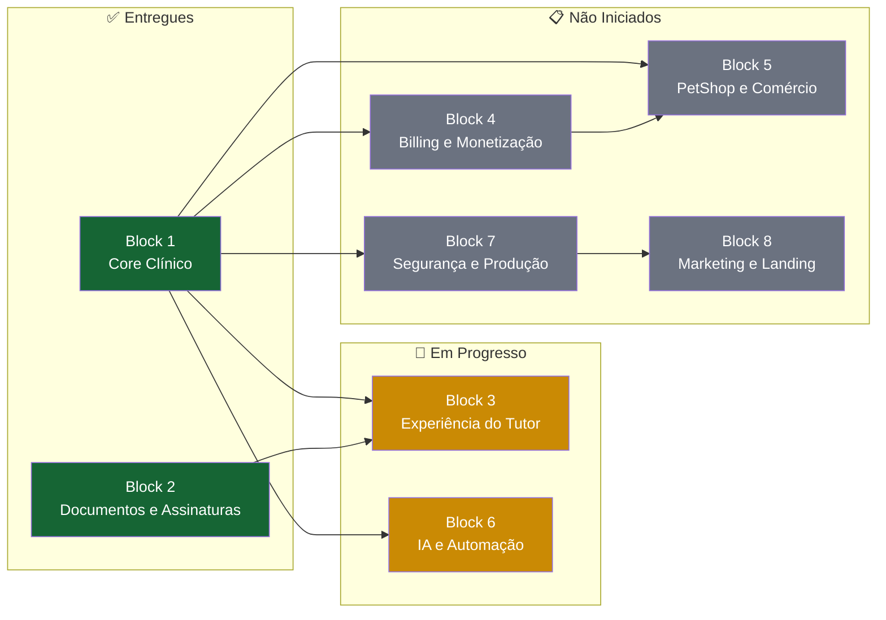
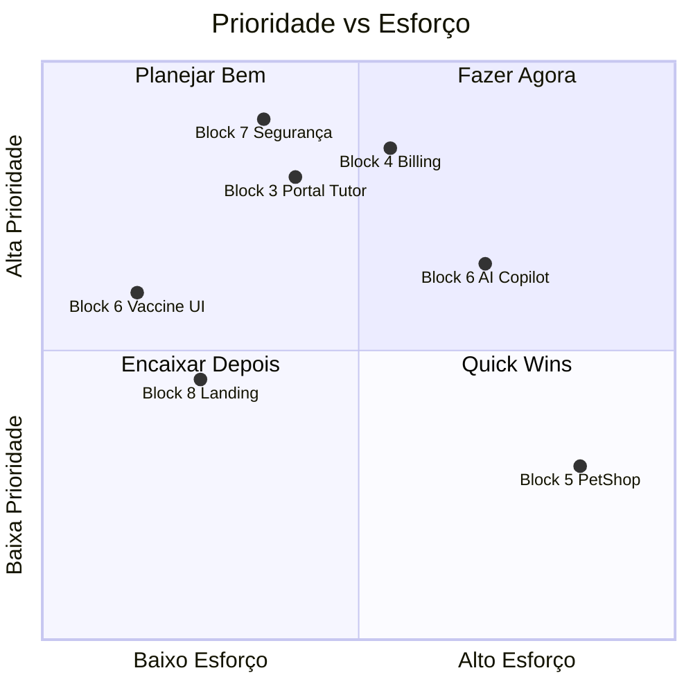

# Roadmap Estratégico V2 — VetOS AI

> **Última atualização:** 26/06/2026
> **Versão:** 2.0 — Proposta Paralela (não substitui [ROADMAP.md](file:///home/moa-dev/projetos/vetos-ai/.planning/ROADMAP.md))

Visão estratégica do produto VetOS AI organizada por **Blocos Funcionais** ao invés de fases sequenciais. Cada bloco agrupa funcionalidades que compartilham o mesmo domínio de negócio, permitindo priorização independente e paralelização de esforços.

---

---

## Block 1: Core Clínico ✅

| Atributo | Valor |
| :--- | :--- |
| **Objetivo** | Estabelecer toda a fundação da plataforma: autenticação multi-tenant, CRUD de entidades clínicas, calendário veterinário premium, prontuário médico completo e analytics operacional |
| **Status** | **COMPLETO** |
| **Prioridade** | Crítico |
| **Esforço Investido** | ~13 fases (Fases 1–13) |
| **Dependências** | Nenhuma (bloco raiz) |

### Entregas Concluídas

| Componente | Fase | Detalhamento |
| :--- | :---: | :--- |
| Infraestrutura e Monorepo | 1 | NestJS + React monorepo, Docker (Postgres + Redis) |
| Multi-Tenant e Autenticação | 2 | JWT, RBAC (ADMIN/STAFF/SUPERADMIN), isolamento por `clinicId` |
| CRUD Core | 2–3 | Clínicas, Usuários, Clientes, Pets, Agendamentos |
| Automação e Notificações | 4 | BullMQ, SMTP, WhatsApp (Evolution API), Cron scheduler, templates |
| Admin Dashboard | 5 | Dashboard com estatísticas, CRUD visual, feed de atividades |
| Super Admin | 7 | Impersonation, gestão de clínicas, métricas globais |
| UI/UX Premium | 8–9 | Refinamentos visuais, tema claro/escuro com OKLCH |
| Calendário Premium | 10 | Visualizações diária/semanal, criação ágil, filtros |
| Prontuário Completo | 11 | Clinical records, alergias, vacinas, peso, linha do tempo |
| Feed de Auditoria | 12 | Activity feed com 7 tipos de entidade |
| Analytics Operacional | 13 | Gráficos de 30 dias, inativos 90d, alertas vacinais (13A, 13B, 13C) |

> [!NOTE]
> O Block 1 representa **85% do código atual** da plataforma e toda a proposta de valor MVP para clínicas veterinárias.

---

## Block 2: Documentos e Assinaturas ✅

| Atributo | Valor |
| :--- | :--- |
| **Objetivo** | Habilitar conformidade legal com documentação digital: uploads de exames, receitas médicas, termos de consentimento e assinaturas digitais com verificação pública |
| **Status** | **COMPLETO** |
| **Prioridade** | Crítico |
| **Esforço Investido** | ~5 fases (16A, 16B, 16B.1, 16B.1.1, 16B.1.2) |
| **Dependências** | Block 1 (Prontuário, Notificações) |

### Entregas Concluídas

| Componente | Fase | Detalhamento |
| :--- | :---: | :--- |
| Uploads de Exames | 16A | `ClinicalAttachment` model, validação MIME, armazenamento seguro |
| Receitas Médicas | 16B | `Prescription` model, layout de impressão, assinatura digital |
| Termos de Consentimento | 16B | `ConsentTemplate` + `ConsentTerm` models, geração dinâmica |
| Compartilhamento com Tutor | 16B.1 | `ShareDocumentModal`, envio por e-mail e WhatsApp, PDF |
| Aceite Digital do Tutor | 16B.1.1 | Formulário público com CPF, auditoria (IP, User-Agent), timeline |
| Cadastro Completo do Tutor | 16B.1.2 | Expansão do `Client` (endereço, telefone, contato emergência) |

> [!NOTE]
> Este bloco construiu toda a cadeia de conformidade legal: documento → assinatura → verificação → compartilhamento → aceite pelo tutor.

---

## Block 3: Experiência do Tutor 🔄

| Atributo | Valor |
| :--- | :--- |
| **Objetivo** | Transformar o tutor de receptor passivo em usuário ativo da plataforma, com portal dedicado para acessar dados dos pets, histórico, documentos e comunicação com a clínica |
| **Status** | **EM PROGRESSO** |
| **Prioridade** | Alto |
| **Esforço Estimado** | 2–3 semanas |
| **Dependências** | Block 1, Block 2 |

### Status das Fases

| Fase | Título | Status | Observação |
| :--- | :--- | :---: | :--- |
| 16B.1.2 | Cadastro Completo do Tutor | ✅ Completo | Formulário público, validação, expansão do `Client` |
| 16B.1.2.1 | Portal do Tutor | 📋 Não Planejado | Apenas `.gitkeep` — requer planejamento completo |

### Escopo Previsto — Portal do Tutor (Fase 16B.1.2.1)

Funcionalidades esperadas para planejamento:

- **Autenticação do Tutor**: Login por magic link (e-mail/WhatsApp) ou senha. Modelo `TutorAuth` ou expansão de `Client`
- **Visualização de Pets**: Lista dos animais vinculados ao tutor com dados básicos e foto
- **Histórico Clínico**: Timeline de consultas, procedimentos e prontuários (leitura)
- **Documentos Assinados**: Acesso a receitas, termos de consentimento e certificados de vacinação
- **Próximas Consultas**: Visualização de agendamentos futuros com opção de cancelamento/reagendamento
- **Carteira de Vacinação Digital**: Comprovante vacinal digital do pet
- **Notificações**: Central de avisos recebidos pela clínica

> [!IMPORTANT]
> O Portal do Tutor é o principal diferencial competitivo do VetOS AI frente a concorrentes que não oferecem interface para o dono do pet. Deve ser priorizado antes de features de monetização.

### Deliverables

- [ ] Planejamento detalhado da Fase 16B.1.2.1 (`SPEC.md`, `PLAN.md`)
- [ ] Backend: autenticação de tutor, rotas read-only, middleware de escopo
- [ ] Frontend: portal responsivo (mobile-first) com tema VetOS
- [ ] Integração: magic link via notificações existentes

---

## Block 4: Billing e Monetização 📋

| Atributo | Valor |
| :--- | :--- |
| **Objetivo** | Habilitar receita recorrente com cobrança automatizada, enforcement de planos SaaS e portal de faturamento para clínicas |
| **Status** | **NÃO INICIADO** |
| **Prioridade** | Crítico |
| **Esforço Estimado** | 3–4 semanas |
| **Dependências** | Block 1 (Modelos `Plan`, `ClinicSubscription` já existem) |

### Contexto Atual

O banco de dados já contém os modelos `Plan` e `ClinicSubscription` com limites por tenant (usuários, armazenamento, notificações), porém:

- ❌ Nenhum gateway de pagamento integrado
- ❌ Enforcement de cotas não distribuído nos controllers
- ❌ Sem checkout ou portal de faturamento no frontend

### Fases Associadas

| Fase | Título | Status |
| :--- | :--- | :---: |
| 15 | SaaS Billing & Stripe Integration | 📋 Não Iniciado |

### Deliverables

- [ ] Integração Stripe (ou Asaas) com webhooks para subscription lifecycle
- [ ] Middleware/Guard NestJS para enforcement de cotas por plano
- [ ] Checkout de plano e upgrade/downgrade no frontend
- [ ] Portal de faturamento: faturas, histórico de pagamentos, método de pagamento
- [ ] Webhook de suspensão automática por inadimplência
- [ ] Trial period e onboarding flow

> [!CAUTION]
> **Bloqueador de Receita:** Sem este bloco, a plataforma não gera receita. Deve ser priorizado logo após o Portal do Tutor para viabilizar o modelo de negócio SaaS.

---

## Block 5: PetShop e Comércio 💭

| Atributo | Valor |
| :--- | :--- |
| **Objetivo** | Expandir o VetOS AI para gestão de produtos e operações comerciais da clínica/petshop: catálogo, estoque, PDV e potencial e-commerce para tutores |
| **Status** | **NÃO INICIADO** (conceitual) |
| **Prioridade** | Médio |
| **Esforço Estimado** | 6–8 semanas |
| **Dependências** | Block 4 (Billing deve estar funcional) |

### Escopo Conceitual

| Módulo | Descrição |
| :--- | :--- |
| **Catálogo de Produtos** | Cadastro de itens (rações, medicamentos, acessórios) com categorização e controle por unidade/lote |
| **Gestão de Estoque** | Controle de entradas/saídas, alertas de estoque mínimo, relatório de movimentação |
| **Ponto de Venda (PDV)** | Interface ágil de venda no balcão com cálculo de troco, desconto e múltiplas formas de pagamento |
| **E-commerce do Tutor** | Vitrine pública integrada ao Portal do Tutor para pedidos de rações e produtos recorrentes |
| **Nota Fiscal Eletrônica** | Integração com sistema de emissão de NF-e/NFC-e |

> [!NOTE]
> Este bloco é uma expansão de mercado (TAM) e não é necessário para o MVP clínico. Deve ser planejado com cuidado para não diluir o foco da equipe.

### Deliverables

- [ ] Modelagem de dados (Product, Stock, Order, Payment)
- [ ] Backend: CRUD de produtos, gestão de estoque, processamento de vendas
- [ ] Frontend: PDV responsivo, catálogo, controle de estoque
- [ ] Integração com Portal do Tutor (vitrine e pedidos)
- [ ] Relatórios financeiros e de movimentação

---

## Block 6: IA e Automação 🔄

| Atributo | Valor |
| :--- | :--- |
| **Objetivo** | Elevar a inteligência da plataforma com IA generativa para diagnósticos, automação avançada de campanhas e predição comportamental |
| **Status** | **PARCIAL** |
| **Prioridade** | Alto |
| **Esforço Estimado** | 4–6 semanas |
| **Dependências** | Block 1 (Prontuário, Analytics, Notificações) |

### Status das Fases

| Fase | Título | Status | Observação |
| :--- | :--- | :---: | :--- |
| 14A | Vaccine Automation Backend Engine | ✅ Completo | Scheduler, deduplicação, janelas UTC-safe, dev-trigger |
| 14B | Vaccine Management Frontend UI | 📋 Não Iniciado | Monitoramento de fila, disparo manual, métricas |
| 17 | AI Copilot & Anamnesis Optimizer | 📋 Não Iniciado | IA generativa, predição, reengajamento |

### Deliverables — Fase 14B (Vaccine UI)

- [ ] Painel de monitoramento de lembretes futuros na fila BullMQ (D0, D-1, D-7)
- [ ] Botão de disparo manual imediato de lembretes por pet
- [ ] Toggle para ativar/desativar lembretes automáticos por pet
- [ ] Dashboard de métricas: vacinas notificadas vs. doses aplicadas (conversão)

### Deliverables — Fase 17 (AI Copilot)

- [ ] **Copilot de Anamnese**: Sugestão de diagnósticos e exames com base em sintomas descritos
- [ ] **Reengajamento por IA**: Redação automatizada de mensagens humanizadas para clientes inativos
- [ ] **Preditor de No-Show**: Modelo de probabilidade de falta baseado em histórico comportamental
- [ ] Integração com LLM (OpenAI/Anthropic) via API key configurável por clínica

> [!TIP]
> A Fase 14B (Vaccine UI) é de esforço curto (~3-5 dias) pois o backend já está completo. Pode ser encaixada como quick win entre blocos maiores.

---

## Block 7: Segurança e Produção 📋

| Atributo | Valor |
| :--- | :--- |
| **Objetivo** | Blindar a plataforma para produção: rate limiting, hardening de segurança, refatoração de débitos técnicos e cobertura de testes automatizados |
| **Status** | **NÃO INICIADO** |
| **Prioridade** | Crítico |
| **Esforço Estimado** | 2–3 semanas |
| **Dependências** | Nenhuma (pode rodar em paralelo) |

### Fases Associadas

| Fase | Título | Status |
| :--- | :--- | :---: |
| 18 | Segurança, Rate Limiting & e2e Tests | 📋 Não Iniciado |

### Deliverables

- [ ] **NestJS Redis Module**: Encapsular `ioredis` na injeção de dependências (eliminar `require('ioredis')` manual)
- [ ] **Rate Limiter**: `@nestjs/throttler` em rotas críticas (login, registro, teste de conexão, endpoints de envio)
- [ ] **Refatoração PetDetails.tsx**: Decompor o componente de 100KB em subcomponentes isolados
- [ ] **Testes e2e**: Cobertura com Playwright/Cypress dos fluxos críticos:
  - Login → Dashboard → Agendamento → Prontuário → Notificação
  - Fluxo de assinatura pública do tutor
  - Impersonation por Super Admin
- [ ] **CORS e Helmet**: Configuração adequada de headers de segurança
- [ ] **Validação de Input**: Pipes de validação globais com `class-validator`
- [ ] **Variáveis de Ambiente**: Auditoria de secrets e configuração de `ENCRYPTION_KEY` obrigatória

> [!CAUTION]
> **Risco de Produção:** Sem rate limiting, as rotas de login e de teste de conexão (que geram envios externos) estão expostas a brute force e consumo financeiro de cotas. Este bloco deve ser completado **antes do launch público**.

### Débitos Técnicos Conhecidos

| Débito | Severidade | Módulo |
| :--- | :---: | :--- |
| Redis via `require('ioredis')` ao invés de DI | Média | `scheduler/` |
| `ENCRYPTION_KEY` efêmera em desenvolvimento | Baixa | `encryption/` |
| `PetDetails.tsx` com 100KB (monolítico) | Média | `frontend/pages/` |
| Sem testes e2e no frontend | Alta | `frontend/` |
| Template renderer com risco de XSS | Alta | `notifications/` |

---

## Block 8: Marketing e Landing Page 📋

| Atributo | Valor |
| :--- | :--- |
| **Objetivo** | Criar presença pública da marca VetOS AI: landing page institucional com SEO, conversão de leads e demonstração do produto |
| **Status** | **NÃO INICIADO** |
| **Prioridade** | Médio |
| **Esforço Estimado** | 1–2 semanas |
| **Dependências** | Block 7 (plataforma pronta para produção), Block 4 (planos definidos para pricing page) |

### Deliverables

- [ ] Landing page institucional responsiva (mobile-first)
- [ ] Seções: Hero, Features, Pricing, Testimonials, FAQ, CTA
- [ ] SEO técnico: meta tags, Open Graph, sitemap, robots.txt
- [ ] Formulário de lead capture (email de clínicas interessadas)
- [ ] Integração com analytics (Google Analytics / Plausible)
- [ ] Demo interativa ou screenshots do produto
- [ ] Página de Pricing alinhada com os planos do Block 4
- [ ] Blog/conteúdo veterinário para SEO orgânico (futuro)

---

## Matriz de Priorização

---

## Ordem de Execução Recomendada

| Ordem | Bloco | Justificativa | Estimativa |
| :---: | :--- | :--- | :---: |
| 1️⃣ | **Block 7** — Segurança e Produção | Pré-requisito para qualquer deploy público | 2–3 sem |
| 2️⃣ | **Block 6** — Vaccine UI (14B) | Quick win: backend pronto, apenas frontend | 3–5 dias |
| 3️⃣ | **Block 3** — Portal do Tutor | Diferencial competitivo, habilita retenção | 2–3 sem |
| 4️⃣ | **Block 4** — Billing e Monetização | Habilita receita recorrente (modelo SaaS) | 3–4 sem |
| 5️⃣ | **Block 8** — Landing Page | Habilita aquisição de clientes | 1–2 sem |
| 6️⃣ | **Block 6** — AI Copilot (17) | Diferencial premium, alto valor percebido | 3–4 sem |
| 7️⃣ | **Block 5** — PetShop e Comércio | Expansão de mercado, nova vertical | 6–8 sem |

> [!TIP]
> A Fase 14B (Vaccine UI) do Block 6 pode ser intercalada como quick win a qualquer momento, pois tem esforço mínimo e backend já completo.

---

## Indicadores de Progresso Global

| Métrica | Valor Atual |
| :--- | :--- |
| **Blocos Completos** | 2 de 8 (25%) |
| **Blocos em Progresso** | 2 de 8 (25%) |
| **Blocos Não Iniciados** | 4 de 8 (50%) |
| **Fases Entregues** | 17 de 21+ |
| **Cobertura de Testes** | Unitários parciais, e2e = 0% |
| **Prontidão para Produção** | ⚠️ Requer Block 7 |

---

> **Nota:** Este documento é o `ROADMAP-V2`, uma proposta paralela de organização estratégica. O [ROADMAP.md](file:///home/moa-dev/projetos/vetos-ai/.planning/ROADMAP.md) original permanece inalterado como referência histórica das fases sequenciais.
