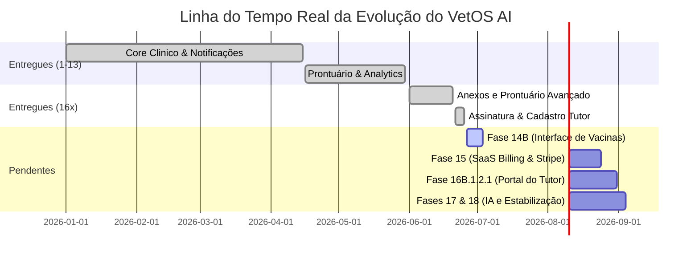

# Reconciliação do Estado do Projeto — VetOS AI

Este documento estabelece a fonte única da verdade para o estado do projeto VetOS AI, diagnosticando e reconciliando as inconsistências encontradas entre os arquivos de planejamento (`STATE.md`, `ROADMAP.md` e `CURRENT_STATE.md`) e o estado real da base de código.

---

## 1. Auditoria de Inconsistências Detectadas

### 1.1 Inconsistências em `STATE.md`
*   **Status do Projeto e Metas de Conclusão:** O cabeçalho (frontmatter) indica que a milestone está completa e parou na Fase 16B.1.1, mas o progresso está congelado com números extremamente baixos:
    ```yaml
    status: complete
    stopped_at: Phase 16B.1.1 completed and verified
    progress:
      total_phases: 10
      completed_phases: 1
      total_plans: 9
      completed_plans: 1
      percent: 10
    ```
    *Divergência:* Pelo menos 18 fases/waves foram concluídas na realidade.
*   **Fase Atual (Current Phase) Congelada:**
    ```markdown
    ## Current Phase: Phase 4 (Automation and Notifications Core)
    **Status:** Ready to plan
    ```
    *Divergência:* A Fase 4 foi inteiramente concluída com todas as suas waves (1A, 1B, 2 e 3) e o status deveria refletir uma fase pós-16B.1.2.
*   **Próximos Passos (Next Steps) Obsoletos:**
    ```markdown
    ## Next Steps
    - Execute Phase 4 Wave 3 when ready to implement Evolution API integration and the frontend notification observability/configuration dashboard.
    ```
    *Divergência:* A Wave 3 da Fase 4 já está implementada e integrada.

### 1.2 Inconsistências em `ROADMAP.md`
*   **Omissão de Fases Anteriores:** Não há menção às Fases 1 a 13 que foram executadas e validadas. O arquivo assume o planejamento a partir de fases futuras e algumas do bloco 16.
*   **Status de Conclusão Oculto:** As fases `16A`, `16B`, `16B.1` e `16B.1.2` estão de fato implementadas no código-fonte, mas não estão marcadas como concluídas no roadmap:
    ```markdown
    - [ ] TBD (run /gsd-plan-phase 16A to break down)
    - [ ] TBD (run /gsd-plan-phase 16B to break down)
    ```
    Apenas a `16B.1.1` consta com o checkbox marcado (`[x] COMPLETED`).

### 1.3 Inconsistências em `CURRENT_STATE.md`
*   **Desatualização do Bloco 16:** É o documento mais completo de auditoria do código, mas foi escrito antes do início da implementação das fases 16x. Não lista nenhuma das fases `16A`, `16B`, `16B.1`, `16B.1.1` e `16B.1.2`, que já possuem arquivos de código e artefatos de planejamento criados e validados no repositório.

---

## 2. Baseline de Status Real das Fases (1 a 18)

Com base no cruzamento entre os arquivos de planejamento existentes na pasta `.planning/phases/` e a análise de código (`backend/src/` e `frontend/src/`), o status real do projeto é estruturado conforme a tabela abaixo:

| Fase | Título | Status Real | Evidência em Código / Artefatos |
| :--- | :--- | :--- | :--- |
| **Fase 1** | Setup do Projeto & Infraestrutura | **Concluído** | Monorepo estruturado, arquivos `docker-compose` de suporte. |
| **Fase 2** | Modelagem do Banco & Core API | **Concluído** | Prisma schema com multi-tenancy, autenticação e RBAC. |
| **Fase 3** | Consultas e Lógica de Negócio | **Concluído** | Entidades básicas (Clients, Pets, Appointments) funcionais. |
| **Fase 4** | Automação e Notificações Core | **Concluído** | Fila do BullMQ, integração SMTP e Evolution API (WhatsApp) prontas. |
| **Fase 5** | Desenvolvimento do Frontend (Admin) | **Concluído** | Dashboard de administração e telas básicas de gestão de clientes/pets. |
| **Fase 6** | *N/A (Não Documentada)* | **Ignorada** | Sem artefatos de planejamento ou diretório físico na base. |
| **Fase 7** | Super Admin Dashboard | **Concluído** | Gerenciamento global de clínicas e funcionalidade de impersonation. |
| **Fase 8** | Refinamentos de UI/UX | **Concluído** | Estilos CSS premium aplicados, estados de carregamento e vazios. |
| **Fase 9** | Suporte a Tema Claro / Escuro | **Concluído** | `ThemeContext` no frontend e variáveis OKLCH mapeadas. |
| **Fase 10** | Calendário de Consultas Premium | **Concluído** | Visualização diária/semanal de agendamentos no frontend. |
| **Fase 11** | Prontuário Clínico & Histórico | **Concluído** | Linha do tempo, vacinas, alergias, peso e notas médicas. |
| **Fase 12** | Feed de Atividades da Clínica | **Concluído** | Módulo de auditoria e linha do tempo de eventos clínicos/operacionais. |
| **Fase 13** | Insights & Analytics Operacionais | **Concluído** | Dashboards de análise e consolidação de dados de faturamento/retenção. |
| **Fase 14A**| Motor de Automação de Vacinas (Back) | **Concluído** | Lógica de automação de vacinação e disparo via fila BullMQ no backend. |
| **Fase 14B**| Interface de Gerenciamento de Vacinas | **Não Iniciado** | Falta tela para visualizar e interagir com a fila de lembretes no frontend. |
| **Fase 15** | SaaS Billing & Stripe Integration | **Não Iniciado** | Modelos de planos definidos no banco, mas lógica de limitação e pagamento inexistente. |
| **Fase 16A**| Upload de Exames e Anexos Clínicos | **Concluído** | Módulo `clinical-attachments` e tabela `ClinicalAttachment`. |
| **Fase 16B**| Prontuário Avançado & Assinatura | **Concluído** | Modelos `Prescription`, `ConsentTemplate` e `ConsentTerm` criados. |
| **Fase 16B.1**| Compartilhamento com Tutor | **Concluído** | Modal de compartilhamento no frontend integrado a notificações. |
| **Fase 16B.1.1**| Aceite e Assinatura Digital do Tutor | **Concluído** | Tela `PublicDocumentView` com fluxo de assinatura por IP/User Agent. |
| **Fase 16B.1.2**| Cadastro Completo do Tutor | **Concluído** | Modelo `Client` expandido com CPF, RG, contatos e endereço. |
| **Fase 16B.1.2.1**| Portal do Tutor | **Planejado** | Apenas diretório com `.gitkeep` existente. Sem códigos ou planos. |
| **Fase 17** | IA Assistente (AI Copilot) | **Não Iniciado** | Pendente de planejamento de prompts e integrações de LLM. |
| **Fase 18** | Refinamentos de Segurança & Testes e2e | **Não Iniciado** | Débitos técnicos acumulados (Throttler, Redis Module, refatorar PetDetails). |

---

## 3. Cronograma e Linha do Tempo Real

Abaixo, a representação visual da evolução cronológica real do projeto, considerando o trabalho entregue (fases concluídas) e o trabalho futuro necessário (fases pendentes):



---

## 4. Plano de Correção e Atualização dos Arquivos de Controle

Para sanar as inconsistências mapeadas, os seguintes passos de edição devem ser tomados assim que o portal ou o planejamento estratégico atual for aprovado.

### 4.1 Correção Segura de `.planning/STATE.md`
1.  Atualizar o status no frontmatter para `active` (caso estejamos planejando ativamente) ou manter `complete` apenas se a meta de reorganização estiver fechada.
2.  Corrigir os contadores de progresso para contemplar a totalidade de fases concluídas (18 concluídas).
3.  Modificar a `Current Phase` para apontar para a **Fase 14B** (ou **Fase 15**, de acordo com a prioridade selecionada).
4.  Substituir os `Next Steps` pelo planejamento da próxima fase de desenvolvimento ativo.

### 4.2 Correção Segura de `.planning/ROADMAP.md`
1.  Marcar as fases `16A`, `16B`, `16B.1` e `16B.1.2` como concluídas: `[x] COMPLETED`.
2.  Manter a estrutura cronológica atualizada para que reflita a ordem canônica acordada.

### 4.3 Correção Segura de `.planning/CURRENT_STATE.md`
1.  Inserir no início do mapeamento de fases a auditoria referente ao bloco 16 (16A, 16B, 16B.1, 16B.1.1, 16B.1.2).
2.  Listar os respectivos modelos do Prisma (`ClinicalAttachment`, `Prescription`, `ConsentTemplate`, `ConsentTerm`) nas tabelas de banco de dados mapeadas.

---

## 5. Sequência Canônica Recomendada

Para a retomada do desenvolvimento após esta etapa de documentação e planejamento estratégico, recomenda-se a seguinte ordem de execução:

1.  **Fase 14B (Interface de Vacinas):** Resolve a pendência da Fase 14A, finalizando por completo a experiência de monitoramento de imunizações.
2.  **Fase 15 (SaaS Billing & Stripe Integration):** Crítica para o posicionamento de mercado SaaS da plataforma, viabilizando o controle de cotas (seats, notificações, storage) e o recebimento financeiro.
3.  **Fase 16B.1.2.1 (Portal do Tutor):** Expansão natural das funcionalidades de relacionamento, permitindo que os tutores cadastrados acessem seus pets e documentos assinados.
4.  **Fase 17 (IA Assistente):** Introdução dos recursos de Copilot de Anamnese, preditor de no-show e reengajamento automatizado por inteligência artificial.
5.  **Fase 18 (Segurança e Testes):** Refinamento final da infraestrutura, rate limiting e automação de testes e2e para blindar a aplicação contra regressões.
