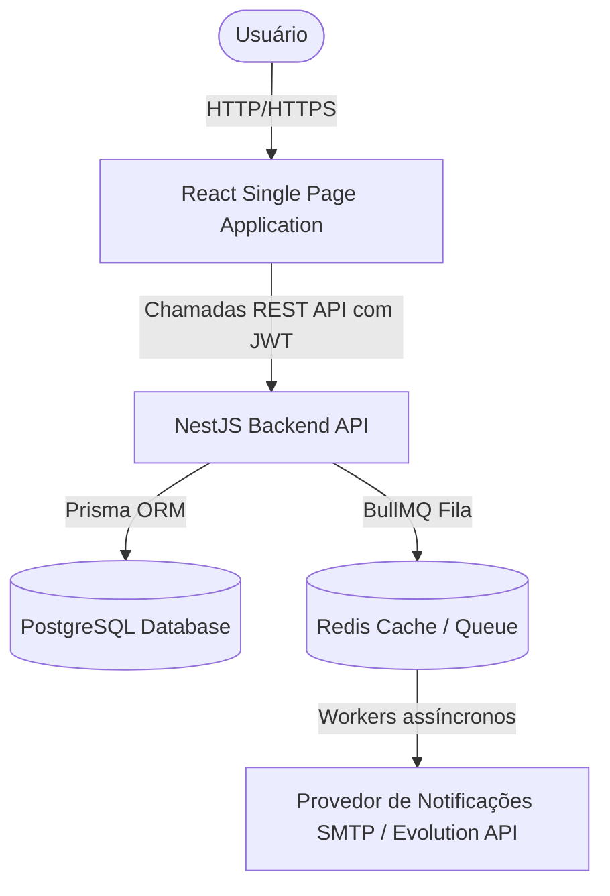

# System Overview

O VetOS AI é um sistema de gerenciamento clínico e de atendimento para clínicas veterinárias e petshops, estruturado em uma arquitetura monorepo com isolamento multi-tenant lógico.

## 1. Propósito do Produto

Centralizar toda a gestão operacional, clínica e de atendimento em um único sistema nervoso central, garantindo que o histórico clínico, vacinas, agenda e prontuários estejam unificados e facilmente acessíveis em tempo real, reduzindo a fadiga cognitiva dos profissionais.

## 2. Visão de Arquitetura de Alto Nível

A plataforma está organizada como um monorepo contendo:

* **Backend**: Aplicação NestJS (Node.js) com Prisma ORM e PostgreSQL, utilizando Redis + BullMQ para filas de processamento assíncrono de notificações.
* **Frontend**: Aplicação React com TailwindCSS v4 e componentes Shadcn-like baseados em Lucide Icons para uma experiência de usuário premium e otimizada (light/dark theme).

## 3. Estrutura do Repositório (Monorepo)

* `/backend`: Código do servidor NestJS, migrations do Prisma, scripts de manutenção.
* `/frontend`: Código da aplicação web single-page baseada em React (Vite).
* `/docs`: Documentação técnica e de negócio unificada.

## 4. Tecnologias Principais

| Camada | Tecnologia |
| :--- | :--- |
| **Backend** | NestJS, TypeScript, Prisma ORM, BullMQ, Jest |
| **Frontend** | React, TypeScript, TailwindCSS v4, Vite |
| **Banco de Dados** | PostgreSQL, Redis |
| **Infraestrutura** | Docker Compose |
