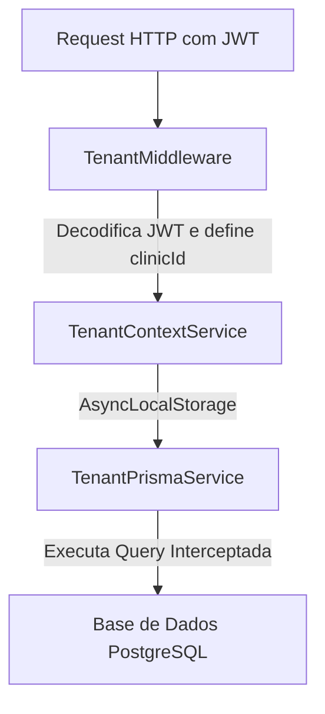

# Multi-Tenant Architecture Overview

Este documento fornece uma visão geral de alto nível sobre a arquitetura de isolamento de inquilinos (multi-tenancy) implementada no VetOS AI.

---

## 1. Introdução

O VetOS AI utiliza uma arquitetura de banco de dados compartilhado com isolamento lógico via `clinicId`. Para garantir que dados de clínicas diferentes permaneçam estritamente isolados sem a necessidade de adicionar cláusulas `where` manuais em cada ponto do sistema, projetamos uma extensão nativa do Prisma baseada em contextos assíncronos.

---

## 2. Componentes da Solução

1. **[TenantContextService](file:///home/moa-dev/projetos/vetos-ai/backend/src/tenant/tenant-context.service.ts)**: Utiliza `AsyncLocalStorage` do Node.js para propagar o `clinicId` e a role do usuário corrente através da pilha de execução de forma isolada por thread lógica.
2. **[TenantMiddleware](file:///home/moa-dev/projetos/vetos-ai/backend/src/tenant/tenant.middleware.ts)**: Intercepta cada requisição HTTP, extrai e valida o token JWT do cabeçalho `Authorization`, e inicializa o contexto com o `clinicId` correspondente.
3. **[TenantPrismaExtension](file:///home/moa-dev/projetos/vetos-ai/backend/src/prisma/tenant-prisma.extension.ts)**: Intercepta chamadas de banco de dados do Prisma Client e dinamicamente avalia se deve ou não injetar filtros ou dados de isolamento baseado no modelo, na operação, na role do usuário e no modo de execução configurado.

---

## 3. Navegação da Documentação

A documentação detalhada sobre o sistema multi-tenant está dividida nos seguintes arquivos:

* **01. Visão Geral (Este documento)**
* **[02. Auditoria e Inventário de Queries (02-query-audit.md)](file:///home/moa-dev/projetos/vetos-ai/docs/architecture/tenant/02-query-audit.md)**: Inventário de 100% das chamadas Prisma no backend, riscos e dívida técnica estrutural.
* **[03. Matriz de Decisão e Classificação (03-decision-matrix.md)](file:///home/moa-dev/projetos/vetos-ai/docs/architecture/tenant/03-decision-matrix.md)**: Classificação de modelos (Filtráveis vs Globais) e inteligência de decisão da extensão.
* **[04. Plano de Ativação e Feature Flags (04-activation-plan.md)](file:///home/moa-dev/projetos/vetos-ai/docs/architecture/tenant/04-activation-plan.md)**: Configurações de Feature Flag e etapas seguras para virar a chave em produção.
