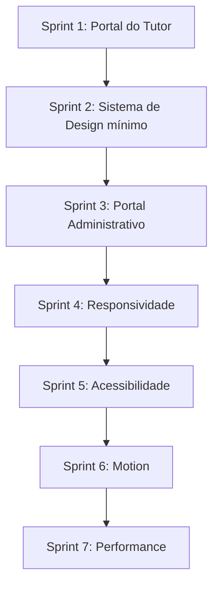

# 🗺️ Roadmap de Refinamento de Frontend - VetOS AI

Este documento serve como o guia oficial para a evolução e refinamento da interface do usuário (UI) e experiência do usuário (UX) do **VetOS AI**. Ele traduz a visão estratégica descrita no [PRODUCT.md](file:///home/moa-dev/projetos/vetos-ai/PRODUCT.md) e as diretrizes visuais do [DESIGN.md](file:///home/moa-dev/projetos/vetos-ai/DESIGN.md) em metas práticas divididas em sprints incrementais.

---

## 🏃 Sprints de Refinamento

---

## 🐕 Sprint 1: Portal do Tutor (Primeira Experiência Premium B2C)
**Prioridade:** Crítico

### Objetivos
- Refinar a área dedicada aos tutores de pets para criar uma experiência B2C de alto nível (premium).
- Transmitir acolhimento, cuidado e clareza nas informações de saúde e agendamento de consultas.
- [x] O tutor consegue visualizar o status das vacinas de seus animais de forma clara e amigável.
- [ ] O fluxo de agendamento e remarcação de consultas é simples e empático.
- [x] Uso balanceado da marca com tons que geram tranquilidade e confiança (badges WCAG AA, chips e tons amigáveis).

### Checklist de Tarefas — TutorPetDetails.tsx (Fase 1 - Refinamento Completo Híbrido)
- [x] **Layout em 2 Áreas** — Hero/Resumo de Saúde (coluna lateral) e Diário de Saúde/Timeline (coluna principal), preservando bastante espaço em branco.
- [x] **PetHeroCard Reutilizável** — Apresenta avatar de placeholder redondo grande, nome, espécie, raça, sexo (símbolos ♂/♀), idade, tutor e clínica, preparado para futuras imagens.
- [x] **Painel de Resumo de Saúde** — Exibição elegante em grid de 5 cards rápidos (Vacinas, Peso, Alergias, Tratamentos ativos e Próxima Consulta). Usa dados do backend ou placeholders elegantes sem criar dados fictícios.
- [x] **Filtros com Chips e Ícones** — Chips de filtro de categorias interativas (📋 Tudo, 💉 Vacinas, 🩺 Consultas, 💊 Receitas, 🧪 Exames) com contadores integrados de ocorrências.
- [x] **Agrupamento Cronológico de Timeline** — Timeline dividida e ordenada de maneira fluida em seções por Mês e Ano (ex: "Maio de 2026").
- [x] **Estrutura de Eventos Padronizada** — Cada item da timeline segue rigorosamente a estrutura: Ícone, Título, Data localizada, Subtítulo opcional, Descrição e Ação (com indicador `↗` se aplicável).
- [x] **Tratamento de Estados** — Padronização de skeletons animados para a página inteira (Loading), tratamento claro de erros com botão de retorno (Error), e ilustração amigável caso não haja eventos sob o filtro selecionado (Empty).
- [x] **`classNames` centralizado** — substituído por `cn()` de `../../lib/utils`.

### Registro de Decisões & Validações
**[2026-07-10] Implementação da Experiência Híbrida Premium concluída e build homologada.**

| Decisão | Racional |
|---|---|
| Grid Responsivo de 2 Colunas (`lg:grid-cols-12`) | Permite visualização fluida com bastante espaço em branco no desktop (5/12 para Hero e 7/12 para Timeline) e empilhamento natural no mobile. |
| Agrupamento por Mês/Ano com Separadores | Aumenta a legibilidade da linha do tempo reduzindo a carga cognitiva ao segmentar os eventos no tempo. |
| Contadores nas Categorias | Evita cliques desnecessários ao indicar previamente quantos registros existem em cada aba/chip de filtro. |
| Tratamento de dados sem mock fictício | O resumo de saúde extrai dados do banco de dados (ex: `pet.allergies`, `pet.weightRecords`) e exibe "Não registrado" ou "Nenhuma alergia" caso vazio, respeitando a integridade das informações reais da API. |

---

## 🎨 Sprint 2: Sistema de Design mínimo
**Prioridade:** Alto

### Objetivos
- Consolidar e padronizar os tokens de design do [DESIGN.md](file:///home/moa-dev/projetos/vetos-ai/DESIGN.md) no TailwindCSS v4.
- Criar componentes primitivos consistentes e reutilizáveis (botões, inputs, badges) que sirvam de base para os portais.

### Critérios de Aceitação
- [ ] Todos os componentes primitivos utilizam as variáveis OKLCH definidas no `:root`.
- [ ] Nenhum componente básico utiliza classes ad-hoc de cores ou espaçamento fora do padrão.
- [ ] Contraste mínimo de 4.5:1 para elementos de texto contra o fundo.

### Checklist de Tarefas
- [ ] Refatorar os botões primários, secundários e ghost no frontend para usar as classes do tema.
- [ ] Padronizar os campos de texto (`inputs` e `selects`) com estados de focus visíveis (`ring`).
- [ ] Remover cores estáticas puras (ex: `bg-black` ou `bg-gray-100`) substituindo por semantic tokens do `index.css`.

### Registro de Decisões & Validações
*Nenhuma decisão registrada ainda.*

---

## 🏥 Sprint 3: Portal Administrativo (Foco em Eficiência)
**Prioridade:** Alto

### Objetivos
- Refinar a experiência da clínica (Dashboard principal, Prontuários e Fichas de Pacientes).
- Aumentar a densidade de informação útil sem poluir a interface.

### Critérios de Aceitação
- [ ] Alertas críticos de saúde (alergias do pet) ficam visíveis de forma imediata na ficha do paciente.
- [ ] O Prontuário Clínico permite inserções rápidas com o mínimo de navegação entre abas.
- [ ] Dashboard exibe os status de operação da clínica em tempo real de forma limpa.

### Checklist de Tarefas
- [ ] Redesenhar os alertas de alergia/risco na página [PetDetails.tsx](file:///home/moa-dev/projetos/vetos-ai/frontend/src/pages/PetDetails.tsx).
- [ ] Simplificar a visualização do histórico do pet utilizando uma linha do tempo (timeline) mais limpa.
- [ ] Otimizar a visualização das métricas rápidas do Dashboard, evitando o modelo saturado de "hero-metrics".

### Registro de Decisões & Validações
*Nenhuma decisão registrada ainda.*

---

## 📱 Sprint 4: Responsividade (Visualização Multipontos)
**Prioridade:** Alto

### Objetivos
- Garantir que a interface do VetOS AI seja perfeitamente utilizável em tablets e smartphones.
- Evitar quebras de texto e layouts quebrados em telas menores.

### Critérios de Aceitação
- [ ] Prontuários e fichas clínicas são legíveis em telas de tablets (usadas comumente por veterinários em consultórios).
- [ ] A navegação principal colapsa em um menu hambúrguer ou barra inferior em telas mobile.
- [ ] Nenhuma tabela de dados quebra o layout (uso de rolagem horizontal assistida).

### Checklist de Tarefas
- [ ] Testar e ajustar o grid de cartões e tabelas no [Dashboard.tsx](file:///home/moa-dev/projetos/vetos-ai/frontend/src/pages/Dashboard.tsx) para mobile.
- [ ] Refatorar a visualização da agenda de consultas para telas menores.
- [ ] Garantir que o texto de títulos longos não ultrapasse os limites dos cards.

### Registro de Decisões & Validações
*Nenhuma decisão registrada ainda.*

---

## ♿ Sprint 5: Acessibilidade (Inclusão)
**Prioridade:** Crítico

### Objetivos
- Elevar a interface do VetOS AI para o nível WCAG AA.
- Assegurar acessibilidade para usuários com baixa visão ou limitações motoras.

### Critérios de Aceitação
- [ ] Todos os elementos interativos possuem indicadores de foco (`focus-visible`) nítidos e contrastantes.
- [ ] Alertas críticos não utilizam apenas a cor vermelha/verde para transmitir significado (uso de ícones e textos de suporte).
- [ ] Textos legíveis com tamanho mínimo adequado e contraste correto.

### Checklist de Tarefas
- [ ] Adicionar descrições acessíveis (`aria-label`) a botões que contêm apenas ícones.
- [ ] Ajustar o foco de teclado nas telas de formulários de cadastro.
- [ ] Testar contraste de todas as combinações de cores ativas e desativadas no painel.

### Registro de Decisões & Validações
*Nenhuma decisão registrada ainda.*

---

## ✨ Sprint 6: Motion (Animações Significativas)
**Prioridade:** Médio

### Objetivos
- Adicionar animações sutis e micro-interações que guiem o usuário de forma intuitiva.
- Evitar animações lentas ou desnecessárias que prejudiquem a agilidade de uso.

### Critérios de Aceitação
- [ ] Transições de estado (como hover de botões e abertura de modais) duram menos de 200ms e usam curvas suaves (ease-out).
- [ ] Respeito estrito à preferência do sistema de movimento reduzido (`prefers-reduced-motion`).
- [ ] Nenhuma imagem é animada diretamente em eventos de hover.

### Checklist de Tarefas
- [ ] Implementar feedbacks visuais instantâneos ao salvar prontuários.
- [ ] Configurar transições de fade e deslize suave para a abertura de modais de agendamento.
- [ ] Revisar e aplicar regras de redução de animação em CSS para acessibilidade.

### Registro de Decisões & Validações
*Nenhuma decisão registrada ainda.*

---

## ⚡ Sprint 7: Performance & Resiliência
**Prioridade:** Médio

### Objetivos
- Reduzir o tempo de carregamento da interface e melhorar o feedback em conexões lentas.
- Criar estados de carregamento (skeletons) elegantes.

### Critérios de Aceitação
- [ ] Carregamento inicial da página rápido (redução de bundles pesados).
- [ ] Skeletons de carregamento são utilizados em substituição a spinners simples de carregamento.
- [ ] Tratamento visível e amigável para falhas de rede.

### Checklist de Tarefas
- [ ] Criar componentes de Skeleton para as tabelas e para a ficha do pet.
- [ ] Otimizar os pacotes de ícones importados no frontend para evitar bundle bloat.
- [ ] Implementar tratamento elegante de erros caso a API backend falhe.

### Registro de Decisões & Validações
*Nenhuma decisão registrada ainda.*
