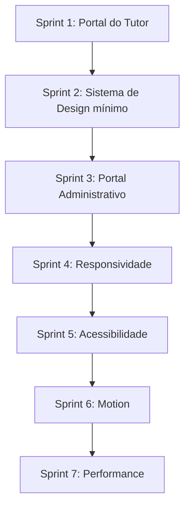

# 🗺️ Roadmap de Refinamento de Frontend - VetOS AI

Este documento serve como o guia oficial para a evolução e refinamento da interface do usuário (UI) e experiência do usuário (UX) do **VetOS AI**. Ele traduz a visão estratégica descrita no [PRODUCT.md](file:///home/moa-dev/projetos/vetos-ai/PRODUCT.md) e as diretrizes visuais do [DESIGN.md](file:///home/moa-dev/projetos/vetos-ai/DESIGN.md) em metas práticas divididas em sprints incrementais.

---

## 🏃 Sprints de Refinamento

---

## 🐕 Sprint 1: Portal do Tutor (Primeira Experiência Premium B2C)
**Prioridade:** Crítico

### Objetivos
- Refinar a área dedicada aos tutores de pets para criar uma experiência B2C de alto nível (premium).
- Transmitir acolhimento, cuidado e clareza nas informações de saúde e agendamento de consultas.

### Critérios de Aceitação
- [x] O tutor consegue visualizar informações do pet de forma clara e organizada (card de perfil com espécie, raça, idade e clínica).
- [ ] O fluxo de agendamento e remarcação de consultas é simples e empático.
- [x] Uso balanceado da marca com tons que geram tranquilidade e confiança (badges WCAG AA, semantic tokens).

### Checklist de Tarefas — TutorPetDetails.tsx (Fase 1)
- [x] **Skeleton de carregamento** — substitui texto puro por skeleton animado com card de perfil + 3 eventos fantasmas.
- [x] **Estado de erro com recuperação** — mensagem clara + link de retorno para `/tutor` (substitui div vazia com `text-red-500`).
- [x] **Estado vazio contextualizado** — ícone 🐾, título e copy explicativo com nome do pet.
- [x] **Card de perfil do pet** — avatar emoji por espécie, nome, raça, idade e clínica. Botão de voltar acessível com `aria-label`.
- [x] **Badges de tone WCAG AA** — refatorado de `bg-blue-100 text-blue-600` para `bg-blue-50 text-blue-700 ring-1` (ratio ≥ 4.5:1).
- [x] **Ícones de timeline acessíveis** — adicionado `role="img"` e `aria-label` descritivo composto por categoria + título.
- [x] **Indicador de link externo** — sufixo `↗` nos botões de ação com `aria-label` explicitando "abre em nova aba".
- [x] **`classNames` centralizado** — substituído por `cn()` importado de `../../lib/utils`.
- [x] **`<time>` semântico** — data do evento usa elemento `<time>` com atributo `dateTime` em ISO 8601.
- [ ] Implementar a timeline de vacinação histórica e filtros por categoria.
- [ ] Desenvolver o formulário simples de solicitação ou remarcação de consulta.

### Registro de Decisões & Validações
**[2026-07-09] Fase 1 — TutorPetDetails.tsx implementada e build validada.**

| Decisão | Racional |
|---|---|
| Avatar por espécie via emoji | Evita dependency de assets externos; funciona offline e é culturalmente neutro. |
| Skeleton com 3 itens fantasma | Quantidade típica de eventos visíveis acima do fold; evita CLS. |
| `ring-1` nos badges de tone | Adiciona separação visual entre badge e fundo sem exigir sombra; alinha ao "Flat-By-Default Rule" do DESIGN.md. |
| Indicador `↗` com `aria-label` | Atende WCAG 2.4.4 (Link Purpose) sem depender de biblioteca de ícones. |
| `<time dateTime>` | Semântica correta para datas de eventos históricos; compatível com parsers de acessibilidade. |

---

## 🎨 Sprint 2: Sistema de Design mínimo
**Prioridade:** Alto

### Objetivos
- Consolidar e padronizar os tokens de design do [DESIGN.md](file:///home/moa-dev/projetos/vetos-ai/DESIGN.md) no TailwindCSS v4.
- Criar componentes primitivos consistentes e reutilizáveis (botões, inputs, badges) que sirvam de base para os portais.

### Critérios de Aceitação
- [ ] Todos os componentes primitivos utilizam as variáveis OKLCH definidas no `:root`.
- [ ] Nenhum componente básico utiliza classes ad-hoc de cores ou espaçamento fora do padrão.
- [ ] Contraste mínimo de 4.5:1 para elementos de texto contra o fundo.

### Checklist de Tarefas
- [ ] Refatorar os botões primários, secundários e ghost no frontend para usar as classes do tema.
- [ ] Padronizar os campos de texto (`inputs` e `selects`) com estados de focus visíveis (`ring`).
- [ ] Remover cores estáticas puras (ex: `bg-black` ou `bg-gray-100`) substituindo por semantic tokens do `index.css`.

### Registro de Decisões & Validações
*Nenhuma decisão registrada ainda.*

---

## 🏥 Sprint 3: Portal Administrativo (Foco em Eficiência)
**Prioridade:** Alto

### Objetivos
- Refinar a experiência da clínica (Dashboard principal, Prontuários e Fichas de Pacientes).
- Aumentar a densidade de informação útil sem poluir a interface.

### Critérios de Aceitação
- [ ] Alertas críticos de saúde (alergias do pet) ficam visíveis de forma imediata na ficha do paciente.
- [ ] O Prontuário Clínico permite inserções rápidas com o mínimo de navegação entre abas.
- [ ] Dashboard exibe os status de operação da clínica em tempo real de forma limpa.

### Checklist de Tarefas
- [ ] Redesenhar os alertas de alergia/risco na página [PetDetails.tsx](file:///home/moa-dev/projetos/vetos-ai/frontend/src/pages/PetDetails.tsx).
- [ ] Simplificar a visualização do histórico do pet utilizando uma linha do tempo (timeline) mais limpa.
- [ ] Otimizar a visualização das métricas rápidas do Dashboard, evitando o modelo saturado de "hero-metrics".

### Registro de Decisões & Validações
*Nenhuma decisão registrada ainda.*

---

## 📱 Sprint 4: Responsividade (Visualização Multipontos)
**Prioridade:** Alto

### Objetivos
- Garantir que a interface do VetOS AI seja perfeitamente utilizável em tablets e smartphones.
- Evitar quebras de texto e layouts quebrados em telas menores.

### Critérios de Aceitação
- [ ] Prontuários e fichas clínicas são legíveis em telas de tablets (usadas comumente por veterinários em consultórios).
- [ ] A navegação principal colapsa em um menu hambúrguer ou barra inferior em telas mobile.
- [ ] Nenhuma tabela de dados quebra o layout (uso de rolagem horizontal assistida).

### Checklist de Tarefas
- [ ] Testar e ajustar o grid de cartões e tabelas no [Dashboard.tsx](file:///home/moa-dev/projetos/vetos-ai/frontend/src/pages/Dashboard.tsx) para mobile.
- [ ] Refatorar a visualização da agenda de consultas para telas menores.
- [ ] Garantir que o texto de títulos longos não ultrapasse os limites dos cards.

### Registro de Decisões & Validações
*Nenhuma decisão registrada ainda.*

---

## ♿ Sprint 5: Acessibilidade (Inclusão)
**Prioridade:** Crítico

### Objetivos
- Elevar a interface do VetOS AI para o nível WCAG AA.
- Assegurar acessibilidade para usuários com baixa visão ou limitações motoras.

### Critérios de Aceitação
- [ ] Todos os elementos interativos possuem indicadores de foco (`focus-visible`) nítidos e contrastantes.
- [ ] Alertas críticos não utilizam apenas a cor vermelha/verde para transmitir significado (uso de ícones e textos de suporte).
- [ ] Textos legíveis com tamanho mínimo adequado e contraste correto.

### Checklist de Tarefas
- [ ] Adicionar descrições acessíveis (`aria-label`) a botões que contêm apenas ícones.
- [ ] Ajustar o foco de teclado nas telas de formulários de cadastro.
- [ ] Testar contraste de todas as combinações de cores ativas e desativadas no painel.

### Registro de Decisões & Validações
*Nenhuma decisão registrada ainda.*

---

## ✨ Sprint 6: Motion (Animações Significativas)
**Prioridade:** Médio

### Objetivos
- Adicionar animações sutis e micro-interações que guiem o usuário de forma intuitiva.
- Evitar animações lentas ou desnecessárias que prejudiquem a agilidade de uso.

### Critérios de Aceitação
- [ ] Transições de estado (como hover de botões e abertura de modais) duram menos de 200ms e usam curvas suaves (ease-out).
- [ ] Respeito estrito à preferência do sistema de movimento reduzido (`prefers-reduced-motion`).
- [ ] Nenhuma imagem é animada diretamente em eventos de hover.

### Checklist de Tarefas
- [ ] Implementar feedbacks visuais instantâneos ao salvar prontuários.
- [ ] Configurar transições de fade e deslize suave para a abertura de modais de agendamento.
- [ ] Revisar e aplicar regras de redução de animação em CSS para acessibilidade.

### Registro de Decisões & Validações
*Nenhuma decisão registrada ainda.*

---

## ⚡ Sprint 7: Performance & Resiliência
**Prioridade:** Médio

### Objetivos
- Reduzir o tempo de carregamento da interface e melhorar o feedback em conexões lentas.
- Criar estados de carregamento (skeletons) elegantes.

### Critérios de Aceitação
- [ ] Carregamento inicial da página rápido (redução de bundles pesados).
- [ ] Skeletons de carregamento são utilizados em substituição a spinners simples de carregamento.
- [ ] Tratamento visível e amigável para falhas de rede.

### Checklist de Tarefas
- [ ] Criar componentes de Skeleton para as tabelas e para a ficha do pet.
- [ ] Otimizar os pacotes de ícones importados no frontend para evitar bundle bloat.
- [ ] Implementar tratamento elegante de erros caso a API backend falhe.

### Registro de Decisões & Validações
*Nenhuma decisão registrada ainda.*
