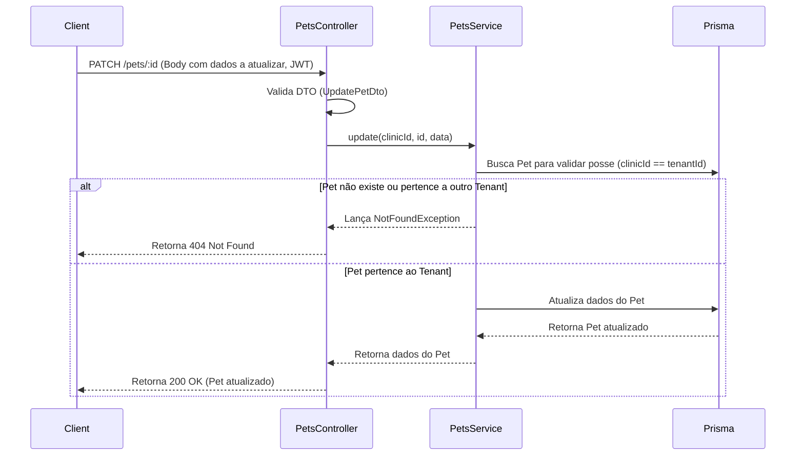
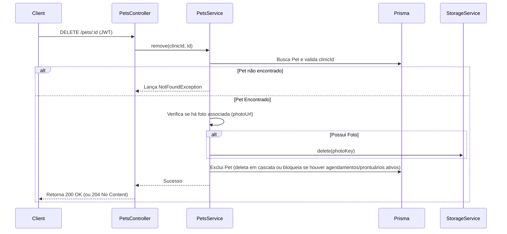
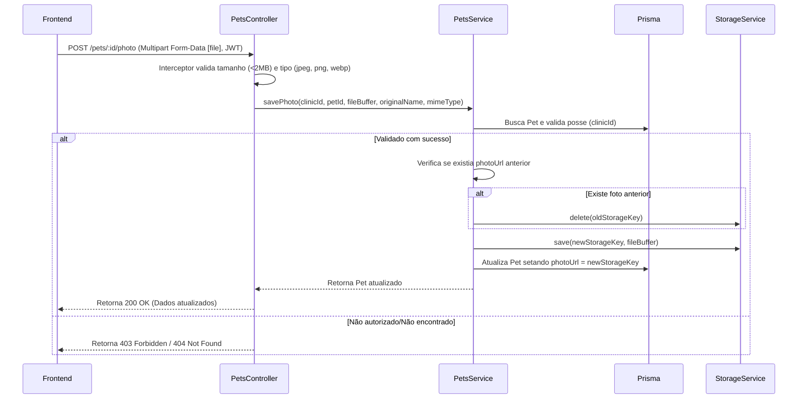

# Engineering Specification (ES) - Sprint 002: Pets Module Finalization

## 1. Resumo Executivo
Este documento especifica a especificação técnica (contrato) para a Sprint 002 do VetOS AI. O objetivo principal desta sprint é concluir e consolidar o ciclo de vida do módulo de **Pets (Pacientes)**, implementando as funcionalidades pendentes de edição (CRUD completo), exclusão segura com tratamento de erros, upload de foto de perfil e melhorias de UX, garantindo a integridade de isolamento multi-tenant (segurança entre clínicas) e qualidade via testes automatizados.

## 2. Objetivo
Estabelecer as diretrizes técnicas detalhadas, arquitetura de software, fluxos de dados e critérios de aceitação para o desenvolvimento das funcionalidades da Sprint 002, sem iniciar qualquer tipo de modificação de código neste momento de planejamento.

## 3. Estado Atual
- **Modelagem no Banco (Prisma)**: O modelo `Pet` possui campos básicos (`id`, `name`, `species`, `breed`, `age`, `clientId`, `clinicId`, `createdAt`, `updatedAt`), mas carece de um campo `photoUrl` para armazenar a referência da imagem do animal.
- **Endpoints Backend (`PetsController`)**: 
  - `POST /pets` - Criação de pet (parcialmente validado).
  - `GET /pets` - Lista todos os pets da clínica (`clinicId`).
  - `GET /pets/:id` - Detalha o pet e seus relacionamentos (histórico, agendamentos, etc.).
  - `PATCH /pets/:id` - Atualização básica usando `updateMany` (não estruturada por DTO).
  - `DELETE /pets/:id` - Remoção básica usando `deleteMany`.
- **Frontend**:
  - `Pets.tsx`: Listagem de pacientes, barra de pesquisa, botão e modal simples de cadastro.
  - `PetDetails.tsx`: Exibição visual robusta (prontuário, peso, vacinas, etc.), mas sem opções para editar o perfil do pet, excluí-lo ou carregar foto. Possui um avatar estático (`PawPrint` icon).

## 4. Problemas Encontrados
1. **Falta do Campo de Foto no Schema**: O modelo `Pet` no banco de dados não prevê campo para foto de perfil.
2. **DTOs Vazios**: `CreatePetDto` e `UpdatePetDto` estão vazios, impedindo a validação automática via `ValidationPipe` do NestJS (class-validator).
3. **Ausência de Interface de Edição/Remoção**: A interface atual do frontend impossibilita o veterinário de corrigir erros de digitação (raça, idade, nome) ou remover registros indevidos de Pets.
4. **Acoplamento de Armazenamento**: Atualmente os arquivos de prontuários em `ClinicalAttachments` utilizam o `StorageService` para uploads físicos, mas a rota de streaming ou deleção física precisa ser reutilizada e adaptada especificamente para o avatar dos pets com regras de limpeza automática.

## 5. Escopo da Sprint
1. **CRUD Completo de Pets**:
   - Edição de informações do Pet no backend (`PATCH /pets/:id`) com validações rigorosas de campos e integridade de tenant.
   - Remoção de Pet no backend (`DELETE /pets/:id`) com tratamento de cascata segura (ou bloqueio se houver registros clínicos sensíveis, garantindo consistência referencial).
   - Tela de Edição no Frontend reutilizando `PetModal` e atualizando a interface em tempo real.
   - Botão e confirmação modal de exclusão segura.
2. **Upload da Foto do Pet**:
   - Desenho de rota dedicada (`POST /pets/:id/photo`) no backend.
   - Integração com o `StorageService` existente.
   - Upload no Frontend diretamente através do componente de avatar em `PetDetails.tsx`.
3. **Melhorias de UX**:
   - Adicionar estados de *loading*, tratamento de erros amigável, mensagens toast para confirmação de ações e feedbacks visuais premium.
4. **Testes Completos**:
   - Cobertura de testes unitários e de integração (com foco em multi-tenancy e tratamento de erros).

## 6. Fora do Escopo
- Alterações em módulos de terceiros (Clientes, Agendamentos, Assinaturas Digitais).
- Modificação no fluxo global de autenticação ou RBAC do sistema.
- Armazenamento em nuvem (S3/GCS) de fato durante esta sprint (deve-se utilizar a infraestrutura local em `uploads` pelo `LocalStorageService`, abstraída pela interface `StorageService`).

## 7. Arquitetura Proposta

### 7.1 Schema Database (Prisma)
Propõe-se adicionar o campo `photoUrl` ao modelo `Pet`:
```prisma
model Pet {
  // ... campos existentes
  photoUrl   String?
  // ... relações existentes
}
```

### 7.2 Arquitetura de Armazenamento (Upload de Foto)
- **Interface**: Utilização do `StorageService` injetável para salvar, recuperar e apagar os arquivos físicos.
- **Organização de Pastas**: `clinics/${clinicId}/pets/${petId}/photo/`
- **Nomenclatura do Arquivo**: Para evitar vazamento de informações e colisões, o arquivo físico no disco receberá o nome gerado por UUID: `${randomUUID()}${extension}`.
- **Formato**: Limitado a imagens `image/jpeg`, `image/png` e `image/webp`.
- **Limites**: Máximo de 2MB por foto de perfil.
- **Estratégia de Substituição (Limpeza)**: Se o pet já contiver um `photoUrl` não nulo, o upload de uma nova foto deve remover o arquivo anterior correspondente fisicamente do disco antes de gravar o novo caminho no banco.
- **Segurança e Isolamento**: 
  - A imagem **não** será exposta publicamente via pasta estática.
  - A leitura da foto será realizada por meio de uma rota protegida `GET /pets/:id/photo` que valida se o usuário autenticado pertence à mesma `clinicId` do Pet, fazendo o stream seguro do arquivo via `StorageService.getFileStream(key)`.

---

## 8. Arquivos que serão modificados
- `backend/prisma/schema.prisma`: Inclusão do campo `photoUrl` no modelo `Pet`.
- `backend/src/pets/pets.controller.ts`: Adicionar validação de payload no método `update`, rota de exclusão com tratamento de erros customizado e novas rotas para upload (`POST :id/photo`) e recuperação de foto (`GET :id/photo`).
- `backend/src/pets/pets.service.ts`: Ajustar métodos de `update` e `remove` para tratamento preciso de erros e implementar o fluxo de salvamento, substituição e deleção de arquivos físicos da foto.
- `backend/src/pets/dto/create-pet.dto.ts` e `update-pet.dto.ts`: Definir campos e validações usando `class-validator`.
- `frontend/src/pages/PetDetails.tsx`: Adicionar botão de edição (disparando modal preenchido), botão de deleção (com modal de confirmação), e componente interativo no avatar para upload direto de arquivo de imagem.
- `frontend/src/pages/Pets.tsx`: Atualizar a interface quando um paciente for editado ou excluído.

## 9. Arquivos novos
- N/A (Nenhum novo módulo será criado. Apenas DTOs serão populados e novos testes adicionados nos arquivos existentes).

---

## 10. Fluxo Backend

### 10.1 Atualização / Edição (`PATCH /pets/:id`)


### 10.2 Exclusão (`DELETE /pets/:id`)


---

## 11. Fluxo Frontend
1. **Fluxo de Edição**:
   - O usuário clica em "Editar Perfil" na barra de ações de `PetDetails.tsx`.
   - O modal `PetModal` é aberto em modo edição, recebendo via *props* o objeto do pet atual.
   - Ao submeter o formulário, realiza um `api.patch('/pets/' + pet.id, payload)`.
   - Em caso de sucesso, emite um Toast de confirmação, fecha o modal e dispara uma atualização de estado local do prontuário (`loadPetData`).
2. **Fluxo de Exclusão**:
   - O usuário clica em "Excluir Paciente" em `PetDetails.tsx`.
   - Exibe-se um modal de diálogo customizado: "A exclusão do prontuário do paciente é permanente e apagará todo o histórico clínico. Confirma a exclusão de [Nome do Pet]?"
   - Se confirmado, dispara um `api.delete('/pets/' + pet.id)`.
   - Após sucesso, exibe Toast informativo e redireciona o usuário de volta para a lista geral de pacientes (`/pets`).

---

## 12. Fluxo Upload de Fotos


---

## 13. Impactos
- **Migração de Banco**: Necessidade de executar uma migração no banco de dados para acrescentar o campo `photoUrl` no Prisma schema.
- **Interface**: Componentes como cards de Pet e cabeçalho de prontuário devem passar a verificar a presença de `photoUrl` para renderizar a imagem, mantendo o fallback do ícone caso nulo.

## 14. Riscos
- **Arquivos Órfãos**: Caso uma exclusão de Pet falhe no banco de dados após a foto já ter sido removida do disco, ou vice-versa. 
  - *Mitigação*: Executar a exclusão lógica/física dentro de blocos estruturados `try/catch` e transações onde apropriado, priorizando a deleção de banco primeiro e, após a confirmação da transação, apagar os arquivos físicos do storage.
- **Vazamento de Dados (Bypass de Tenant)**: Tentativa de recuperar fotos de animais de outras clínicas através do ID do pet via rota pública.
  - *Mitigação*: A foto nunca será exposta de forma estática direta no express. Todo acesso passará pelo interceptor de autenticação e validação do `clinicId` associado ao token do usuário antes de realizar o stream do arquivo.

---

## 15. Plano de Testes

### 15.1 Testes Unitários
- **PetsService (`pets.service.spec.ts`)**:
  - Validar que a edição (`update`) impede espécies que não sejam DOG, CAT ou OTHER.
  - Garantir que a deleção (`remove`) de fato chama o Prisma com o `clinicId` correto do tenant.
  - Garantir que o upload de foto apaga o arquivo antigo física e corretamente.
- **PetsController (`pets.controller.spec.ts`)**:
  - Validar que o DTO do payload é sanitizado e validado corretamente.

### 15.2 Testes de Integração
- **Isolamento de Tenants (Multi-tenancy)**:
  - Garantir que um usuário autenticado na Clínica Alfa não consiga editar ou excluir um Pet cadastrado na Clínica Beta (deve retornar HTTP 404 ou 403).
  - Garantir que a Clínica Alfa não consiga ler/fazer stream do avatar de um Pet da Clínica Beta.

### 15.3 Cenários de Erro a Validar
- Envio de foto com extensão maliciosa (ex: `.exe`, `.html`, `.svg`).
- Envio de foto com tamanho maior que 2MB.
- Tentativa de atualizar um pet passando um `clientId` inexistente ou pertencente a outra clínica.

---

## 16. Critérios de Aceitação
- O veterinário consegue editar todas as informações básicas do Pet através da UI sem recarregar a página manualmente (SPA).
- A imagem de perfil do animal é exibida corretamente nas páginas `Pets.tsx` e `PetDetails.tsx`.
- Tentativas de requisição maliciosa cruzando informações de pets entre clínicas diferentes resultam em falha segura e log de acesso indevido.
- A cobertura de testes unitários para os novos fluxos do módulo de pets deve ser de 100%.

## 17. Definition of Done (DoD)
- Código fonte devidamente revisado.
- Build local do Frontend e Backend passando sem alertas ou erros.
- Banco de dados migrado via prisma migration controlada.
- Testes de integração de multi-tenancy cobrindo os fluxos de escrita e deleção.
- Sem arquivos temporários ou lixo deixados no diretório `uploads` durante os testes.

---

## 18. Checklist de Execução da Sprint (Para o Desenvolvedor)
- [ ] Atualizar `schema.prisma` adicionando `photoUrl` ao modelo `Pet`.
- [ ] Executar a migration correspondente localmente.
- [ ] Implementar as regras de validação nos DTOs (`create-pet.dto.ts`, `update-pet.dto.ts`).
- [ ] Implementar a validação de tenant nos endpoints `PATCH /pets/:id` e `DELETE /pets/:id`.
- [ ] Implementar o upload de imagem e persistência física via `StorageService`.
- [ ] Criar a rota segura de exibição/streaming da imagem `GET /pets/:id/photo`.
- [ ] Adaptar o `PetModal` no frontend para suportar o estado de edição.
- [ ] Criar a interface de upload e substituição da foto em `PetDetails.tsx`.
- [ ] Integrar toasts e feedback visual na deleção e edição do paciente.
- [ ] Criar e executar a suite de testes unitários e de integração para validar a sprint.
